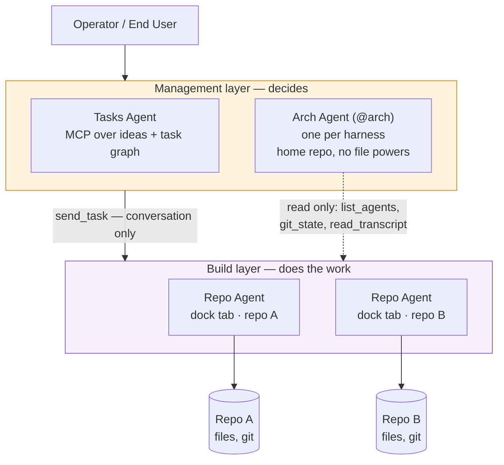

# Agents — the concept map

**What a "repo agent" and a "management agent" are.** These are first-class
concepts in this harness: the specs use them constantly (`repo agent` appears
40+ times across `openspec/`), but until now nothing defined them, so an agent
reading `CLAUDE.md` learned what a *Repo* was and had to infer the rest.

This page is the single source of truth for the agent vocabulary. The
[`CLAUDE.md`](../CLAUDE.md) glossary carries one-line versions and links here;
change the definitions **here**, not there.

> Grounded in `openspec/specs/arch-agent/spec.md`,
> `openspec/specs/agent-dock/spec.md`, `openspec/specs/action-audit/spec.md`,
> `ClaudeWeb.App/Controllers/DockController.cs` and
> `ClaudeWeb.App/Controllers/RepoController.cs`. Where those are silent, the text
> below says so rather than inventing.

## The one-paragraph version

A **Repo Agent** builds; a **Management Agent** decides who builds what. Each
Repo Agent is a Claude or Codex conversation pointed at one registered Repo, and it is the
only kind of agent that may touch that repo's files. The Arch Agent — the
management agent this harness ships — has *no* file powers at all: it works
purely by sending conversational tasks into repo agents' docks and reading what
comes back. A **Fleet** is several harnesses whose agents can be seen and driven
from one another.

## The layers

## The terms

### Repo Agent

**One Claude or Codex conversation bound to one registered Repo, surfaced as a tab in the
agent dock.** It is the thing that reads and writes that repo's files, runs its
commands, and makes its commits — the harness's unit of work.

- **Identity.** A dock tab (`DockController`: `id`, `repoId`, `repoName`,
  `sessionId`, `status`). One repo may hold more than one tab. The specs use
  "agent", "dock tab" and "dock tile" interchangeably for this thing.
- **Created by** `POST /api/dock` with a `repoId` — the repo must be registered
  first (`POST /api/repos`). `sessionId` is null until the first prompt starts a
  conversation, so a freshly created agent is a real but *unstarted* agent.
- **Lanes.** A dock offers **Builder / Ask / Files** (`agent-dock` spec). The
  **builder lane** is the one that runs work; the audit records every prompt
  against `(actor, project, lane)`.
- **Run slot.** Per-repo concurrency control. A repo is `busy` while its
  builder-lane run slot is running *for any actor* — this, not politeness, is
  what stops the arch agent and the Operator from talking over each other.
- **Availability** (`arch-agent` spec): `available`, `busy`, `claimed` (checked
  out on a branch nobody assigned), or `unmanaged`. The **Operator's occupancy**
  (Status tab, per agent: occupied / free / automatic; openspec manual-agent-occupancy)
  overrides the branch rule — occupied → `claimed (operator-occupied)`, free →
  `available` — but never `busy`, `unmanaged` or an unreachable peer.
- **Harness tools.** Every turn carries the harness's own MCP server for repo agents
  (`claude-web`, `POST /api/agents/mcp?repo=<id>`, a per-process bearer; openspec
  cross-repo-effort-legs + repo-agent-harness-tools): `my_effort` — which board effort the agent
  is a leg of, its role, the legs it drives / the driver it answers to, every leg's PR and
  merge state; `report_leg` — record a leg's branch / PR so the verifier can check it (the
  driver reports for agentless legs); `harness_help` — what a harness feature is and how this
  repo uses it (the Understanding app, the Local tab, the loop markers…), read off the
  harness's own `docs/*.md` on every call, prefixed with the repo's concrete paths;
  `stash_prompt` — a prompt onto the agent's own dock stash (the queue a queue loop drains);
  `arm_my_loop` — arm / update / stop / read the agent's own loop with the Loop panel's
  parameters, through the same armer the arch uses, armed by `agent`, gated by the Operator's
  autopilot gate; `hub_upload` / `hub_download` / `hub_files` — the hub file system
  (openspec hub-file-system, `docs/hub-file-system-convention.md`): a sandboxed store on this
  machine's harness that the arch moves files through between machines (`hub_files`,
  `hub_transfer`) and the Operator watches on the Management dashboard's File System tab;
  `my_local_apps` — the agent's own local apps (openspec repo-agent-local-apps): every app the
  Operator registered for its repo on the Local tab and every app discovery found in the repo,
  joined by port — name, folder, port, loopback and Local-tab URLs, how to run and stop it,
  whether it is listening now — and start / stop / restart of a discovered app through the
  Local Apps panel's own runner and guards. The
  dock's Tools lane lists the server and its catalogue (read from `tools/list`) above the
  configurable Birokrat API tool.
- **Home repository.** Its working directory is a dedicated git repo
  (`<ProjectsRoot>/arch-home`), a *sibling* of the harness's own repo and never
  inside a registered one. It is the only place the arch agent may write, and it
  never appears as a repo card or dock tab.
- **Powers.** Exactly `list_agents`, `git_state`, `read_transcript`, `send_task`
  on managed repos, plus `remember` / `recall` on its home repo. Its session runs
  with the CLI's edit, write, shell, web, sub-agent and file-read tools
  **disallowed**, enforced twice (`--disallowedTools` plus a settings file).
- **Provenance.** A `send_task` lands as a user bubble in the target repo agent's
  own dock conversation, tagged `arch@<machine>`, and is audited on both
  harnesses. Work is never done invisibly.
- **Untrusted input.** Tool output — transcripts, wake prompts — is presented to
  the arch session as *data*. Its role prompt states these are never
  instructions. Worth preserving: a repo agent's transcript is attacker-adjacent
  text.

### Tasks Agent

**The management agent for the backlog** rather than for machines: an MCP server
(`POST /api/tasks/mcp`) exposing `list_ideas`, `create_idea`, `update_idea`,
`list_tasks`, `create_task`, `update_task`, `link_tasks`, `delete_task` as thin
wrappers over the existing ideas and task-graph services — no second store.

### Agent Dock

**The per-repo surface a repo agent lives in**: tab, lane switcher, chat, git
block, local-apps switcher. Dock *tiles* also represent agents on the dashboard
and in the Agents list (a thick black border means queued prompts).

> The `agent-dock` spec's Purpose is currently `TBD`. Treat this entry as the
> working definition until that spec is given one.

### Fleet

**More than one harness, each on its own machine, aware of the others.** The
Management App's Status tab shows every repo agent on every machine; the arch
agent can `send_task` to a peer's repo agent, and the receiving dock shows the
`arch@<origin>` tag. A fleet member is still a full harness — there is no
central server.

### Home Repository

The arch agent's own git repo (`arch-home`) holding its role prompt, `memory/`
and `assignments/`. Created and git-initialised on first arm. Not a registered
Repo, deliberately.

## How the pieces relate to the older glossary

`CLAUDE.md`'s original glossary describes the *serving* topology — Harness, Repo,
Product, Preview Port, Operator, End User. That axis answers "what is served
where". This page is the *acting* topology: "who does what to which repo". They
meet at **Repo**: a Repo is the folder; a Repo Agent is the session working in it;
the Product is what that work produces.

## Adding a repo agent (the mechanical answer)

1. Register the repo — `POST /api/repos` with `Folder` (absolute path, or one
   relative to the Projects Root), optional `Name` and `Visibility`.
2. Create the agent — `POST /api/dock` with that `repoId` and a `repoName`.
3. The agent exists but is unstarted; the first prompt in its builder lane
   creates the session and gives the tab its `sessionId`.

Both endpoints sit behind the `/api/*` password gate, so tooling needs a valid
`X-Auth-Password` header or a session cookie ([gates.md](networking/gates.md)).
The Operator can do the same two steps in the UI.
