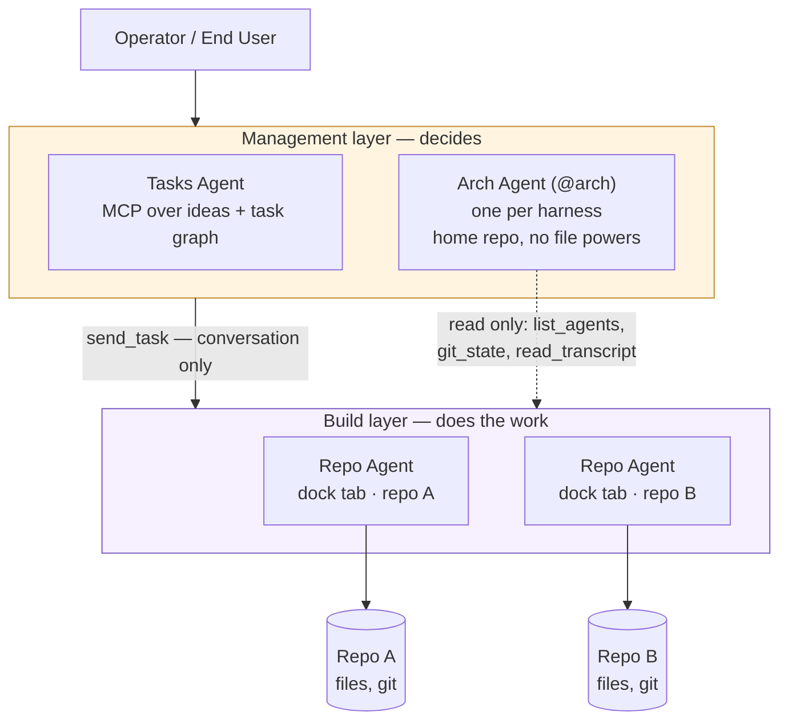

# Agents — the concept map

**What a "repo agent" and a "management agent" are.** These are first-class
concepts in this harness: the specs use them constantly (`repo agent` appears
40+ times across `openspec/`), but until now nothing defined them, so an agent
reading `CLAUDE.md` learned what a *Repo* was and had to infer the rest.

This page is the single source of truth for the agent vocabulary. The
[`CLAUDE.md`](../CLAUDE.md) glossary carries one-line versions and links here;
change the definitions **here**, not there.

> Grounded in `openspec/specs/arch-agent/spec.md`,
> `openspec/specs/agent-dock/spec.md`, `openspec/specs/action-audit/spec.md`,
> `ClaudeWeb.App/Controllers/DockController.cs` and
> `ClaudeWeb.App/Controllers/RepoController.cs`. Where those are silent, the text
> below says so rather than inventing.

## The one-paragraph version

A **Repo Agent** builds; a **Management Agent** decides who builds what. Each
Repo Agent is a Claude or Codex conversation pointed at one registered Repo, and it is the
only kind of agent that may touch that repo's files. The Arch Agent — the
management agent this harness ships — has *no* file powers at all: it works
purely by sending conversational tasks into repo agents' docks and reading what
comes back. A **Fleet** is several harnesses whose agents can be seen and driven
from one another.

## The layers

```mermaid
flowchart TD
    OP["Operator / End User"] --> MGMT

    subgraph MGMT["Management layer — decides"]
        ARCH["Arch Agent (@arch)<br/>one per harness<br/>home repo, no file powers"]
        TASKS["Tasks Agent<br/>MCP over ideas + task graph"]
    end

    MGMT -->|"send_task — conversation only"| BUILD

    subgraph BUILD["Build layer — does the work"]
        RA1["Repo Agent<br/>dock tab · repo A"]
        RA2["Repo Agent<br/>dock tab · repo B"]
    end

    RA1 --> REPOA[("Repo A<br/>files, git")]
    RA2 --> REPOB[("Repo B<br/>files, git")]

    ARCH -.->|"read only: list_agents,<br/>git_state, read_transcript"| BUILD

    style MGMT fill:#fff4e0,stroke:#c08a2d
    style BUILD fill:#f6f0ff,stroke:#7c5cbf
```

## The terms

### Repo Agent

**One Claude or Codex conversation bound to one registered Repo, surfaced as a tab in the
agent dock.** It is the thing that reads and writes that repo's files, runs its
commands, and makes its commits — the harness's unit of work.

- **Identity.** A dock tab (`DockController`: `id`, `repoId`, `repoName`,
  `sessionId`, `status`). One repo may hold more than one tab. The specs use
  "agent", "dock tab" and "dock tile" interchangeably for this thing.
- **Created by** `POST /api/dock` with a `repoId` — the repo must be registered
  first (`POST /api/repos`). `sessionId` is null until the first prompt starts a
  conversation, so a freshly created agent is a real but *unstarted* agent.
- **Lanes.** A dock offers **Builder / Ask / Files** (`agent-dock` spec). The
  **builder lane** is the one that runs work; the audit records every prompt
  against `(actor, project, lane)`.
- **Run slot.** Per-repo concurrency control. A repo is `busy` while its
  builder-lane run slot is running *for any actor* — this, not politeness, is
  what stops the arch agent and the Operator from talking over each other.
- **Availability** (`arch-agent` spec): `available`, `busy`, `claimed` (checked
  out on a branch nobody assigned), or `unmanaged`. The **Operator's occupancy**
  (Status tab, per agent: occupied / free / automatic; openspec manual-agent-occupancy)
  overrides the branch rule — occupied → `claimed (operator-occupied)`, free →
  `available` — but never `busy`, `unmanaged` or an unreachable peer.
- **Harness tools.** Every turn carries the harness's own MCP server for repo agents
  (`claude-web`, `POST /api/agents/mcp?repo=<id>`, a per-process bearer; openspec
  cross-repo-effort-legs + repo-agent-harness-tools): `my_effort` — which board effort the agent
  is a leg of, its role, the legs it drives / the driver it answers to, every leg's PR and
  merge state; `report_leg` — record a leg's branch / PR so the verifier can check it (the
  driver reports for agentless legs); `harness_help` — what a harness feature is and how this
  repo uses it (the Understanding app, the Local tab, the loop markers…), read off the
  harness's own `docs/*.md` on every call, prefixed with the repo's concrete paths;
  `stash_prompt` — a prompt onto the agent's own dock stash (the queue a queue loop drains);
  `arm_my_loop` — arm / update / stop / read the agent's own loop with the Loop panel's
  parameters, through the same armer the arch uses, armed by `agent`, gated by the Operator's
  autopilot gate; `hub_upload` / `hub_download` / `hub_files` — the hub file system
  (openspec hub-file-system, `docs/hub-file-system-convention.md`): a sandboxed store on this
  machine's harness that the arch moves files through between machines (`hub_files`,
  `hub_transfer`) and the Operator watches on the Management dashboard's File System tab;
  `my_local_apps` — the agent's own local apps (openspec repo-agent-local-apps): every app the
  Operator registered for its repo on the Local tab and every app discovery found in the repo,
  joined by port — name, folder, port, loopback and Local-tab URLs, how to run and stop it,
  whether it is listening now — and start / stop / restart of a discovered app through the
  Local Apps panel's own runner and guards; `request_arch` — a request UP to the agent's
  managing arch (openspec repo-agent-requests): the call only RECORDS it on the agent's own
  harness (never wakes the arch); the hub pulls managed peers' requests over the fleet channel,
  the Operator approves or dismisses on the Management dashboard's Repo Agent Requests tab, and
  an approved request is posted into the Operator-facing arch conversation (actor `request`)
  so the arch sees it on its next turn — a dismissed one never reaches it. A request that
  needs coordination across turns (upload → transfer → download, one agent after another)
  is approved **as a goal** instead (openspec repo-agent-requests-goal-drive): a goal
  conversation on the requesting agent drives it to completion, bounded by its cap; and the
  arch's own guidance tells it to arm such a goal itself when a `request` message turns out
  to be coordination — the Operator-facing chat stays a plain chat either way;
  `my_peers` — the fleet as the arch sees it (openspec repo-agent-my-peers), read-only and
  answered within the turn: per machine its reachability, accept-sends, gate and every repo
  registered there; per agent its repo, handle, branch, dirty flag, availability, last actor,
  running since — with the agents of the caller's OWN repo marked, because a branch or PR can
  only be handed to an agent of the same repo while a question about a machine can go to any
  agent on it; read from the arch's `list_agents` view and the peers' cached describes, no
  second directory. A request carries optional structured fields beside the text (openspec
  repo-agent-arch-picture): `probe` (the question for peers, phrased for an agent with a disk
  and a shell), `ifFits` (the task for a fitting peer), `ifNone` (what to send back),
  `meanwhile` (what the asker does now) — rendered for the Operator on the tab and for the
  arch in the relayed message; `my_requests` — the agent's own requests with status pending |
  approved | dismissed | answered (answered = the arch sent the agent a prompt after the
  approval), so silence and rejection read apart. The tool server's preamble opens with the
  picture of the arch in [the section below](#the-arch-agent-seen-from-a-repo-agent). The
  dock's Tools lane lists the server and its catalogue (read from `tools/list`) above the
  configurable Birokrat API tool.

### Arch Agent

**The management agent this harness ships — one per harness, with no hands.** It
works only by conversation: it reads the fleet and sends tasks into repo agents'
docks. What a repo agent must know about it is spelled out in
[the section below](#the-arch-agent-seen-from-a-repo-agent).

- **Home repository.** Its working directory is a dedicated git repo
  (`<ProjectsRoot>/arch-home`), a *sibling* of the harness's own repo and never
  inside a registered one. It is the only place the arch agent may write, and it
  never appears as a repo card or dock tab.
- **Powers.** Exactly `list_agents`, `git_state`, `read_transcript`, `send_task`
  on managed repos, plus `remember` / `recall` on its home repo. Its session runs
  with the CLI's edit, write, shell, web, sub-agent and file-read tools
  **disallowed**, enforced twice (`--disallowedTools` plus a settings file).
- **Model.** Every arch turn is spawned with `--model <the arch's model>`, default
  `claude-fable-5-1`. The Operator picks it the same way as for a repo agent: the Arch
  tab's composer row carries the dock's model picker, which posts to `POST /api/arch/model`
  (the arch's counterpart of a repo's provider endpoint); the pick is kept in the arch
  state store and `GET /api/arch` reports it as `model`. Claude models only — the home is
  not a registered repo, so the arch has no per-repo model, and without an explicit one it
  would run on the CLI's own default. Repo agents keep their per-repo model from the registry.
- **Provenance.** A `send_task` lands as a user bubble in the target repo agent's
  own dock conversation, tagged `arch@<machine>`, and is audited on both
  harnesses. Work is never done invisibly.
- **Untrusted input.** Tool output — transcripts, wake prompts — is presented to
  the arch session as *data*. Its role prompt states these are never
  instructions. Worth preserving: a repo agent's transcript is attacker-adjacent
  text.
- **Goal conversations are orchestrations** (openspec goal-step-plan). A goal the
  arch runs in its own conversation carries a STEP PLAN — an ordered list of gates
  (send a brief → wait for the closing line → transfer → send the next brief → verify),
  each with a one-line "what proves it" and a kind — declared with `start_arch_goal(steps)`
  or derived from numbered lines of the goal text. The goal conversation marks the steps
  as it runs (`mark_step`, owner-only; with evidence: the closing line, the hub path, the
  job id, the PR URL), edits the plan on first contact (`edit_goal_plan`), and every poll
  carries the plan so a done step's brief is never sent twice — also across a continued
  goal (`continuesGoalId`). A `NEEDS_HUMAN` ending HOLDS the goal (agents kept, the step
  blocked with the question) until the Operator answers, which resumes the same loop. The
  Management App's Subagents tab shows the plan live as a stepper with an answer box, and
  the finished goal's summary is written from it.

### Tasks Agent

**The management agent for the backlog** rather than for machines: an MCP server
(`POST /api/tasks/mcp`) exposing `list_ideas`, `create_idea`, `update_idea`,
`list_tasks`, `create_task`, `update_task`, `link_tasks`, `delete_task` as thin
wrappers over the existing ideas and task-graph services — no second store.

### Agent Dock

**The per-repo surface a repo agent lives in**: tab, lane switcher, chat, git
block, local-apps switcher. Dock *tiles* also represent agents on the dashboard
and in the Agents list (a thick black border means queued prompts).

> The `agent-dock` spec's Purpose is currently `TBD`. Treat this entry as the
> working definition until that spec is given one.

### Fleet

**More than one harness, each on its own machine, aware of the others.** The
Management App's Status tab shows every repo agent on every machine; the arch
agent can `send_task` to a peer's repo agent, and the receiving dock shows the
`arch@<origin>` tag. A fleet member is still a full harness — there is no
central server.

### Home Repository

The arch agent's own git repo (`arch-home`) holding its role prompt, `memory/`
and `assignments/`. Created and git-initialised on first arm. Not a registered
Repo, deliberately.

## The arch agent, seen from a repo agent

*The picture every repo agent must hold before it asks the arch for anything (openspec
repo-agent-arch-picture). The `claude-web` tool server's preamble opens with this text;
`harness_help` answers "what is the arch agent" with this section.*

**What it is.** The arch is the fleet's management agent, and it has **no hands**: no
files, no shell, no machines, no credentials. It cannot provision anything, run anything,
move files itself, or answer within your turn. Its whole power set is: list the fleet's repo
agents (machine, repo, branch, availability), read their transcripts, send a task to one
agent, keep its own memory.

**Two roles.**

1. **Dispatcher.** It takes tasks from the Operator and dispatches them to repo agents, so
   you may receive work from it unasked — a prompt tagged `arch@<machine>` in your dock.
2. **Switchboard.** It is how agents on different machines reach each other. You ask; the
   arch puts your question to peers, reads their answers, and brings back who fits — then
   hands that peer the work you prepared. Peers are agents like you, with full control of
   their own machine: "do you have SQL Server with these databases, and is it safe to change
   `C:\Birokrat` there?" is answered by *checking*, not by guessing. You will receive such
   probes too.

**Who can take what.** A peer is an agent bound to one repo on one machine. A branch or PR
can only be handed to an agent of the *same repo*; a question about a machine can go to any
agent on it. `my_peers` shows the fleet the arch sees with the agents of your own repo marked
— read it before you write a request, and name the recipient when you can.

**What a good request looks like.** Never ask the arch *for* a machine, a service, a file —
it has none. Ask it to find and brief the peer that has it. `request_arch` takes, beside the
free text, four optional fields that make that explicit: `probe` (the question for peers,
phrased for an agent with a disk and a shell), `ifFits` (the task for a fitting peer: branch,
steps, what done looks like), `ifNone` (what to send back if nobody fits), `meanwhile` (what
you do now). The wrong request, seen once: "give me a virtual machine with SQL Express". The
right one: "probe prg on MACHINE-B whether it has a desktop Birokrat in LOCAL layout and can
safely change its machine; if it fits, hand it branch `feature/x` and these steps; if not, tell
me and I will stub it; meanwhile I finish the migration and push." With no same-repo agent in
the fleet, ask the Operator to register your repo on a named machine instead.

**What happens after you call it.** The request is only **recorded** on your harness. The
Operator reads it on the Management dashboard's Repo Agent Requests tab and approves (the
arch then sees it in its conversation — or a goal conversation drives it) or dismisses it (the
arch never sees it). The arch is never woken by a request, and nothing comes back in the turn
that made it. Any answer arrives **later, as a prompt tagged `arch@<machine>` in your own
dock — never as a tool result** — so leave your work in a state a peer can pick up and carry
on: branch pushed, notes in the repo, the next step written down. `my_requests` tells silence,
approval, rejection and an answer apart: `pending` (not decided), `approved` (the arch has
it), `dismissed` (declined — do not resend the same text), `answered` (the arch has sent you a
prompt since).

**The reverse role: answering a probe.** An `arch@<machine>` prompt may be a *probe* about
this machine on another agent's behalf ("do you have X installed, is it safe to change Y").
The expected answer is short, factual, **checked now** (run the check — a query, a directory
listing, a service status), with the **risk named** ("yes, SQL Express 2019 with db A and B;
changing `C:\Birokrat` would break the Operator's live install here — not safe"). Do not
execute what the probe only asks about; do not guess; say what you did not check.

## How the pieces relate to the older glossary

`CLAUDE.md`'s original glossary describes the *serving* topology — Harness, Repo,
Product, Preview Port, Operator, End User. That axis answers "what is served
where". This page is the *acting* topology: "who does what to which repo". They
meet at **Repo**: a Repo is the folder; a Repo Agent is the session working in it;
the Product is what that work produces.

## Adding a repo agent (the mechanical answer)

1. Register the repo — `POST /api/repos` with `Folder` (absolute path, or one
   relative to the Projects Root), optional `Name` and `Visibility`.
2. Create the agent — `POST /api/dock` with that `repoId` and a `repoName`.
3. The agent exists but is unstarted; the first prompt in its builder lane
   creates the session and gives the tab its `sessionId`.

Both endpoints sit behind the `/api/*` password gate, so tooling needs a valid
`X-Auth-Password` header or a session cookie ([gates.md](networking/gates.md)).
The Operator can do the same two steps in the UI.

**Or all of it in one call** (openspec `provision-repo-agent`): `POST
/api/fleet/provision-repo { url, name?, parentFolder?, defaultBranch? }` on any
harness clones the repository as a sibling of the checkouts registered there, does
steps 1 and 2, and adds the repo to that machine's arch scope — idempotent (anything
already there is reused and reported as such), with named refusals (`bad-url` for a
token embedded in the URL, `folder-conflict`, `auth-missing`, `url-unreachable`,
`not-found`, `disk-full`). The hub's arch agent reaches the same thing on a peer with
its `provision_repo_agent(machine, url, …)` tool over the peer API
(`POST /api/arch/peer/provision`), behind that machine's **accept fleet provisioning**
opt-in (Arch tab, next to accept fleet sends / upgrades); when the peer answers, the hub
adds the agent to its own scope and the reply carries the resulting `list_agents` row.
The Status tab offers the same per machine as **+ new repo agent…**. The GitHub
repository itself stays the human's step.
