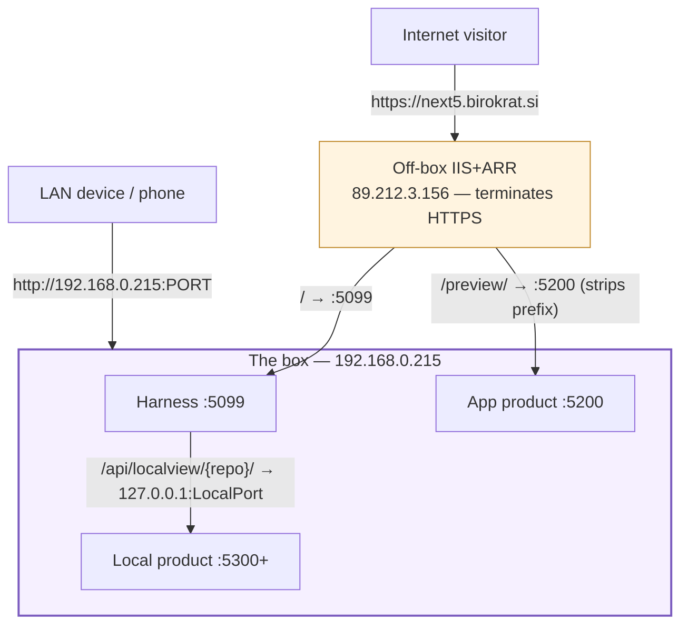
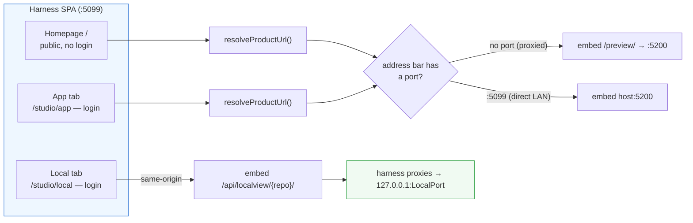
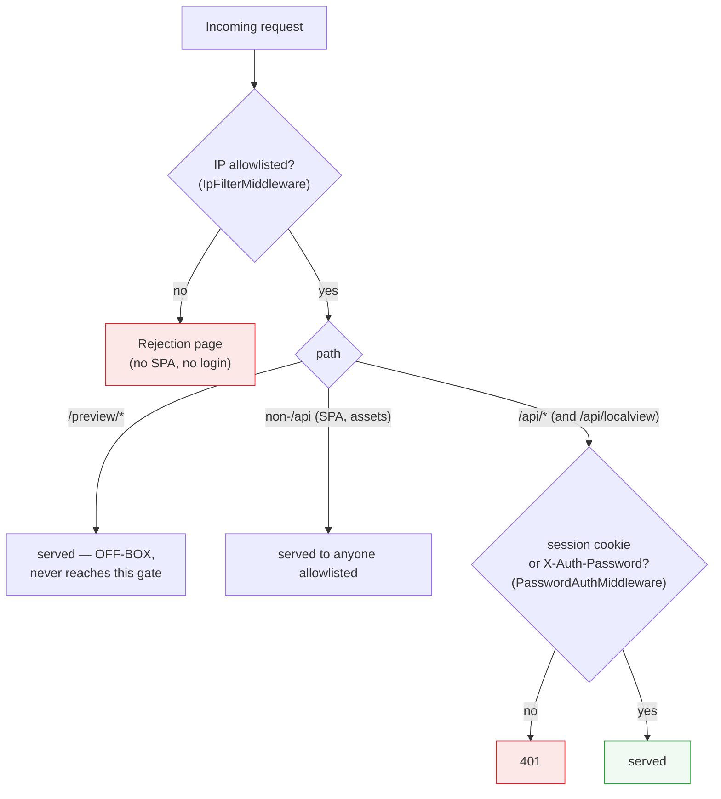
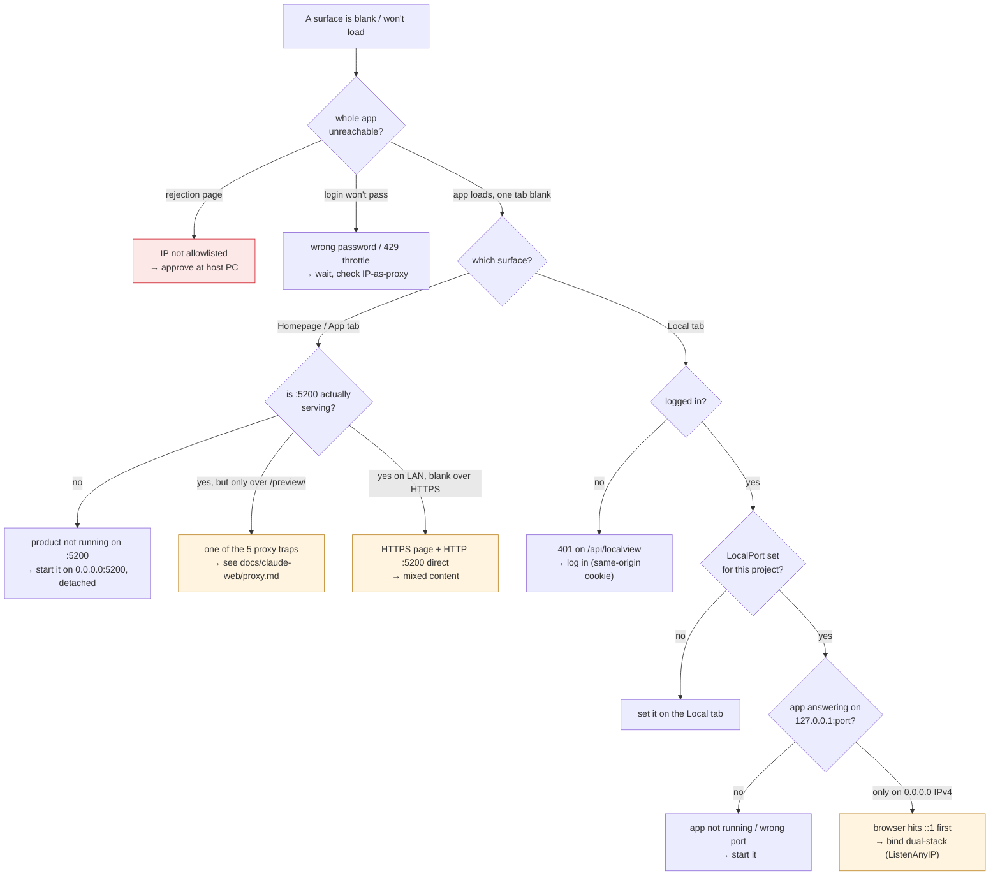

# Claude Web — networking map

How every web surface (homepage, App tab, Local tab) actually reaches a
browser, who is allowed through which gate, and — when something shows up
blank — exactly where to look. This is the picture to hold in your head
before debugging "it won't load."

> Hand-authored reference (NOT generated by "Prepare for preview" — those
> guides live in `docs/claude-web/`). Keep it current when the topology
> changes. Companion: [proxy guide](claude-web/proxy.md) for the five
> sub-path traps under `/preview/`.

## Cast (who and what)

| Name | What it is |
|------|------------|
| **Off-box IIS** | The IIS+ARR reverse proxy fronting `next5.birokrat.si` (public IP **89.212.3.156**). Runs on a *different* machine — **not** this box. Terminates HTTPS. |
| **The box** | `192.168.0.215` — the Windows host running everything below. |
| **Harness** | The Claude Web app (Kestrel) on **:5099**. Serves the SPA + `/api/*`. |
| **App product** | Whatever listens on the **Preview Port :5200** (the App tab's product; also shown on the public homepage). |
| **Local product** | A project's own app on its configured **LocalPort** (e.g. :5300), reached only through the harness. |
| **Operator** | Person at the host PC. **End User** | Person on a phone/browser, on the LAN or over the internet. |

## The two front doors

Everything arrives one of two ways. Which door you came through decides the
**protocol** (HTTPS vs HTTP) and the **host** in the address bar — and that,
in turn, decides how the App/Local tabs build their iframe URLs.

Two facts that cause most confusion:

1. **The off-box IIS is unmanageable from this box.** Its forward rules
   (`/`→:5099, `/preview/`→:5200) live on 89.212.3.156. We cannot add or
   change a rule from here — a missing forward is fixed *there*, not in code.
2. **Direct LAN ports are HTTP; the public door is HTTPS.** An HTTPS page
   cannot embed a plain-HTTP iframe (mixed content). This is why surfaces
   that work on the LAN can be blank over the public URL, and vice-versa.

## How each surface is served

All three are React views (homepage = the public Landing; App/Local tabs =
inside `/studio`). The difference is **what URL their iframe points at** and
**whether you must be logged in**.

- **Homepage (`/`)** — public Landing page; no login. Reads
  `GET /api/health` for `previewPort`/`previewUrl`, then iframes the App
  product via `resolveProductUrl()`.
- **App tab (`/studio/app`)** — same product, same `resolveProductUrl()`,
  but behind the login. `resolveProductUrl()` embeds the same-origin
  `/preview/` path when the page is proxied (no port in the address bar) and
  the raw `host:5200` when hit directly on the LAN.
- **Local tab (`/studio/local`)** — embeds the **same-origin** harness path
  `/api/localview/{repoId}/`, which the harness reverse-proxies to
  `127.0.0.1:LocalPort`. Because it's same-origin it inherits the page's
  protocol (no mixed content) and rides the session cookie — so it works
  over the internet, behind the login (see
  [local-app-proxy](../plans/local-app-proxy.md)).

## The gates (who gets through)

Two gates sit in front of the harness, plus one deliberate hole. Order
matters — the IP filter is outermost.

- **IP allowlist** (`IpFilterMiddleware`) — outermost, **no exemptions**. An
  unapproved IP gets a standalone rejection page, never the SPA or login.
  New IPs are approved only at the host PC (Guests tab is view/unlist only).
  Behind the off-box proxy, the real client IP comes from the **last**
  `X-Forwarded-For` hop, trusted only because the proxy's LAN IP is in
  `AppConfig.TrustedProxyIps` (`ClientIp.Get`). If that list is wrong, every
  visitor looks like the proxy.
- **Password** (`PasswordAuthMiddleware`) — guards **`/api/*` only**.
  Exempt: `GET /api/health`, `GET /api/auth/check`, `POST /api/auth/login`.
  Everything non-`/api` (the SPA shell, static assets) is served to anyone
  who cleared the IP gate — that's why the homepage needs no login.
- **The `/preview/` hole** — the off-box IIS forwards `/preview/`→:5200
  **ungated** (an accepted decision: static games only). It never touches
  the harness gates. The **Local tab** exists partly to serve private apps
  the gated way instead.

## LAN vs internet — what works where

| Surface | LAN (`http://192.168.0.215:…`) | Internet (`https://next5…`) | Gated? |
|---------|-------------------------------|-----------------------------|--------|
| Homepage `/` | harness :5099, iframes `host:5200` | IIS→:5099, iframes `/preview/` | no (public) |
| App tab | `host:5200` direct | `/preview/`→:5200 (5 traps apply) | login |
| Local tab | `/api/localview/`→127.0.0.1:port | same, same-origin over HTTPS | login + IP |
| Raw `:5200` / `:5300` | reachable on LAN | **not forwarded** (except :5200 via /preview/) | no |

## When it won't serve — the decision tree

Walk this before blaming React, races, or state. Most "blank surface" bugs
are one of these.

### Symptom → cause → fix

| Symptom | Likely cause | Fix |
|---------|--------------|-----|
| Standalone "not approved" page | IP not on the allowlist | Approve at the host PC; check `TrustedProxyIps` if everyone looks like the proxy |
| 429 on login | Brute-force throttle | Wait `retryAfterSeconds`; never hammer |
| Homepage/App tab "nothing running" | No product on :5200 | Start it on `0.0.0.0:5200`, detached |
| App tab fine on LAN, broken over `next5…/preview/` | One of the 5 sub-path traps | [proxy guide](claude-web/proxy.md): base path, fetch prefix, prefix-strip, 411, ARR cache |
| App tab blank over HTTPS, works on `localhost:5200` | HTTPS page embedding HTTP port | Use the LAN HTTP URL, or the proxied `/preview/` path |
| Local tab 401 / blank | Not logged in | Log in — the same-origin cookie then rides the iframe |
| Local tab "nothing on this port" | LocalPort unset, or app down | Set the port; start the app |
| Local tab blank, app *is* up on `127.0.0.1:port` | App bound IPv4-only; browser resolves `localhost`→`::1` | Bind dual-stack (`ListenAnyIP`) — [example](../plans/local-app-proxy.md) |
| Local tab works on LAN, not over the public URL | (pre-proxy) direct port iframe blocked as mixed content | Already fixed: the Local tab uses the same-origin proxy path |

## What we control vs what we don't

- **In our code (this box):** the harness gates, the `/api/localview/` proxy,
  how the App/Local tabs build URLs, what binds to :5099 / :5200 / :5300.
- **NOT ours (off-box):** the IIS forward rules (`/`→:5099, `/preview/`→
  :5200), HTTPS termination, the public DNS. A missing/!changed forward or a
  TLS issue there cannot be fixed from this box — `nslookup next5.birokrat.si`
  returns 89.212.3.156, a different machine. Escalate to whoever runs it.
