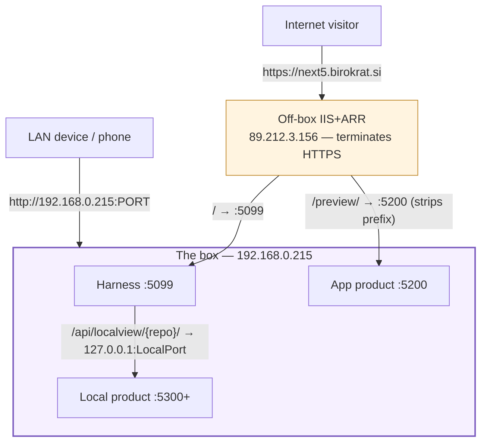

# Claude Web — networking map

The 30-second mental model of how every web surface (homepage, App tab,
Local tab) reaches a browser, who is allowed through, and where to look when
something won't load. Read this first; drill into a detail doc only when you
need it.

> Hand-authored reference (NOT generated by "Prepare for preview"). Keep it
> current when the topology changes. Progressive disclosure
> ([doc-principles #2](../plans/doc-principles.md)): this page stays thin and
> links down.
>
> - **[surfaces.md](networking/surfaces.md)** — how each surface builds its
>   iframe URL.
> - **[gates.md](networking/gates.md)** — who is allowed through (IP +
>   password + the `/preview/` hole).
> - **[troubleshooting.md](networking/troubleshooting.md)** — **open this when
>   a surface won't load**: decision tree + symptom→cause→fix.
> - **[local-product-guide.md](networking/local-product-guide.md)** — building
>   an app to embed in the Local tab? The contract to follow.

## Cast (who and what)

| Name | What it is |
|------|------------|
| **Off-box IIS** | The IIS+ARR reverse proxy fronting `next5.birokrat.si` (public IP **89.212.3.156**). Runs on a *different* machine — **not** this box. Terminates HTTPS. |
| **The box** | `192.168.0.215` — the Windows host running everything below. |
| **Harness** | The Claude Web app (Kestrel) on **:5099**. Serves the SPA + `/api/*`. |
| **App product** | Whatever listens on the **Preview Port :5200** (the App tab's product; also the public homepage). |
| **Local product** | A project's own app on its configured **LocalPort** (e.g. :5300), reached only through the harness. |
| **Operator** | Person at the host PC. **End User** | Person on a phone/browser, LAN or internet. |

## The two front doors

Everything arrives one of two ways. The door decides the **protocol** (HTTPS
vs HTTP) and the **host** in the address bar — which is what the App/Local
tabs build their iframe URLs from ([surfaces.md](networking/surfaces.md)).

Two facts behind most confusion:

1. **The off-box IIS is unmanageable from this box.** Its forward rules
   (`/`→:5099, `/preview/`→:5200) live on 89.212.3.156. A missing forward is
   fixed *there*, not in code (see [troubleshooting.md](networking/troubleshooting.md#what-we-control-vs-what-we-dont)).
2. **Direct LAN ports are HTTP; the public door is HTTPS.** An HTTPS page
   cannot embed a plain-HTTP iframe (mixed content) — so a surface can work
   on the LAN yet be blank over the public URL, and vice-versa.

## How each surface is served (one line each)

All three are React views; the difference is the iframe URL and whether you
must log in. Detail: [surfaces.md](networking/surfaces.md).

- **Homepage (`/`)** — public, no login; iframes the App product (:5200).
- **App tab (`/studio/app`)** — same product, behind login; `/preview/` when
  proxied, `host:5200` when hit directly on the LAN.
- **Local tab (`/studio/local`)** — same-origin `/api/localview/{repo}/`,
  which the harness proxies to `127.0.0.1:LocalPort` — works over the
  internet, behind login.

## LAN vs internet — what works where

| Surface | LAN (`http://192.168.0.215:…`) | Internet (`https://next5…`) | Gated? |
|---------|-------------------------------|-----------------------------|--------|
| Homepage `/` | harness :5099, iframes `host:5200` | IIS→:5099, iframes `/preview/` | no (public) |
| App tab | `host:5200` direct | `/preview/`→:5200 (5 traps apply) | login |
| Local tab | `/api/localview/`→127.0.0.1:port | same, same-origin over HTTPS | login + IP |
| Raw `:5200` / `:5300` | reachable on LAN | **not forwarded** (except :5200 via /preview/) | no |

Gate details — who is allowed through each path — in
[gates.md](networking/gates.md).
