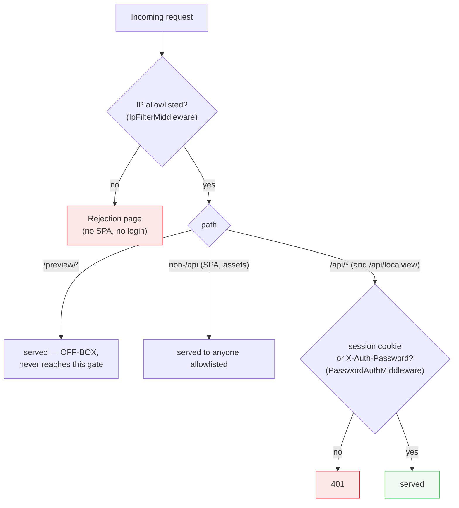

# Networking — the gates (who gets through)

Detail for access control. Overview: [../networking.md](../networking.md).
How surfaces are served: [surfaces.md](surfaces.md). When access *fails*:
[troubleshooting.md](troubleshooting.md).

Two gates sit in front of the harness, plus one deliberate hole. Order
matters — the IP filter is outermost.

## IP allowlist (`IpFilterMiddleware`)

Outermost, **no exemptions**. An unapproved IP gets a standalone rejection
page — never the SPA or the login screen. New IPs are approved only at the
host PC (the Guests tab is view/unlist only).

Behind the off-box proxy, the real client IP is taken from the **last**
`X-Forwarded-For` hop — trusted *only* because the proxy's LAN IP is listed
in `AppConfig.TrustedProxyIps` (`ClientIp.Get`). A direct hit on :5099 (peer
not loopback / not a trusted proxy) cannot spoof an approved IP. **If
`TrustedProxyIps` is wrong, every visitor looks like the proxy** and the
allowlist becomes all-or-nothing.

## Password (`PasswordAuthMiddleware`)

Guards **`/api/*` only**. A request is authorized by either the
`claudeweb_session` HttpOnly cookie (the browser path) or an
`X-Auth-Password` header (the tooling path). Exempt: `GET /api/health`,
`GET /api/auth/check`, `POST /api/auth/login`.

Everything **non-`/api`** (the SPA shell, static assets) is served to anyone
who cleared the IP gate — which is why the homepage needs no login, and why
the **Local tab works**: its iframe requests are under `/api/localview/*`, so
the same-origin session cookie authorizes them automatically.

Failed attempts on either path feed a per-IP brute-force throttle (→ 429).

## The `/preview/` hole

The off-box IIS forwards `/preview/`→:5200 **ungated** — an accepted decision
(static games only). It never touches the harness gates above. The **Local
tab** exists partly to serve *private* apps the gated way instead of through
this open path.
