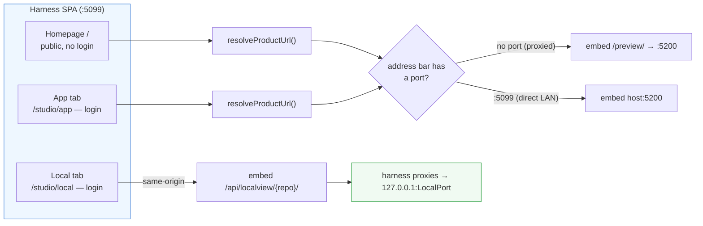

# Networking — how each surface is served

Detail for the three web surfaces. Overview + mental model:
[../networking.md](../networking.md). Who's allowed through:
[gates.md](gates.md).

All three are React views (homepage = the public Landing; App/Local tabs =
inside `/studio`). The difference is **what URL their iframe points at** and
**whether you must be logged in**.

## Homepage (`/`)

The public Landing page; **no login**. It reads `GET /api/health` for
`previewPort`/`previewUrl`, then iframes the App product via
`resolveProductUrl()`. Because it is served to anyone who clears the IP gate
([gates.md](gates.md)), this is the one surface a stranger can see.

## App tab (`/studio/app`)

The **same** App product as the homepage, same `resolveProductUrl()`, but
behind the login. `resolveProductUrl()` decides the embed URL from the
address bar:

- **Proxied** (no port in the address bar → the public `next5…` HTTPS door):
  embed the same-origin **`/preview/`** path, which the off-box IIS forwards
  to :5200. This is where the five sub-path traps apply — see
  [proxy guide](../claude-web/proxy.md).
- **Direct LAN** (`:5099` in the address bar): embed the raw **`host:5200`**.

## Local tab (`/studio/local`)

Embeds the **same-origin** harness path **`/api/localview/{repoId}/`**, which
the harness reverse-proxies to **`127.0.0.1:LocalPort`**
([plans/local-app-proxy.md](../../plans/local-app-proxy.md)). Two consequences
fall out of "same-origin":

- It inherits the page's protocol, so **no mixed-content block** — it works
  over the public HTTPS door, not just the LAN.
- It rides the session cookie, so it's **gated by login** automatically
  (the request is under `/api/*`; see [gates.md](gates.md)).

The embedded product must use **relative URLs** so they resolve under the
`/api/localview/{repo}/` prefix (the iframe `src` ends in `/`). Same idea as
the `/preview/` sub-path, minus the public exposure.

> **Building a product to embed here?** Follow the contract in
> [local-product-guide.md](local-product-guide.md) — dual-stack bind, serve
> at root, relative URLs.
