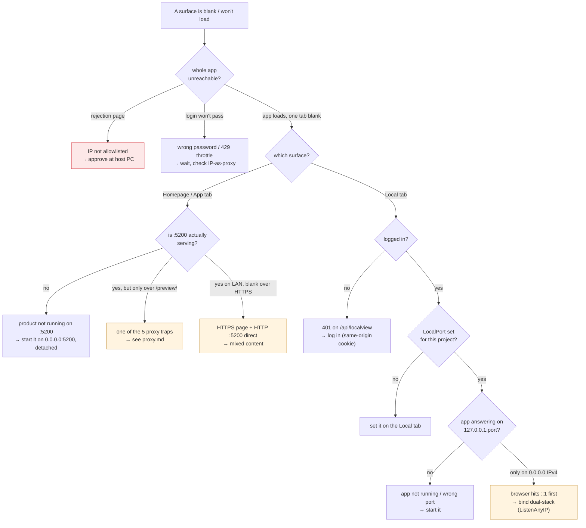

# Networking — when it won't serve

Open this when a surface is blank. Overview:
[../networking.md](../networking.md). Walk the tree before blaming React,
races, or state — most "blank surface" bugs are one of these.

## Symptom → cause → fix

| Symptom | Likely cause | Fix |
|---------|--------------|-----|
| Standalone "not approved" page | IP not on the allowlist | Approve at the host PC; check `TrustedProxyIps` if everyone looks like the proxy ([gates.md](gates.md)) |
| 429 on login | Brute-force throttle | Wait `retryAfterSeconds`; never hammer |
| Homepage/App tab "nothing running" | No product on :5200 | Start it on `0.0.0.0:5200`, detached |
| App tab fine on LAN, broken over `next5…/preview/` | One of the 5 sub-path traps | [proxy guide](../claude-web/proxy.md): base path, fetch prefix, prefix-strip, 411, ARR cache |
| App tab blank over HTTPS, works on `localhost:5200` | HTTPS page embedding HTTP port | Use the LAN HTTP URL, or the proxied `/preview/` path |
| Local tab 401 / blank | Not logged in | Log in — the same-origin cookie then rides the iframe ([surfaces.md](surfaces.md)) |
| Local tab "nothing on this port" | LocalPort unset, or app down | Set the port; start the app |
| Local tab blank, app *is* up on `127.0.0.1:port` | App bound IPv4-only; browser resolves `localhost`→`::1` | Bind dual-stack (`ListenAnyIP`) — [example](../../plans/local-app-proxy.md) |
| Local tab works on LAN, not over the public URL | (pre-proxy) direct port iframe blocked as mixed content | Already fixed: the Local tab uses the same-origin proxy path |

## The recurring footguns (why these keep happening)

- **IPv4-only bind.** `http://0.0.0.0:port` is IPv4-only, but browsers resolve
  `localhost` to `::1` (IPv6) first. The connect then fails or stalls. Bind
  **dual-stack** (`ListenAnyIP` / both `0.0.0.0` and `[::]`).
- **Mixed content.** An HTTPS page can't embed an HTTP iframe. The Local tab
  dodges this by being same-origin (the harness does the HTTP hop to
  `127.0.0.1` server-side); a *direct* `host:port` iframe over the public
  HTTPS door cannot.
- **The five `/preview/` sub-path traps** (asset URLs, fetch URLs, server-side
  prefix strip, body-less POST 411, ARR output cache). Full list and fixes:
  [proxy guide](../claude-web/proxy.md). The ARR cache one mimics a React
  stale-state bug — suspect it whenever "works locally, breaks behind the
  proxy" involves polling + mutations.

## What we control vs what we don't

- **In our code (this box):** the harness gates, the `/api/localview/` proxy,
  how the App/Local tabs build URLs, what binds to :5099 / :5200 / :5300.
- **NOT ours (off-box):** the IIS forward rules (`/`→:5099, `/preview/`→
  :5200), HTTPS termination, the public DNS. A missing/changed forward or a
  TLS issue there **cannot be fixed from this box** — `nslookup
  next5.birokrat.si` returns 89.212.3.156, a different machine. Escalate to
  whoever runs it.
