# Sofa mode — the harness from the living-room sofa

> Fleet card `68090860b8684594a52c0b254f80c217` · openspec `sofa-mode` · PR #164 (the harness leg).
> The living-room leg — a WebView2 `HarnessPresenter` in the projector window and a Harness tab in
> daljinski — is its own PR in the living-room repo; its brief is
> [`openspec/changes/sofa-mode/living-room-brief.md`](../../openspec/changes/sofa-mode/living-room-brief.md).

The living-room PC drives a projector and runs this harness. Until now the Operator used the
harness there with keyboard and mouse at the desk — or, from the sofa, with daljinski's remote
touchpad: "better than nothing, but too much work." Sofa mode makes the phone the remote and the
projector the screen, **without inventing a new screen**: the projector keeps showing the real
harness in a browser, and the phone tells that browser what to open.

The screenshots below are from the automated end-to-end run on an isolated copy of this build with
this machine's dock and board (`client/tests/ui/e2e-sofa-remote.mjs`, 26 checks green). No prompt
was sent in that run — it would have started a real agent.

---

## The three screens that changed

### 1 · The phone — `/remote`

A plain web page fitted for a phone (Android first; not a PWA — the same kind of thing daljinski is).

| First visit: pair | Paired: "projector is showing …" | An agent opened: the composer in reach |
|---|---|---|
| 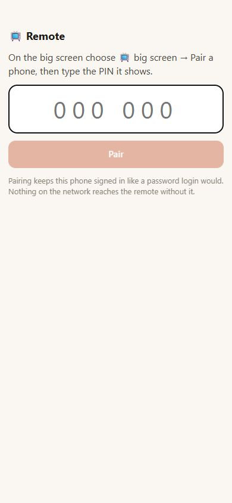 | 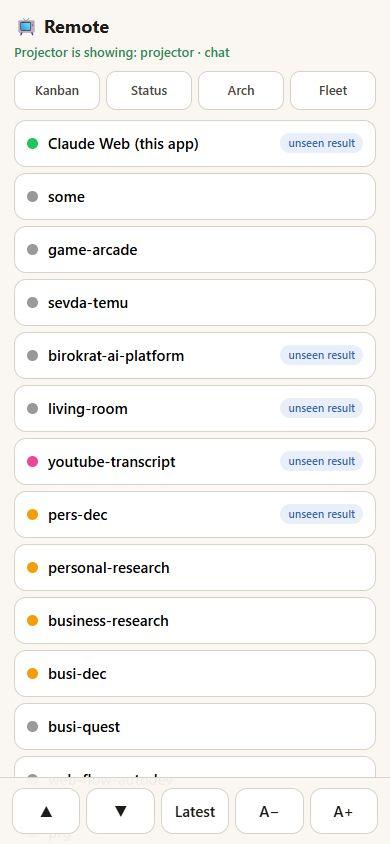 | 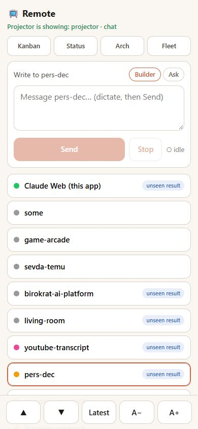 |

| Peek at the last reply | Writing to the arch | A wrong PIN |
|---|---|---|
| 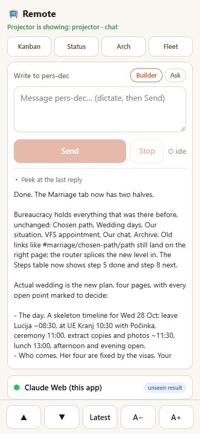 | 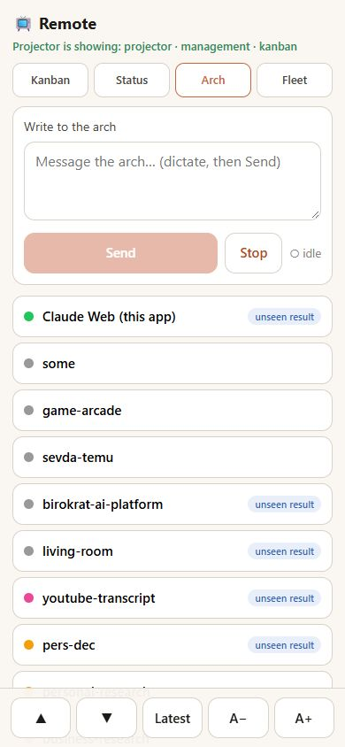 | 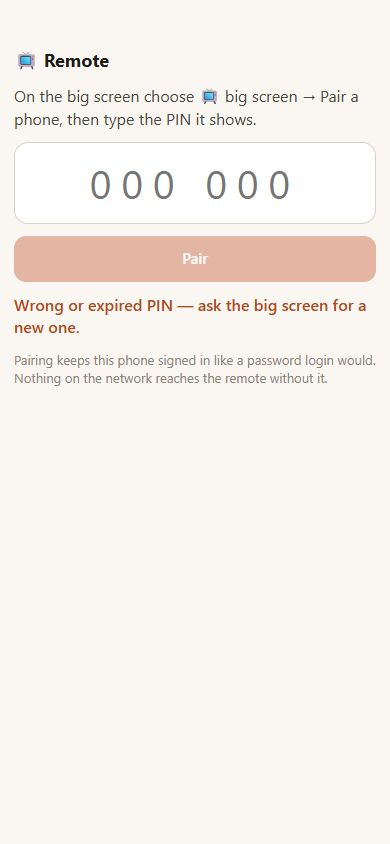 |

### 2 · The projector — the real harness, now a *big screen*

The only new element in the harness UI is the header pill **📺 big screen**. On, the tab takes the
phone's commands and tells the phone what it shows. Its menu mints the pairing PIN.

| The pill's menu (with the last outcome line) | Pair a phone — the PIN, large, 5 minutes, single use |
|---|---|
| 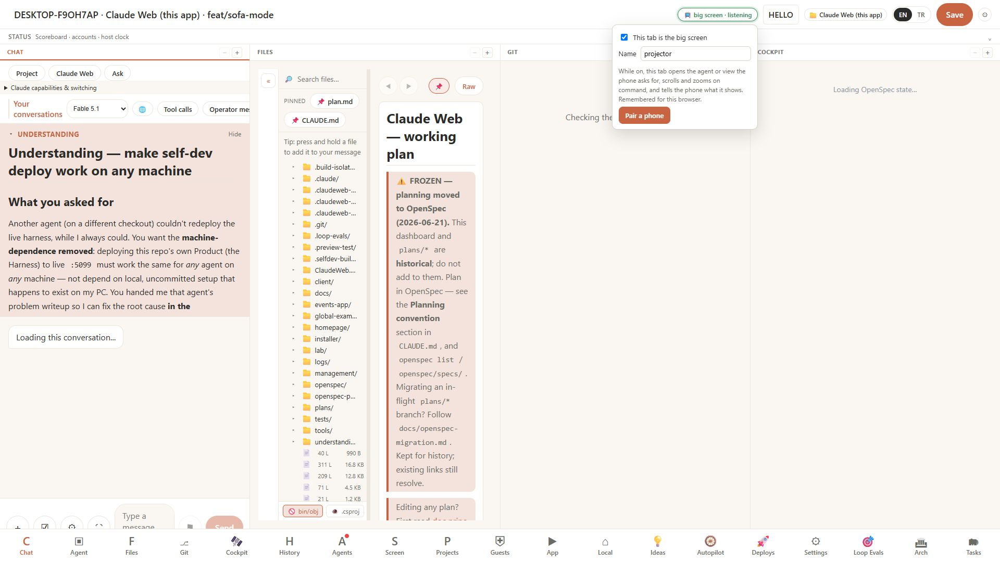 | 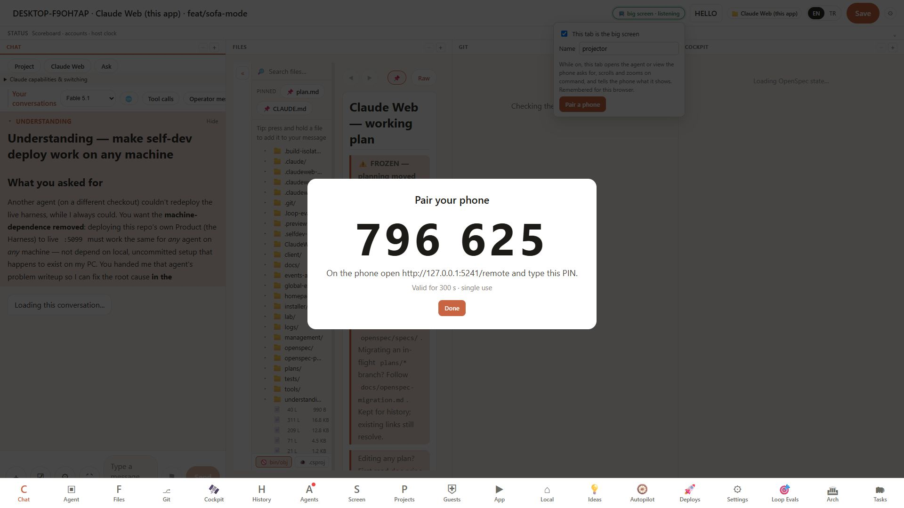 |

After the phone's tap on **pers-dec**, the projector shows exactly what a click on pers-dec's chip on
the Kanban would show — the Agent tab with that dock:

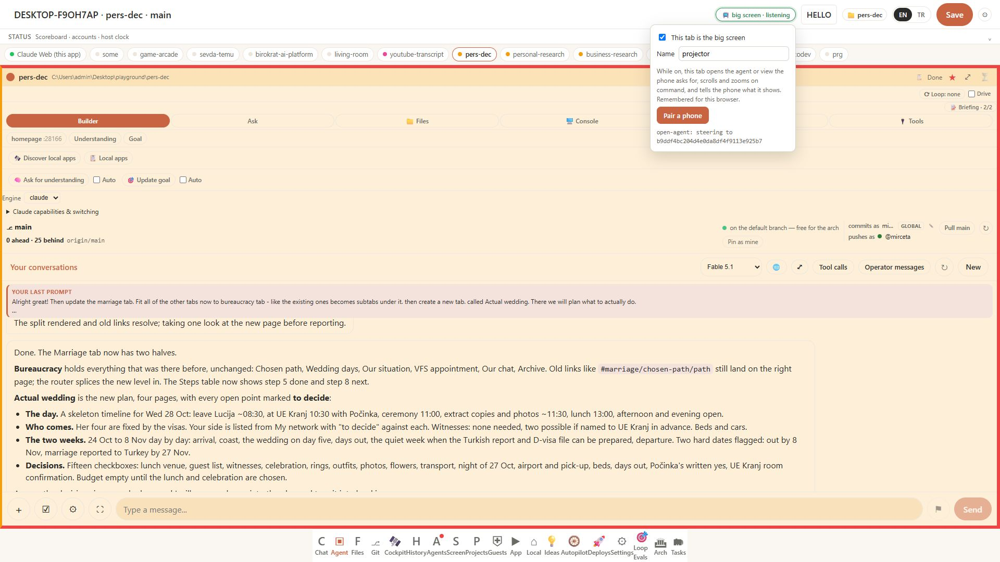

### 3 · The Management App — a big screen too

Tap **Kanban** on the phone and the projector hops to the Management App's Kanban and keeps
listening (the headless listener rides in that bundle); tap **Arch** and it stays there on the Arch
tab; tap an agent and it hops back to the studio.

| Management · Kanban | Management · Arch |
|---|---|
| 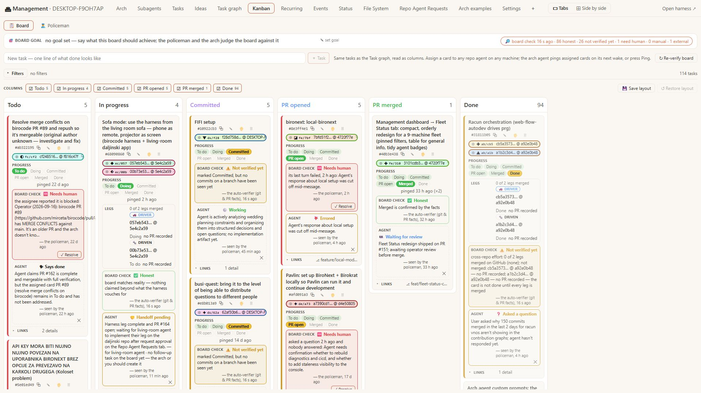 | 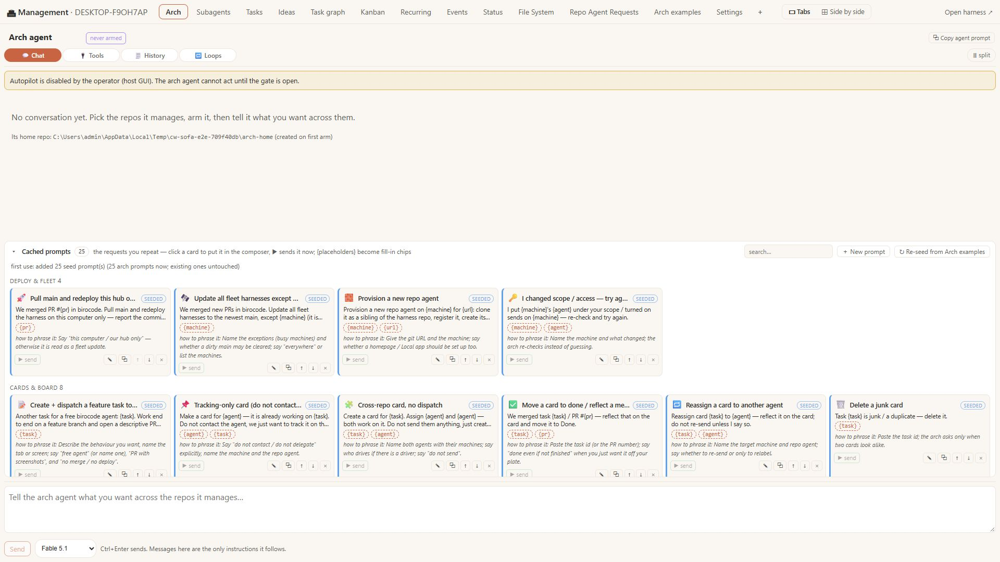 |

---

## User stories

**Pairing — once per phone.**
*As the Operator on the sofa, I pick up my phone, open `http://192.168.1.105:5099/remote`, and see a
PIN field. On the projector I click 📺 big screen → Pair a phone; six large digits appear. I type them
on the phone and I'm in — the phone is now signed in exactly as if I had typed the access code, and it
stays signed in. A wrong PIN is refused; the same PIN cannot be used twice; five wrong tries lock the
phone out for a minute, like five wrong passwords would.*

**Pick an agent.**
*I see my agents listed with their state — busy, waiting for you, unseen result — and a line that
says what the projector is showing right now. I tap pers-dec. Within a second the projector shows
pers-dec's dock in the Agent tab, as if I had clicked its chip on the Kanban.*

**Sofa view — one tap.** *The dock on the projector is too small to read: its top part (lanes, chips, rows, engine, git) eats the height. I tap 🛋 Sofa view on the phone: the dock does what I would do with the mouse — presses ⤢ so the chat covers its top part, and, because an app is pushed, splits 30 / 70 with the app beside the chat. No app pushed? The chat alone, full width; the Apps row on the phone pushes one and the dock splits at once. Tap again (or ⤡ on the dock) and everything is back.*

| The phone: 🛋 Sofa view · on, the Apps row | The projector: ⤢ on, pers-dec's page at 70 %, the chat at 30 % |
|---|---|
| 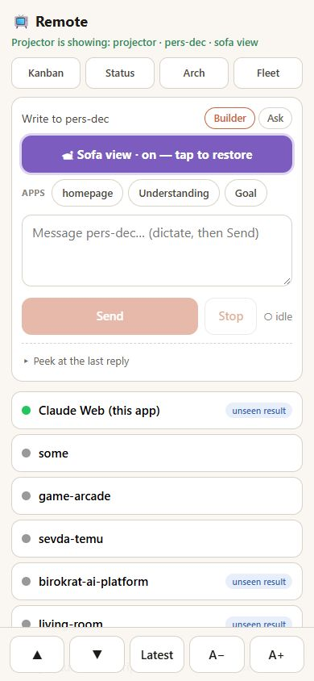 | 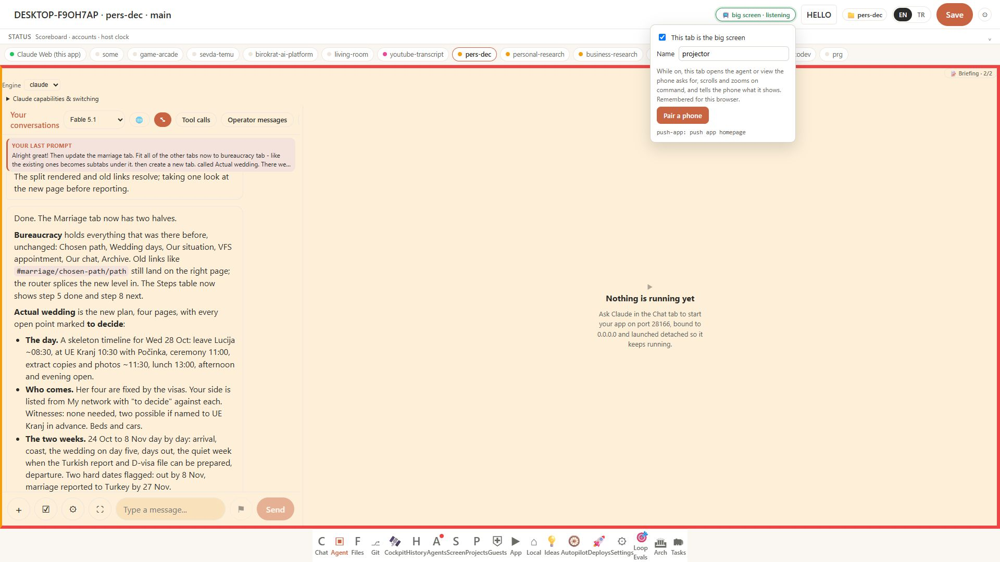 |

**Read.**
*The reply is long. ▲ and ▼ page the conversation on the projector; Latest jumps back down; A+ makes
the type larger for the distance. The projector remembers the zoom.*

**Dictate and send.**
*I dictate my prompt with Wispr Flow into the composer, read it over, press Send. The dock on the
projector shows my message and streams the reply as it does for any run. The phone says "running";
Stop is one tap. If a run is already live on that lane, the phone says "busy" instead of failing
silently, and keeps what I typed.*

**Peek.**
*I didn't catch the end of the reply on the projector — "Peek at the last reply" shows it on the
phone, collapsed until I ask.*

**Answer a question.**
*The agent asks "Two statements match October. Which one?" with three options. The phone mirrors
the options as buttons; a tap sends my choice as the next message — exactly what the question card on
the projector does on a click.*

**Talk to the arch, back to the board.**
*I tap Arch; the projector switches to the arch's conversation and the composer now writes to the
arch. I tap Kanban; the projector shows the board. I never touched the keyboard.*

**Nothing listening.**
*If no screen has the pill on, the phone says so — "no screen is listening — on the projector switch
on 📺 big screen" — and still works as a plain "message my agents" page.*

**Any Chrome tab, anywhere.**
*On another machine I open the harness in Chrome, switch the pill on, and that tab is the big screen.
Nothing from the living-room repo is needed; the living-room presenter is the nicer host, not a
prerequisite.*

---

## How it is built

```
phone  /remote ──POST /api/remote/commands {type,args}──▶ harness ──GET /api/remote/commands?after=seq──▶ big-screen tab
       ◀── GET /api/remote/screens (heartbeats) ────────────────────◀── POST /api/remote/screens every 5 s ──┘
       ──POST /api/chat (X-Repo-Id) ───────────────────────────────▶ the run; the dock on the projector streams it as always
```

- **One dispatch table** (`client/src/components/remote/remoteDispatch.js`), reachable two ways: the
  polling listener (`useBigScreen`) in a tab with the pill on, and `window.claudewebRemote(cmd)` for
  an embedding host (the living-room WebView2). Commands: `open-agent` (the open-agent window message
  the Kanban chip's named tab already answers — or the `/studio?agent=` deep link from the Management
  App), `open-view` (the router, or the Management tab, hopping bundles when needed and keeping the
  `?screen=` name), `scroll` (the active dock's message list), `zoom` (steps, remembered), `lane`
  (a DOM event the dock's lane toggle listens to), `stop`. Nothing new is rendered.
- **Server** (`ClaudeWeb.App/Services/Remote`): `RemoteCommandStore` — a ring of 100 with a `seq`; a
  fresh listener reads `after=-1` and gets no replay; screens drop after 20 s of silence;
  `remote.command` on the harness event feed. `RemotePairing` — 6 digits, 5 minutes, single use,
  constant-time compare. `RemoteController` — every route behind the IP + password gates except the
  pair redeem, which is exempt exactly like `/api/auth/login`, throttled by the same per-IP lockout,
  and mints the same session cookie.
- **Capabilities** `bigScreen` and `remoteView` (Advanced). The `/remote` page itself is reached by
  URL + pairing and is not mode-gated (its security is the pairing, not the device mode).

## Verification

- `tests/ClaudeWeb.Tests/RemoteTests.cs` (20) — ring, seq, watermark, no replay, screen expiry, PIN
  rules; suite 926 green.
- `remoteDispatch.test.mjs` + `remoteModel.test.mjs` (15) — view resolution, URLs, zoom ladder, the
  dispatcher against a fake page, badges, question extraction; suite 270 green.
- `.claudeweb-preview/sofa-remote-e2e.ps1` → `client/tests/ui/e2e-sofa-remote.mjs` — an isolated
  harness, a projector tab and a phone; 26 checks (the gates, pairing, open-agent, heartbeat, zoom,
  peek, lane, the Management hop and back, the hook). It found one real bug on the way: the PIN veil
  auto-closed at once because its countdown started at 0 — fixed.

## Try it after the deploy

1. On the projector's Chrome, open the harness, click **📺 big screen**, tick "This tab is the big
   screen", click **Pair a phone**.
2. On the phone open `http://192.168.1.105:5099/remote`, type the PIN.
3. Tap an agent.

## Not in this PR

The living-room leg (dispatched to its agent); a `&nopoll=1` for hook-only hosts; Web Push / PWA /
in-app voice (declined — Wispr Flow does dictation); off-LAN reachability.
