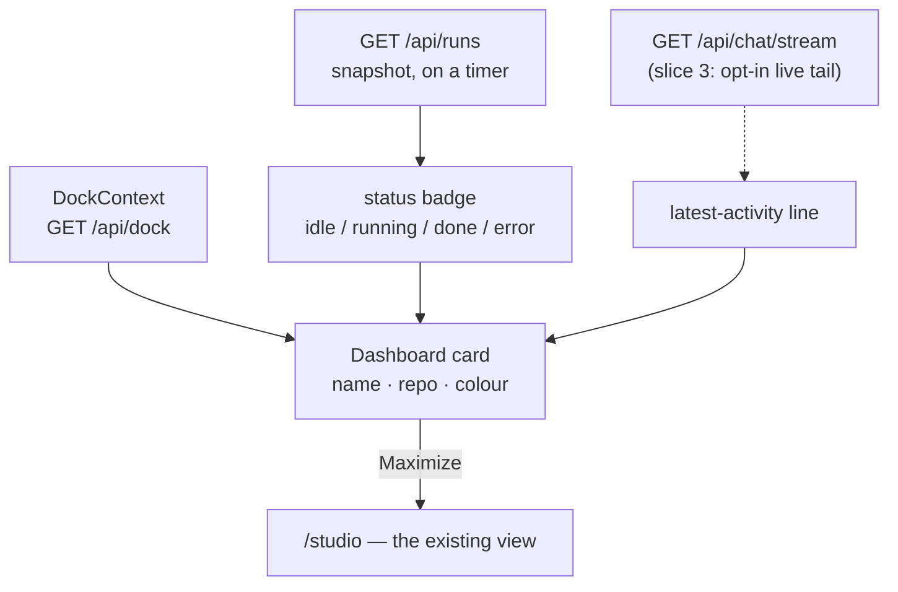
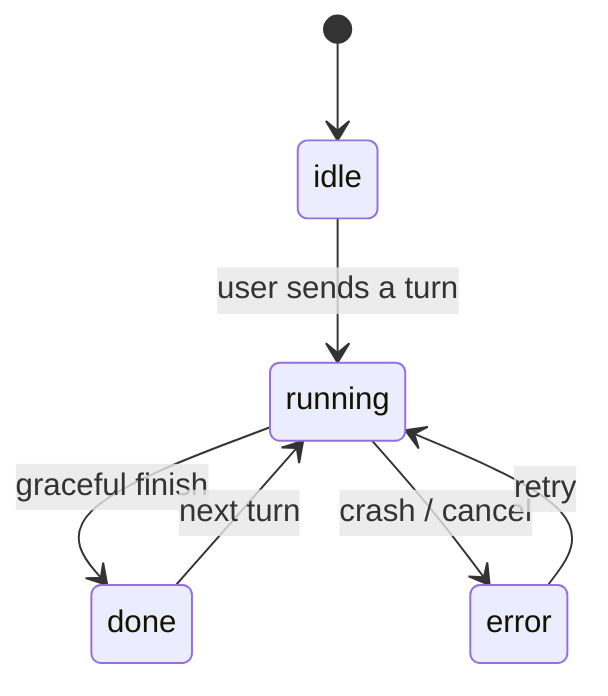

# Agent dashboard — technical design

The plumbing half of [agent-dashboard.md](agent-dashboard.md). The experience
it serves is in [agent-dashboard-ux.md](agent-dashboard-ux.md).

## This is mostly a new *view* over existing plumbing

- **Agent list** — `DockContext` already holds every agent
  (`{ id, repoId, repoName, sessionId, status, color, stash }`) via `/api/dock`,
  persisted server-side. The dashboard renders this same list as a grid.
- **Per-agent status** — `status` is already `idle | running | done | error`
  (the Agents-tab legend + per-agent colour). Snapshot from `GET /api/runs`.
- **Live activity** — `GET /api/chat/stream?after=N` (SSE) is how the Chat tab
  tails what an agent is currently doing; a cell can read the same.
- **Maximize** — `setActiveTab(id)` + navigate `/studio` (exactly what clicking
  an Agents-tab card does today — `DockContext` ~lines 173-178).
- **Grid baseline** — `PaneStrip` / `useMultiPane` already lay out N panes; the
  dashboard is a sibling (a CSS grid of agent cells, not panes of one agent).

## Where each cell's information comes from

## Agent status the badge reflects (already modelled today)

## Liveness depth (the v1 cost tradeoff)

- **Default (v1): status badge + a one-line latest-activity string, refreshed on
  a timer** (poll `/api/runs` + a cheap "latest activity" source). One light
  poll, no per-cell connections.
- **Deferred: a live SSE tail in every cell.** N concurrent `/api/chat/stream`
  connections is the heavy part — prove the cheap version first, then make the
  tail opt-in per agent (slice 3).

## Capability + placement

- New capability flag `agentDashboard`, **Advanced** (per the convention: new
  features default to advanced unless promoted) in `UiModeContext.jsx`.
- New tab registered in `tabRegistry.jsx` → route under `/studio` (default: a
  separate "Dashboard" tab; see the UX doc for the new-tab-vs-evolve-Agents
  question).

## Slices

- **Slice 1 — static grid + maximize. ✅ built & verified.** `agentDashboard`
  capability + a "Dashboard" tab (`pages/Dashboard.jsx`, `dashboard.css`,
  registry/route/`KnownTabs`/i18n); a responsive CSS grid of agent cards from
  `DockContext` (name, status badge + dot, colour mark); a Maximize button per
  card wired to `setActiveTab` + `/studio`. Browser-verified: grid renders all
  6 dock agents, Maximize lands on `/studio`, tab hidden in Basic mode.
- **Slice 2 — liveness.** Per-card status refresh + a one-line latest-activity
  string, updated on a timer (and/or reconciled from `/api/runs`).
- **Slice 3 (later, maybe) — live tail.** An opt-in scrolling stream tail per
  cell, bounded so we don't open N heavy SSE streams at once.

## Out of scope

- Spawning / editing / deleting / configuring agents (stays in the Agents tab).
- Any cross-machine / remote-agent aggregation — this is *this* computer's dock.
- Changing how individual agents run.
