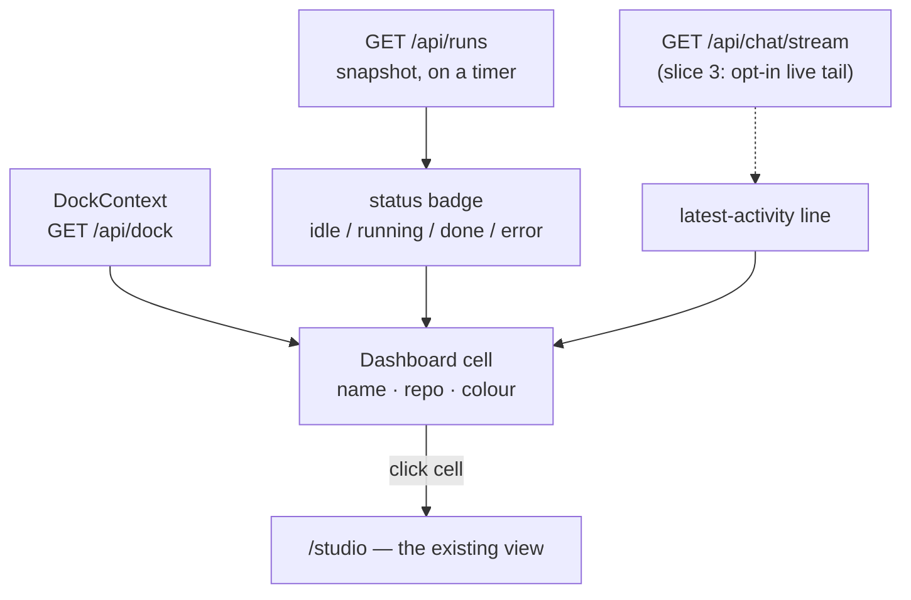
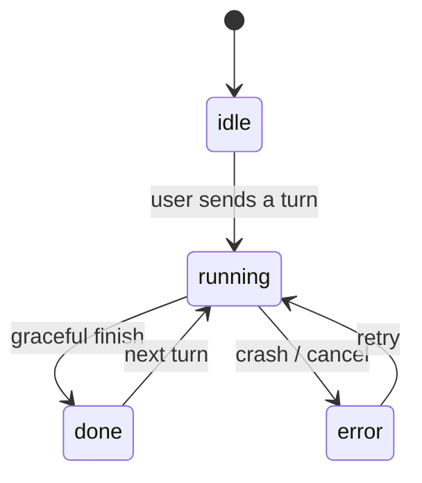

# Agent dashboard — technical design

The plumbing half of [agent-dashboard.md](agent-dashboard.md). The experience
it serves is in [agent-dashboard-ux.md](agent-dashboard-ux.md).

## This is mostly a new *view* over existing plumbing

- **Agent list** — `DockContext` already holds every agent
  (`{ id, repoId, repoName, sessionId, status, color, stash }`) via `/api/dock`,
  persisted server-side. The dashboard renders this same list as a grid.
- **Per-agent status** — `status` is already `idle | running | done | error`
  (the Agents-tab legend + per-agent colour). Snapshot from `GET /api/runs`.
- **Live activity** — `GET /api/chat/stream?after=N` (SSE) is how the Chat tab
  tails what an agent is currently doing; a cell can read the same.
- **Maximize** — `setActiveTab(id)` + navigate `/studio` (exactly what clicking
  an Agents-tab card does today — `DockContext` ~lines 173-178).
- **Grid baseline** — `PaneStrip` / `useMultiPane` already lay out N panes; the
  dashboard is a sibling (a CSS grid of agent cells, not panes of one agent).

## Where each cell's information comes from

## Agent status the badge reflects (already modelled today)

## Liveness depth (the v1 cost tradeoff)

- **Default (v1): status badge + a one-line latest-activity string, refreshed on
  a timer** (poll `/api/runs` + a cheap "latest activity" source). One light
  poll, no per-cell connections.
- **Deferred: a live SSE tail in every cell.** N concurrent `/api/chat/stream`
  connections is the heavy part — prove the cheap version first, then make the
  tail opt-in per agent (slice 3).

## Capability + placement

- Capability flag `agentDashboard`, **Advanced** (per the convention: new
  features default to advanced unless promoted) in `UiModeContext.jsx`.
- **Not a tab.** A top-bar button in `Layout.jsx` (`app-header__actions`)
  toggles a full-screen overlay that replaces the content region and hides the
  bottom nav / pane strip. The button only renders when `agentDashboard` is on
  **and** `DockContext` holds 2+ agents. State (`dashOpen`) lives in
  `StudioShell`; Escape / the in-overlay × / the button itself close it.

## Slice 4 feasibility — the "wall of phones" (researched 2026-06-14)

Goal: each cell renders that agent's *real, live* view, not a summary — like N
mobile phones side by side, each showing one agent's single-tab view.

### What's already solved

- **Rendering a view without the router.** `PaneStrip.jsx` renders
  `{pane.element}` directly (not via `<Outlet>`), so a cell can mount a view
  component straight up.
- **Per-agent conversation state.** `ChatContext` already stores every
  conversation in a `convos` map keyed by tab id, with per-key abort / seq /
  stop refs. The storage is multi-agent-ready.

### The biggest problem — the repo global (only bites the *full* version)

`api/client.js` holds a single module-level `let _repoId` (one per browser tab).
`authHeaders()` stamps `X-Repo-Id: _repoId` on every request unless the caller
passes an explicit `{ repoId }` override. There are ~80 API call-sites in the
client; only ~8 pass the override. So the app assumes **one current repo at a
time**. N live agents = N current repos simultaneously → the danger is **silent
cross-repo bleed**: a phone for repo A issuing a write that lands on repo B
because one Files/Git/History call-site forgot the override. Fixing the full
version means threading `repoId` through ~72 call-sites — tedious and
error-prone. That is the ~6.5/10 cost.

### Why Chat-only sidesteps it (~4/10)

Every chat API call **already threads `{ repoId }` explicitly** (verified in
`ChatContext.jsx`): `apiStream('/chat')` (send), `apiStreamGet('/chat/stream')`
(reattach), `apiPost('/chat/stop')`, `apiUpload('/upload')`,
`apiGet('/sessions/{id}/messages')` (transcript), `apiGet('/sessions')`
(picker). So the repo-global blocker **does not apply to chat** — no cross-repo
bleed risk, because chat never trusts the global in the first place.

The remaining obstacle is specific and contained: **`ChatContext` exposes only
the single *active* conversation.** `activeKey` / `activeRepoId` are single
values, and `send` / `stop` / `openPicker` act on whatever is active; `useChat()`
surfaces just that one. To render N chats at once, refactor the provider so a
conversation's state + actions can be addressed **by key** — e.g. a
`useChatFor(key, repoId)` that the per-cell phone consumes. The per-key storage
and refs already exist; this is mostly re-parameterising the action functions.
One well-structured file.

**Avoid:** mounting N independent `<ChatProvider>`s (one per phone). Each
provider also runs `reconcile()`, the `visibilitychange` listener, and the
"one run per repo" arbitration — N copies would each poll `/api/runs` and fight
over reattaching. Refactor the single provider instead.

### Open questions (carried into Slice 4 design)

1. **Which view per phone** — Chat only to start, or the full per-agent tab bar?
   (The tab bar pulls in the 6.5/10 repo-global work; Chat-only does not.)
2. **Interactive or read-only** — type/send in each phone, or mirror with a
   "maximise to interact"?
3. **Where it lives** — a toggle inside the dashboard (cards ↔ phones), or
   replace the cards entirely?
4. **Scale / small screens** — cap the phone count, and how to collapse when narrow.

## Slices

- **Slice 0 — scope revert. 👈 do first.** Remove the uncommitted, undeployed
  management powers from `pages/Dashboard.jsx` + `dashboard.css` (New-agent
  picker, Pull main, colour swatch + palette, close ×, legend, related
  handlers/state/CSS). Delete `lib/agentColors.js` and re-inline its constants
  in `Agents.jsx`. **Keep:** the square grid, liveness, git state, and
  `lib/gitSync.js`. Net result = the committed `548d6e7` behaviour (view +
  switch + richer read-only info).
- **Slice 1 — static grid + open-agent. ✅ built & verified.** First shipped as
  a bottom-nav tab; **redirected** to a top-bar full-screen overlay.
  `agentDashboard` capability; `pages/Dashboard.jsx` + `dashboard.css` render a
  responsive CSS grid of agent cells from `DockContext` (name, status badge +
  dot, colour mark); the whole cell is clickable → `setActiveTab` + `/studio` +
  close. Top-bar entry (`DashboardButton`) gated Advanced + 2+ agents. No tab /
  route / `KnownTabs` entry.
- **Slice 2 — liveness. ✅ built & verified.** While the overlay is open,
  `pages/Dashboard.jsx` polls `GET /api/runs` (per-repo status snapshot) +
  `GET /api/sessions/{sessionId}/messages` (repo-scoped, last line = activity)
  every 5s and keeps the result **view-local** (no DockContext writes, no
  per-cell SSE). A `busy` guard skips overlapping ticks; the effect teardown
  stops polling on close. Each cell shows the fresher status badge + a
  multi-line-clamped activity string (falling back to `dashboard.noActivity`).
  Cells also show **git state** — branch + ahead/behind lines — matching the
  Agents tab: a best-effort `GET /api/git/status` per unique `repoId`, fetched
  once on open, formatted with the shared `lib/gitSync.js#syncLines` (extracted
  from Agents.jsx so both views stay in sync). Cells lay out in a **square-ish
  grid** (columns = ⌈√n⌉, set inline by `Dashboard.jsx`).
- **Slice 3 (later, maybe) — live tail.** An opt-in scrolling stream tail per
  cell, bounded so we don't open N heavy SSE streams at once.
- **Slice 4 — wall of phones (Chat-only). ✅ built & verified.** `ChatContext`
  now exposes per-key actions (`sendTo`/`stopTo`/`startNewIn`/`resumeIn`/
  `seedConvo`/`loadSessionsFor`) and a `useChatFor({ key, repoId, tabId,
  sessionId })` hook that returns the same shape `<Chat>` consumes but bound to
  one background agent; the active `useChat()` is unchanged (thin wrappers over
  the same primitives). `components/dashboard/PinnedAgent.jsx` = a phone frame
  (tappable header → maximise) wrapping `<Chat chat={…} embedded />`. `Chat`
  gained `chat`/`embedded` props; embedded mode drops the app-level chrome
  (Claude/Term toggle, project/harness scopes, understanding panel) and the
  stash button (keyed to the *active* tab — would cross-write), and the CSS
  un-fixes the composer so N phones don't stack it at the window bottom.
  `Dashboard.jsx` has a Cards/Phones toggle (remembered in
  `localStorage['claudeweb_dash_view']`); Phones reuses the square grid with
  fixed-height rows, collapsing to one column under 700px. **No Files/Git/
  History call-sites touched** — a *full* tab-bar-per-phone would need the
  repo-global work above.

## Out of scope

- Spawning / editing / deleting / configuring agents (stays in the Agents tab).
- Any cross-machine / remote-agent aggregation — this is *this* computer's dock.
- Changing how individual agents run.
