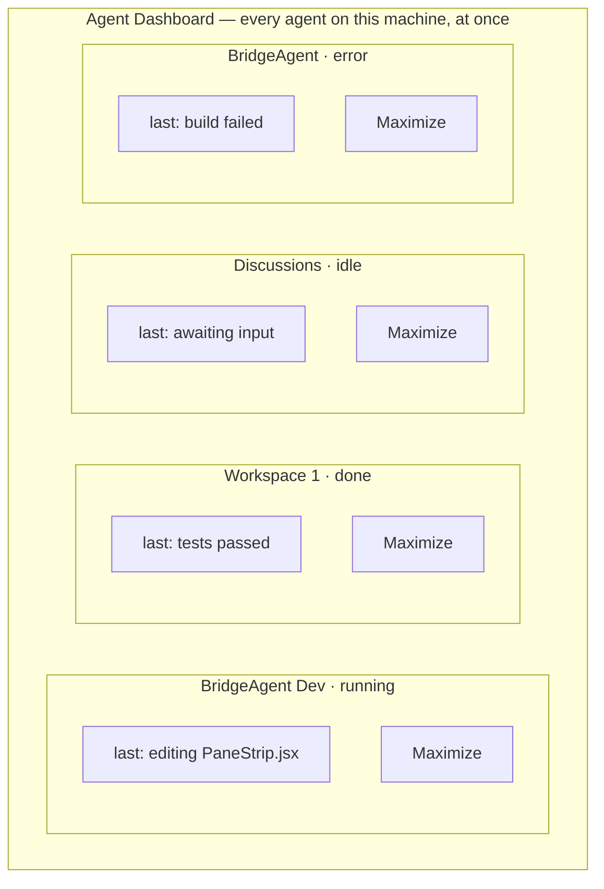
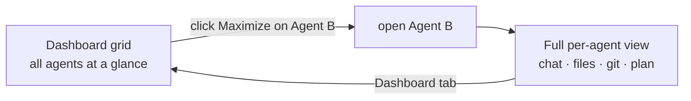

# Agent dashboard — user experience

The experience half of [agent-dashboard.md](agent-dashboard.md). The plumbing
this rides on is in [agent-dashboard-tech.md](agent-dashboard-tech.md).

## The vision: a wall of screens

Today, checking on another agent means leaving the one you're on: open the
Agents tab, click an agent (it *maximizes* into the normal chat/files/git view),
look, then navigate back. There is no single screen that shows **all** agents
and what each is doing **at the same time**.

The dashboard is a mission-control "wall of screens" sitting *above* the
per-agent tab navigation — a grid where every agent on this machine is a live
cell you can read at a glance, with a **Maximize** button that drops you into
the existing full view for just that agent.

## The dashboard at a glance

## What each cell shows

- **Agent name + repo** — which project this agent is working in.
- **Status** — a badge + the agent's colour swatch, reusing the Agents-tab
  legend: idle, running, done, error (the "needs attention" signal).
- **A one-line "what's it doing"** — the agent's latest activity, so a stuck
  agent is distinguishable from a working one without opening it.
- **Maximize** — the only action on a cell (the dashboard is read + maximize,
  not a management screen).

## Maximize — into the existing view, and back

Maximize opens the chosen agent in **the per-agent view we already have** — the
same place clicking an Agents-tab card takes you today. Returning to the
dashboard is just selecting the Dashboard tab again; the overview is always one
tap away.

## UX decisions (defaults — confirm or redirect)

- **A new "Dashboard" tab** (default). The existing Agents tab stays the place
  to *create/manage* agents; the dashboard is *overview + maximize* only, so the
  two don't fight for one screen. Alternative: fold the grid into the Agents tab.
- **Maximize target = the current `/studio` per-agent view** (chat/files/git for
  that agent) — confirm this is what "the mode we currently have" means.

> Liveness *depth* (a refreshed status line vs. a live scrolling tail in every
> cell) is a cost tradeoff — see [agent-dashboard-tech.md](agent-dashboard-tech.md).
