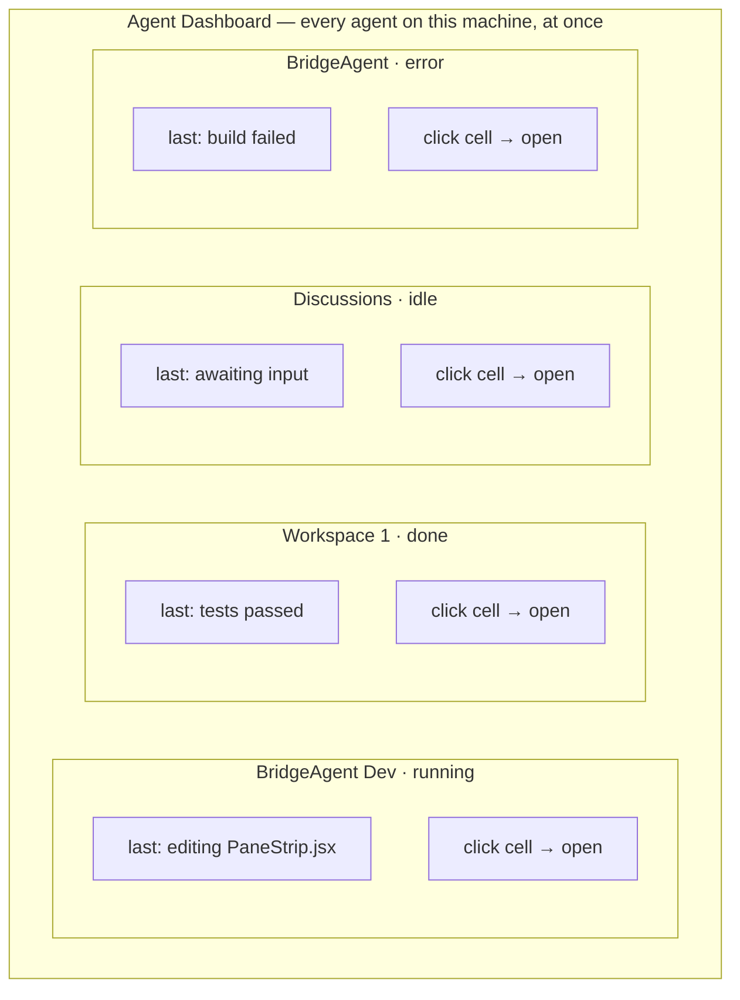
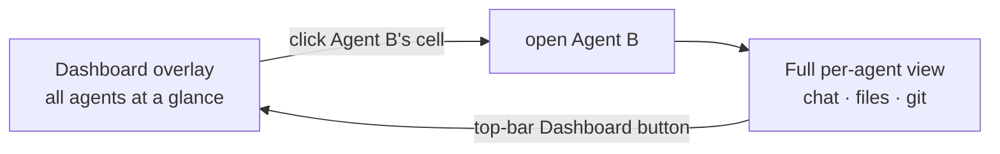
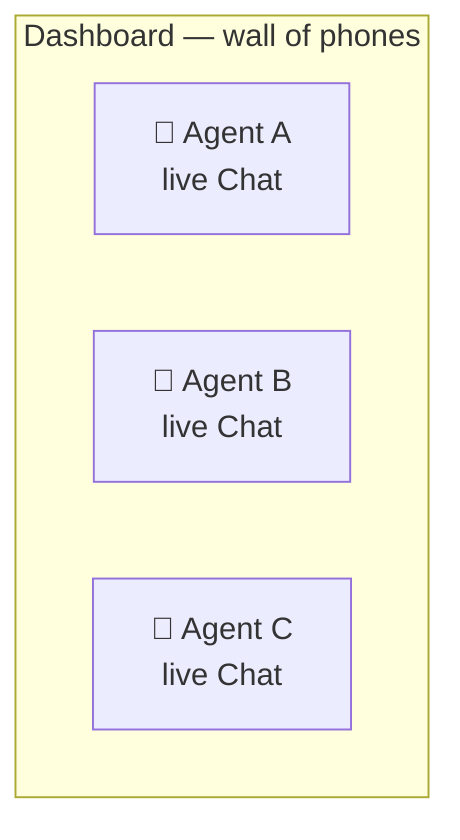

# Agent dashboard — user experience

The experience half of [agent-dashboard.md](agent-dashboard.md). The plumbing
this rides on is in [agent-dashboard-tech.md](agent-dashboard-tech.md).

## The vision: a wall of screens

Today, checking on another agent means leaving the one you're on: open the
Agents tab, click an agent (it *maximizes* into the normal chat/files/git view),
look, then navigate back. There is no single screen that shows **all** agents
and what each is doing **at the same time**.

The dashboard is a mission-control "wall of screens" sitting *above* the
per-agent tab navigation — a **full-screen overview**, opened from a top-bar
button, where every agent on this machine is a live cell you can read at a
glance. Clicking a cell drops you into the existing full view for just that
agent. It is **not a tab**: it covers the content area (hiding the bottom nav
and pane strip) and the top bar stays so the same button closes it.

## The dashboard at a glance

Reached from a **Dashboard button in the top bar**, which only appears in
Advanced mode when the dock holds **2+ agents** (with 0–1 there is nothing to
compare). Closed by the same button, the in-overlay **×**, or **Escape**.

## What each cell shows

- **Agent name + repo** — which project this agent is working in.
- **Status** — a badge + the agent's colour swatch, reusing the Agents-tab
  legend: idle, running, done, error (the "needs attention" signal).
- **A one-line "what's it doing"** — the agent's latest activity, so a stuck
  agent is distinguishable from a working one without opening it (slice 2).
- **The whole cell is the click target** — clicking it opens that agent (the
  dashboard is read + open, not a management screen; there is no separate
  Maximize button).
- **A recency border** — the dock is outlined (a fat 5px border) by how long
  ago *you* last wrote in that agent, so the ones you touched most recently
  stand out: **<1min** green, **<5min** bright green, **5–30min** blue,
  **30–60min** purple, **>1hr** no border. Applies to both cards and phones.

- **The repository path** — each dock shows the project's filesystem path (a
  small muted line under the repo name), on the Agents-tab cards, the Dashboard
  cards, and the phone bars. Sourced from `/api/repos` (`repo.path`), looked up
  by the tab's `repoId`.

**Choosing which agents appear:** each card in the **Agents** tab has a
show-on-dashboard toggle (the grid glyph next to the colour swatch). Off =
that agent is omitted from the Dashboard (both views). Default on; the choice
is stored on the backend dock tab, so it is shared across devices.

## Open an agent — into the existing view, and back

Clicking a cell opens that agent in **the per-agent view we already have** (the
same place clicking an Agents-tab card takes you today) and closes the overlay.
Re-opening the dashboard is one tap on the top-bar button.

## Slice 4 — the literal wall of phones

The cells so far are *summaries* (name, status, activity, git). The headline
next step makes each cell the agent's **real, live view** — as if you set
several mobile phones side by side, each phone showing one agent's single-tab
experience. On a big screen you watch five agents at once; each looks and
behaves like the one-tab-at-a-time view you'd get on a phone.

**We start Chat-only** (each phone = that agent's live chat) because it's the
safe, shippable slice — the technical reasons are in
[agent-dashboard-tech.md](agent-dashboard-tech.md#slice-4-feasibility--the-wall-of-phones-researched-2026-06-14).
A Chat-only phone shows just the conversation — no per-agent Files/Git/Terminal
tabs yet; that's a deliberate stopping point, not a dead end.

Four UX questions are still open and gate the build: which view each phone shows,
whether phones are interactive or read-only (mirror + "maximise to interact"),
whether phones replace the summary cards or sit behind a toggle, and how the wall
collapses on small screens. (Listed in the tech plan.)

## UX decisions (resolved)

- **A top-bar button → full-screen overlay, not a tab.** The Agents tab stays
  the place to *create/manage* agents; the dashboard is *overview + open* only.
  Gated to Advanced mode with **2+ agents**.
- **Open target = the current `/studio` per-agent view** (chat/files/git for
  that agent) — the existing open-agent flow.

> Liveness *depth* (a refreshed status line vs. a live scrolling tail in every
> cell) is a cost tradeoff — see [agent-dashboard-tech.md](agent-dashboard-tech.md).
