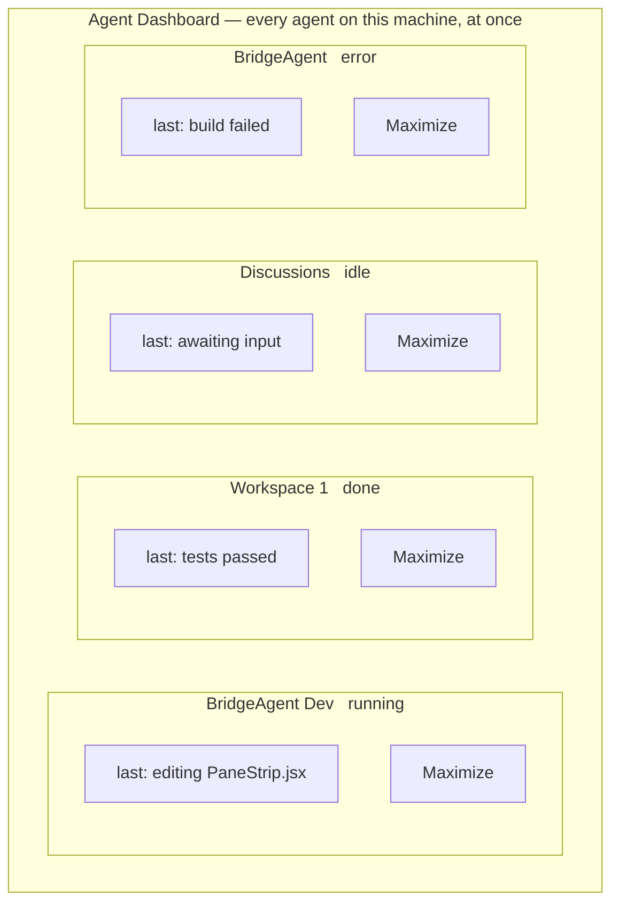
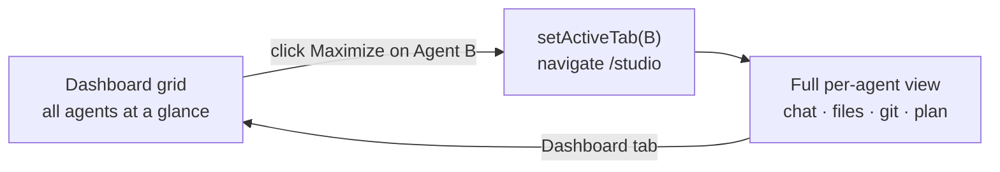
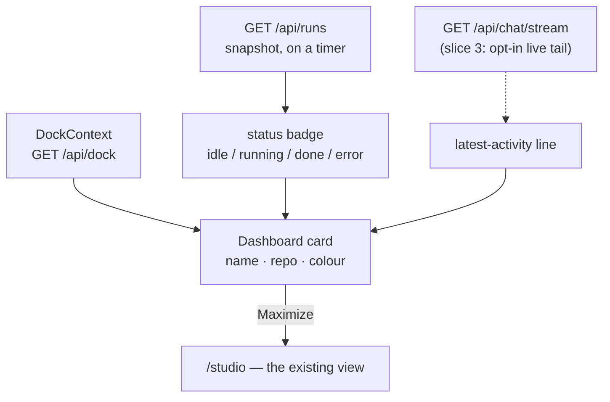
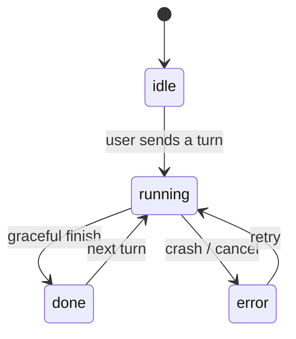

# Agent dashboard — a grid overview of all agents

> **Status (2026-06-14):** PLANNED, on `feature/agent-dashboard`. Not started.
> Three design defaults below are chosen but unconfirmed — flagged inline.

## Why

To see what another agent on this machine is doing today, you open the Agents
tab, click one (which *maximizes* it into the normal chat/files/git view), look,
then navigate back to the agent you were on. There is no single screen showing
**all** agents and what each is doing **at the same time**. The dashboard is a
mission-control "wall of screens" sitting *above* the per-agent tab navigation:
a grid of live agent cells, each with a **Maximize** button that expands that
agent into the existing full view.

## Visuals

### The dashboard at a glance — a grid of live agent cells

### Maximize — from overview into the existing per-agent view and back

### Where each cell's information comes from (reused plumbing)

### Agent status the badge reflects (already modelled today)

## What we reuse (this is mostly a new *view*, not new plumbing)

- **Agent list** — `DockContext` already holds every agent
  (`{ id, repoId, repoName, sessionId, status, color, stash }`) via `/api/dock`,
  persisted server-side. The dashboard renders this same list as a grid.
- **Per-agent status** — `status` is already `idle | running | done | error`
  (the Agents-tab legend + per-agent colour). Snapshot from `GET /api/runs`.
- **Live activity** — `GET /api/chat/stream?after=N` (SSE) is how the Chat tab
  tails what an agent is currently doing; the dashboard can read the same.
- **Maximize** — `setActiveTab(id)` + navigate `/studio` (exactly what clicking
  an Agents-tab card does today — `DockContext` lines ~173-178).
- **Grid baseline** — `PaneStrip` / `useMultiPane` already lay out N panes; the
  dashboard is a sibling (a CSS grid of agent cells, not panes of one agent).

## Design (defaults — confirm or redirect)

**Default 1 — a NEW "Dashboard" tab**, Advanced-gated by a new capability
`agentDashboard`. The existing Agents tab stays the place to *create/manage*
agents; the dashboard is *overview + maximize* only. (Alternative considered:
fold the grid into the Agents tab. Kept separate so management and overview
don't fight for one screen.)

**Default 2 — v1 liveness = status badge + a one-line "what's it doing"**,
refreshed on a timer (poll `/api/runs` + a cheap "latest activity" source).
A full scrolling stream-tail inside every cell is **deferred to a later slice**
(N live SSE connections at once is the heavy part — prove the cheap version
first).

**Default 3 — Maximize target = the current `/studio` per-agent view**
(chat/files/git scoped to that agent), via the existing open-agent flow.

## Slices

- **Slice 1 — static grid + maximize.** New `agentDashboard` capability + tab;
  a responsive CSS grid of agent cards from `DockContext` (name, repo, status
  badge, colour); a Maximize button per card wired to the existing open-agent
  flow. Browser-verify the grid renders every dock agent and Maximize opens the
  right agent full-screen.
- **Slice 2 — liveness.** Per-card status refresh + a one-line latest-activity
  string, updated on a timer (and/or reconciled from `/api/runs`). Show a clear
  "running / idle / needs attention" signal at a glance.
- **Slice 3 (later, maybe) — live tail.** An opt-in scrolling stream tail per
  cell for the agents you care about, bounded so we don't open N heavy SSE
  streams at once.

## Out of scope

- Spawning / editing / deleting / configuring agents (stays in the Agents tab).
- Any cross-machine / remote-agent aggregation — this is *this* computer's dock.
- Changing how individual agents run.

## Open questions

1. New tab vs. evolving the Agents tab (Default 1).
2. v1 liveness depth — status+line vs. live tail (Default 2).
3. Confirm Maximize target (Default 3).
