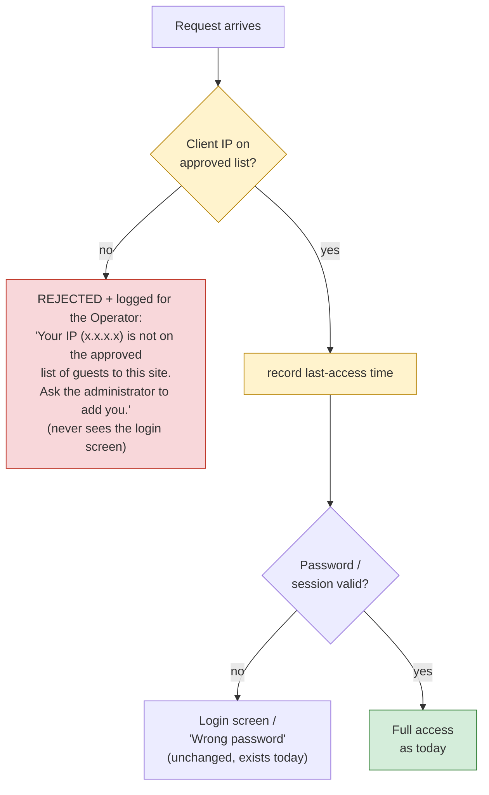
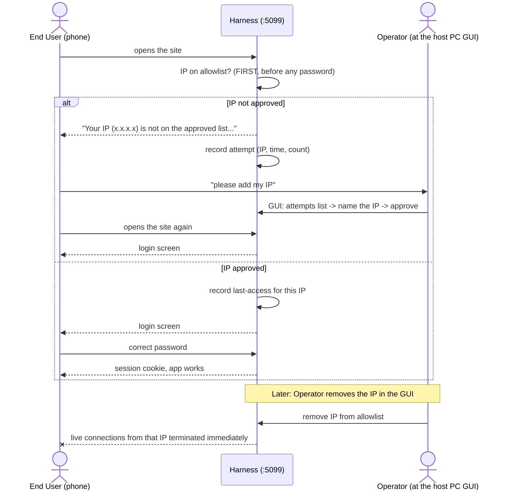

# Auth — IP allowlist filter

> **Status (2026-06-12):** DEPLOYED — verified on an isolated preview
> instance (gate + XFF hardening via curl; Guests tab 12/12 Playwright
> checks; live-SSE kill in 254 ms), then deployed to production and
> field-tested (internet IP correct via `TrustedProxyIps`, approve/remove
> flow working). Merged to main. Remaining vectors:
> [threat-model.md](threat-model.md).

## What we are building

A second authentication gate in front of the existing password login
(plans/auth-login.md): an **IP allowlist**. The IP check runs **first**,
before the password is even considered. The access rule becomes
**approved IP AND password**, not either alone.

## Confirmed requirements

1. **Approving IPs — host GUI only, never the web. The web can only
   shrink access, never grow it.**
   ADDING an IP to the allowlist happens exclusively in the Harness's
   desktop GUI on the host PC (the WinForms window the Operator physically
   sits at). There is NO web endpoint that can add or approve an IP — that
   surface simply does not exist, so a remote attacker can never grant
   themselves access. The web UI may *view* everything and may *remove*
   (unlist) IPs — both are fail-safe directions: the worst a hijacked web
   session can do is lock people out, never let anyone in.

2. **Exact IPs only.** Single, exact IP addresses. No CIDR, no ranges, no
   wildcards. Ever.

3. **IP check first; rejection message includes the caller's IP.** An
   unapproved IP is rejected before any password handling — such a visitor
   never sees the login screen at all, only:

   > "Your IP (203.0.113.42) is not on the approved list of guests to this
   > site. Ask the administrator to add you."

   so they can tell the Operator exactly what to add. Only approved IPs
   reach the password step (where "Wrong password" behaves as today).

4. **Attempt log + naming, in the desktop GUI.** The GUI shows rejected
   connection attempts (IP, when, how many times). From that list the
   Operator can approve an IP and **assign it a name** ("Mom's phone",
   "work laptop") — the allowlist is a set of *named, known guests*, not
   anonymous numbers. Workflow: guest calls → Operator opens the attempts
   list → recognizes the IP → names and approves it.

5. **Immediate revocation.** Removing an IP from the allowlist terminates
   that IP's access **immediately**: in-flight long-lived connections (SSE
   chat streams) are killed and every subsequent request is rejected — not
   "on next login" or "when the cookie expires". Every request is checked,
   not just login.

6. **No localhost exception.** Every request goes through the same
   IP + password check — no special branch for the host machine. One flow,
   one diagram. (Not a lockout risk: the allowlist itself is managed in the
   desktop GUI, which is not behind the web filter, so the Operator can
   always re-add any IP — including their own.)

7. **IP inspection tab — in the web UI too, with full visibility.** The
   Operator can see EVERYTHING from the frontend: the approved guests (the
   only users who can ever connect), each one's **last access time**, and
   the **connection attempts** from unapproved IPs. The web tab can also
   **unlist** (remove) an approved IP. The one and only thing it cannot do
   is approve — per req. 1. The desktop GUI shows the same information and
   is where approval happens.

   | Capability | Desktop GUI (host PC) | Web tab |
   |---|---|---|
   | See approved guests + last access | yes | yes |
   | See connection attempts | yes | yes |
   | Remove / unlist an IP | yes | yes |
   | **Approve + name a new IP** | **yes** | **NO — surface does not exist** |

## The decision in one picture



The yellow shapes and red box are the NEW parts; everything else already
exists (plans/auth-login.md). The IP gate is the OUTERMOST check — an
unapproved IP is turned away before any password handling. There is
deliberately NO localhost bypass — everybody, including the host machine,
takes the same path.

## Who does what



## Operator GUI (host PC only)

```
+------------------------------------------------------------------------+
| Approved guests                 Last access  | Connection attempts     |
|----------------------------------------------|-------------------------|
| Mom's phone     192.168.0.17   today 14:02 [x]| 203.0.113.42  3x  14:02 |
| Work laptop     203.0.113.9    Jun 9 18:40 [x]|   [Name + approve]      |
| localhost       127.0.0.1      today 13:55 [x]| 198.51.100.7  1x  09:31 |
|                                               |   [Name + approve]      |
+------------------------------------------------------------------------+
  [x] = remove -> takes effect immediately (kills live conns)
```

The "Last access" column is the IP inspection view (req. 7): every approved
guest with the last time they touched the Harness.

(Sketch only — exact layout decided during implementation, following the
existing WinForms panels.)

## Design (v2)

### 1. Client IP source — DECIDED: Option A (hardened proxy trust)

Deployment fact: End Users reach the Harness via `https://<domain>` →
IIS/ARR reverse proxy → Kestrel on localhost:5099 (README "expose"
script). So the socket peer Kestrel sees is always 127.0.0.1 and the real
client IP only exists in the `X-Forwarded-For` header ARR appends.

`AuthController.ClientKey()` today takes the **first XFF hop,
unconditionally** — fine for a brute-force throttle, spoofable for an
allowlist (anyone hitting :5099 directly could claim an approved IP).

**Decision (Operator, 2026-06-12): Option A with hardening.**

- Trust `X-Forwarded-For` **only when the socket peer is loopback** (the
  ARR proxy on the same machine). Otherwise the header is ignored and the
  **socket IP** is used.
- When trusted, take the **LAST** hop of the header (the value ARR itself
  appended), never the first — the first hop is client-controlled.

Degrades safely both ways: via the proxy you get the true client IP;
hitting :5099 directly (LAN/local testing) you get the true socket IP and
a spoofed header is ignored. This logic replaces `ClientKey()` so the
throttle and the allowlist agree on who the caller is (refactor below).

Rejected: B (socket IP only — everyone behind ARR would look like
127.0.0.1, making the allowlist all-or-nothing), C (config flag — a knob
we don't need since A already handles both paths).

### 2. Module layout (per plans/INTEGRATION.md)

```
ClaudeWeb.App/Services/IpFilter/
  IpAllowlistService.cs        # guests + attempts + last-access; persistence
  IpConnectionRegistry.cs      # in-flight HttpContexts per IP (kill switch)
  IpFilterMiddleware.cs        # the gate itself
  IpFilterModuleExtensions.cs  # AddIpFilterModule()
ClaudeWeb.App/Controllers/IpFilterController.cs   # web read + remove only
ClaudeWeb.App/UI/IpFilterForm.cs                  # desktop GUI dialog (approve lives here;
                                                  #   RepositoriesForm precedent, opened by a
                                                  #   "Guests (IPs)" header button in MainForm)
client/src/pages/Guests.jsx (+ css, i18n keys)    # web inspection tab
```

Shared-file touches (each follows an existing precedent):

- `EmbeddedApi.cs` — uncomment `AddIpFilterModule()` in the marked region;
  add `app.UseMiddleware<IpFilterMiddleware>()` as the **first** pipeline
  step; pass the pre-built `IpAllowlistService` through the constructor so
  the WinForms GUI and the API share one instance (exact same pattern as
  `RepositoryRegistry`, EmbeddedApi.cs:87-88).
- `AuthController.cs` / `PasswordAuthMiddleware.cs` — small refactor: move
  `ClientKey()` into a shared `Services/Hosting/ClientIp.cs` helper that
  implements the §1 decision; both auth and the IP filter call it. Removes
  today's smell (a controller exporting a public static utility) and
  guarantees one definition of "the caller's IP".
- `MainForm.cs` — ~5 lines to host `IpFilterPanel` (precedent: DetailPanel).
- `client/src/context/UiModeContext.jsx` — register the tab as `'advanced'`.

Nothing else in the existing app changes. ChatController is untouched (§4).

### 3. Middleware placement — FIRST, before static files

Pipeline today: static files → no-cache → routing → CORS → password auth →
controllers → SPA fallback. The IP gate goes **in front of all of it**:
req. 3 says an unapproved IP never sees the login screen — that means no
SPA shell, no JS assets, nothing. Every request from an unapproved IP gets
a minimal standalone HTML page (served straight from the middleware, no
assets) with the exact rejection text and the caller's IP, plus HTTP 403.
This also settles the old open item: it is a dedicated page, not an SPA
error state — the SPA never loads for them.

There are **no exemptions** — `/api/health` is gated too (one flow, one
diagram, per req. 6's spirit; local probes work because 127.0.0.1 is
seeded). On the allowed path the middleware records last-access (in-memory,
flushed to disk at most every ~30 s — no disk write per request) and passes
through to the existing pipeline, password auth unchanged.

### 4. Immediate revocation — how connections die

The middleware registers every in-flight request in `IpConnectionRegistry`
(IP → live `HttpContext`s, unregistered on completion). Removing an IP
calls `HttpContext.Abort()` on all of that IP's contexts. SSE attachments
already stream on `HttpContext.RequestAborted` (ChatController.AttachAsync),
so aborting the context terminates the stream instantly — **no changes to
ChatController or any SSE code**.

Note the deliberate semantics: removal kills the *connections* and blocks
all further requests. A detached Claude **Run** that IP started keeps
executing (Runs are owned by RunSessionService, not by connections — see
plans/detached-runs.md); the Operator can stop it from the GUI as today.

### 5. Storage

`%APPDATA%\ClaudeWeb\ipallow.json` (same dir/pattern as auth.json,
sessions.json), one file, written atomically:

```json
{
  "guests":   [ { "ip": "203.0.113.9", "name": "Work laptop",
                  "addedUtc": "...", "lastAccessUtc": "..." } ],
  "attempts": [ { "ip": "198.51.100.7", "count": 3,
                  "firstUtc": "...", "lastUtc": "..." } ]
}
```

- Attempts are aggregated per IP (count + first/last time — exactly what
  the GUI shows), capped at the **200 most recently seen** IPs; oldest
  pruned. Settles the retention open item.
- First run seeds `127.0.0.1` as guest "localhost" — a normal, removable
  entry (req. 6; also keeps Playwright/local curl working).
- Approving an IP clears its attempts entry.

### 6. Web surface (deliberately asymmetric)

`IpFilterController`, behind both the IP gate and password auth:

- `GET  /api/ipfilter` — guests (with last access), attempts, and
  `callerIp` (so the UI can mark "this is you").
- `DELETE /api/ipfilter/guests/{ip}` — unlist; if `{ip}` == caller's IP the
  UI shows a confirm dialog first ("this is YOUR IP — you will be locked
  out until the Operator re-adds you at the host PC"). The kill is
  immediate per §4, including your own connection.
- **No POST/add endpoint exists.** Approval is a method on
  `IpAllowlistService` called only by `IpFilterPanel` (desktop GUI) — the
  web cannot reach it.

Web tab "Guests": Advanced mode, two lists (approved + attempts), remove
button on approved entries only.

### 7. Implementation order

1. `ClientIp` helper refactor (per §1 decision) + tests of existing auth.
2. `IpAllowlistService` + storage + seed.
3. `IpFilterMiddleware` + `IpConnectionRegistry` + EmbeddedApi wiring.
4. Desktop `IpFilterPanel` (approve/name/remove, attempts, last access).
5. `IpFilterController` + web Guests tab (Advanced).
6. Playwright verification (rejection page, approve via service, unlist
   kills SSE), then deploy with the Operator's say-so.
