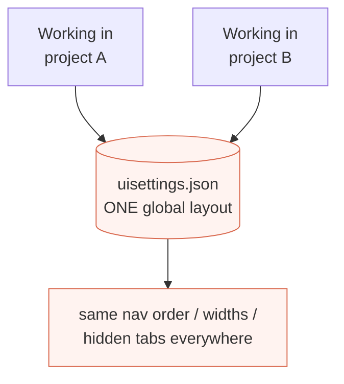

# Tab settings — scoped per agent / project

> **Status (2026-06-14):** Plan / design — not built yet. On
> `feature/browser-scoped-tab-order`. Decided: **per-context, backend-keyed by
> project** (Option B). Structured per [doc-principles.md](doc-principles.md).

## Problem in one picture

Tab order — and pane widths and tab visibility — are stored once, globally
(`uisettings.json`, served by `GET/PUT /api/settings/ui`). There is exactly one
layout for the whole app, so you can't have a different layout per project.

The chain today: `UiSettingsService` (`uisettings.json`) → `/api/settings/ui` →
`UiSettingsContext.jsx` → [`useOrderedTabs()`](../client/src/layout/tabRegistry.jsx)
→ `BottomNav` / `PaneStrip`. `useOrderedTabs` already applies the order
client-side — so we mainly change *what the layout is keyed by*.

## Goal

**One goal: tab settings specific to the agent/project.** A different
**tab order, pane widths, and tab visibility** per project, so each project's
nav matches the work (a backend project foregrounds Git/Term; a frontend one
Files/App). Switching project swaps the layout.

**Explicit non-goal:** browser independence. Two browsers/devices showing the
*same* project should show the *same* layout — so the store stays on the
**backend** and **cross-device sync is kept** (no change to settings-tab.md's
sync decision; we only refine "one global layout" → "one layout per project").

## Comparing the options

Three candidate scopes, rated 1–5★ on the dimensions that decide this:

| Dimension | A · Browser | B · Agent / project | C · Single tab |
|---|:---:|:---:|:---:|
| Per-context layouts (the goal) | ★☆☆☆☆ | ★★★★★ | ★★☆☆☆ |
| Cross-device sync | ★☆☆☆☆ | ★★★★★ | ★☆☆☆☆ |
| Nav predictability | ★★★★★ | ★★★★☆ | ★★☆☆☆ |
| Implementation simplicity | ★★★★★ | ★★★☆☆ | ★★★☆☆ |

**Dimensions explained**

- **Per-context layouts** — can the layout differ per agent/project? Only B is
  *about* this. A is one layout for the whole browser; C varies per browser tab,
  which lines up with a project only by accident. This is the goal, so it
  decides the table.
- **Cross-device sync** — same layout on phone and desktop for a given project.
  B (backend) keeps it; the local options (A, C) lose it.
- **Nav predictability** — A never moves; B moves when you switch project
  (intended, so still predictable); C "resets" on every new browser tab.
- **Implementation simplicity** — A swaps one persistence layer; B turns the
  backend store + its API into a per-project map (keyed by the `X-Repo-Id`
  header that's already sent) and re-fetches on project switch; C reuses the
  per-tab `viewState` helper but needs seed logic.

Each option's design and exact code-change magnitude live in its sub-plan:

- **[Option A — scoped to the browser](tab-order-option-browser.md)** — one
  layout per browser. **Misses the goal** (no per-project layouts).
- **[Option B — scoped to the agent/project](tab-order-option-agent.md)** ←
  chosen — a per-project layout map on the backend, keyed by `repoId`.
- **[Option C — scoped to a single browser tab](tab-order-option-tab.md)** —
  per browser tab; misses the goal and resets per tab. For completeness.

## Recommendation

**Option B — backend, keyed by project (`repoId`), covering all three tab
settings (order + pane widths + visibility).** It's the only option that meets
the goal, and keeping it on the backend preserves cross-device sync with no
reversal of any prior decision. Cost is moderate (★★★, see the sub-plan): the
existing global store becomes a `repoId → { tabOrder, tabWidths, hiddenTabs }`
map, the API keys off the `X-Repo-Id` header it already receives, and the
frontend re-fetches when the project changes.

## Settled questions

1. **Key by project (`repoId`), not by agent** — agents are ephemeral (deleted
   on close) so a per-agent layout would vanish; `repoId` persists and is
   already the axis Files/Git/App follow.
2. **Scope = all three** tab settings (order, pane widths, visibility) — the
   user confirmed; they share the store and move together.
3. **Cross-device sync kept** (backend store) — so no settings-tab.md reversal.

## Verification (planned)

Headless Playwright per [browser-testing.md](../docs/claude-web/browser-testing.md)
on an isolated `:5200` preview: set a distinct order/width/hidden-set under
project A, switch to project B and see a *different* (default) layout, switch
back to A and see A's layout restored; reload persists; a second browser context
on project A sees A's layout too (cross-device sync intact). Store hygiene: test
under a pinned repo id, cleared in `finally`.
