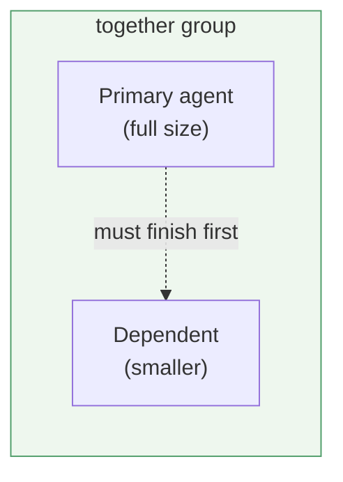

# Dependent agents — "together" groups on the dashboard

> **Status (2026-06-17):** **Slice 1 built & browser-verified** on
> `feature/dependent-agents` (not yet deployed/merged). A backend-synced
> `DependsOn` (primary tab id) on `DockTab`, a per-dock "depends on…" picker, and
> a "together" group in `Dashboard.jsx` that renders the dependent ~0.82× the
> primary. Defaults locked (no extra questions): primary chosen from a dropdown
> of the other dashboard agents; group only when the primary is a visible,
> independent dock (no chains this slice); dangling/cyclic links → independent; a
> group sorts by its primary's position. Structured per
> [doc-principles.md](doc-principles.md).

## Problem / goal

When one agent's work **can't continue until another agent finishes**, the
dashboard gives no visual cue of that ordering — the two docks sit side by side
like peers. The existing [agent "waiting on" toggle](agent-waiting.md) records
*that* a dock is waiting (a bool + free-text note), but it doesn't **link** the
two docks or show the relationship spatially.

**Goal:** let a dock be tagged as **dependent on a specific primary agent**, and
render the pair as a **"together" group** in the agent docks — the dependent
shown **a bit smaller** than the primary, so it reads at a glance as "the primary
must finish before this one's work can proceed."

## Terms

| Term | Meaning |
|------|---------|
| **Primary** | the agent whose work must finish first |
| **Dependent** | an agent blocked on the primary; rendered smaller, grouped with it |
| **Together group** | the primary + its dependents, rendered as one visual cluster |

## Design (proposed)

**Data — one new field on `DockTab`** (same path as `Color` / `Important` /
`Waiting`): `DependsOn` — the **tab id of the primary** this dock depends on
(null = independent). Backend-synced through the existing
`PATCH /api/dock/{id}` surface (add `dependsOn` to `PatchRequest`, the DTO, and
the GET projection in `DockController` + `DockRegistry`). This is a structural
link to a specific agent — distinct from `WaitingOn`'s free-text note, though the
two are complementary.

**Setting it — a dock-header control** (sibling of the ⭐ important / ⏳ waiting
toggles): a small "depends on…" picker that lists the other dashboard agents and
sets `DependsOn` to the chosen primary's id (or clears it). Advanced-mode, like
its siblings.

**Rendering — group + shrink in `Dashboard.jsx`.** Before laying out the grid,
fold dependents under their primary: a primary and its dependents render inside a
**"together" container** (a labelled, bordered cluster). The dependent dock is
scaled to **~0.8×** the primary's cell size so the hierarchy is obvious. The
primary keeps full size; independent agents are unaffected.

## Open questions

1. **Picking the primary** — a dropdown of the other dashboard agents (by repo
   name) is the simplest. Confirm that vs. a free-text id.
2. **Primary not on the dashboard / multiple dependents / chains** — default:
   only group when the primary is itself a visible dashboard dock; render
   multiple dependents stacked under one primary; ignore (don't recurse) a
   dependent that is itself a primary, for the first slice.
3. **Cycle / stale link guard** — if `DependsOn` points to a removed agent, treat
   the dock as independent (self-heal, like other dangling refs).
4. **Interaction with `Important` ordering** — important agents pin to the front;
   decide whether a together group sorts by its primary's position.

## Slices

- **Slice 1** — data field + the dashboard grouping/shrink rendering (the core
  visual), with the primary chosen via a header picker.
- **Slice 2 (maybe)** — richer cues (e.g. a connector, or auto-derive the link
  from the existing `WaitingOn` text when it names a known agent).

## Verification (later)

Browser-verify on an isolated preview: tag agent B as depending on A; assert A+B
render in one "together" cluster with B visibly smaller than A; clearing the link
returns B to the normal grid; a dangling `DependsOn` is ignored.
