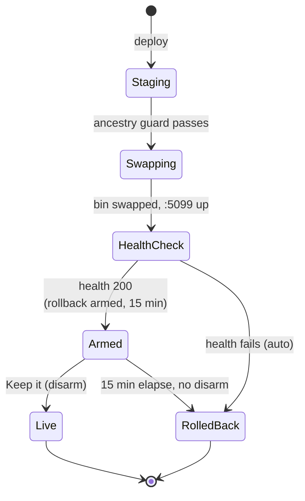
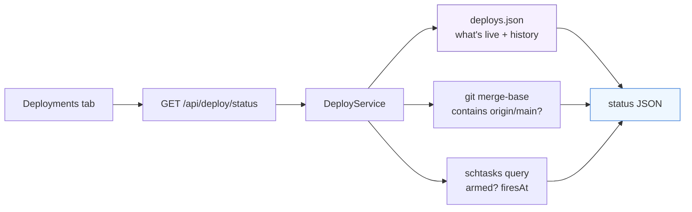
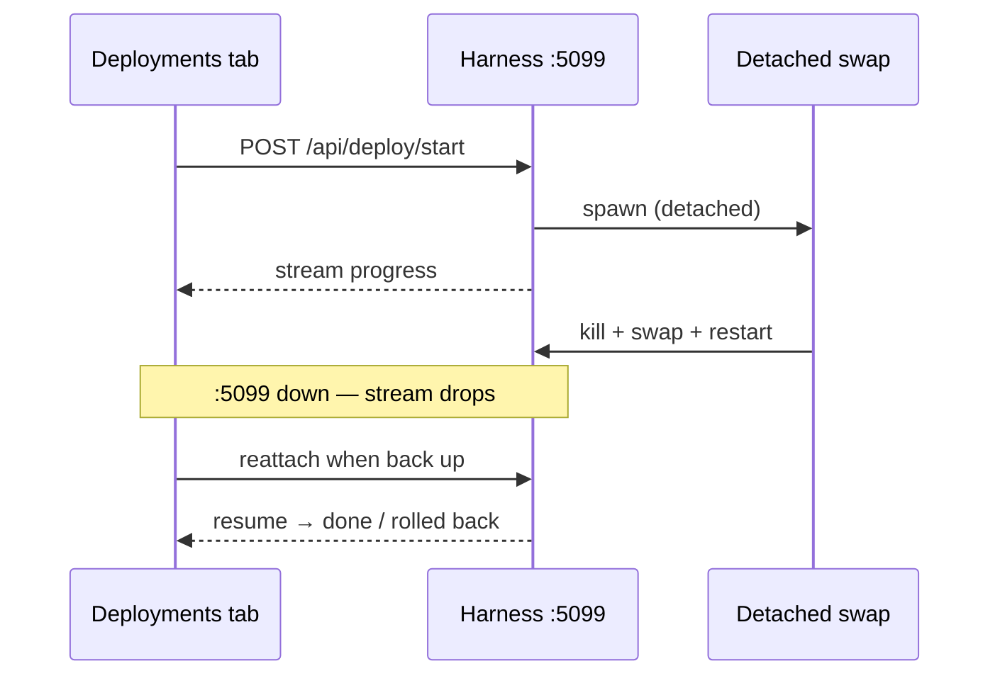

# Deployments tab — make deploys observable and safe

> **Status (2026-06-13):** Proposed — plan for discussion, sliced. Slice 1
> (observability + rollback control) is the first build. Not started.

## Problem

Deploying this harness is wild-west: nothing surfaces **what's live**, the
auto-rollback is an **invisible race**, and **parallel sessions clobber**
each other. Lived pain this project has actually taken:

- No "what's live" anywhere — which commit `:5099` serves, whether it
  contains `origin/main`, when it was deployed. The Git tab shows *origin*
  drift, not *deploy* state. You trust memory.
- The dead-man's switch (`arm.ps1` → scheduled task `ClaudeWebAutoRollback`,
  15 min) is invisible: you must reload and message in time to disarm, or it
  silently reverts live — it has reverted a deployed **security gate**.
- Three times, a session deployed a **stale tree** and knocked another's
  live feature off. `swap.ps1`'s origin/main ancestry guard helps, but there
  is no lock and no "deploy in progress" signal.
- Deploy history lives in `swap.log` (UTF-16!) off in `claudeweb-rollback\`,
  unseen.

## Scope boundary (can't fix from here)

The **off-box IIS** (`next5.birokrat.si` → 89.212.3.156: the `/preview/`
forward and the public root forward) is unmanageable from this box (project
memory). This tab governs the **on-box** deploy only; the IIS stays external.

## The deploy machinery today (what the tab wraps)

In `C:\Users\Administrator\Desktop\playground\claudeweb-rollback\`:

- `arm.ps1` — `Register-ScheduledTask ClaudeWebAutoRollback`, fires
  `rollback.ps1` in 15 min.
- `swap.ps1` — ancestry guard (`git merge-base --is-ancestor origin/main
  HEAD`) → kill harness → wait :5099 free → `robocopy /MIR` staged bin →
  health check → auto-rollback on failure. Logs to `swap.log`.
- `rollback.ps1` — restore `bin.lastgood` + `client/dist.lastgood`, restart,
  delete the scheduled task.

A deploy's lifecycle — note the **race** the tab is built to tame: once
healthy, live is only kept if someone disarms within 15 minutes.

The harness serves `client/dist` from the **working tree** at runtime, so a
frontend build hits live instantly (before any bin swap).

## Slice 1 — Deploy status & control (BUILD FIRST)

A read-mostly **Deployments tab** (advanced-only, `deploysTab`) that finally
shows the state and tames the rollback race. Low-risk: mostly reads; the only
writes are disarm/rollback, which already exist as scripts.

### What it shows

- **Live now**: deployed commit (sha + subject), deployed-at, ✅/⚠️ "contains
  origin/main", current served bundle hash. These are the facts I check by
  hand on every deploy.
- **Rollback panel**: when `ClaudeWebAutoRollback` is armed, a **live
  countdown** to `firesAt` with **Keep it** and **Roll back now** buttons.
  Replaces the message-race disarm — the single biggest hazard.
- **History**: last N deploys (commit, time, health result, rolled-back?).

### The missing primitive: a deploy ledger

Nothing records what was deployed. Add an **append-only JSON ledger**
`deploys.json` (in `claudeweb-rollback\`, next to the scripts), one entry per
swap: `{ at, commit, subject, healthOk, rolledBack }`. `swap.ps1` appends on
swap + after the health check; `rollback.ps1` appends a `rolledBack` entry.
The tab's "Live now" = the latest non-rolled-back entry. This is honest
because `swap.ps1` is the **only sanctioned deploy path** (the enforced
deploy-from-merged-main rule, docs/claude-web/self-dev.md).

> ⚠️ This edits `swap.ps1`/`arm.ps1`/`rollback.ps1` — the deploy chokepoint
> whose origin/main guard "must be enforced". Changes are **additive only**
> (append a ledger line; never touch the guard or the swap logic) and
> verified on a staging copy before the scripts in use are touched.

### Backend

`DeployService` + `DeployController` (`/api/deploy`, advanced, behind the
global gate):

- `GET /api/deploy/status` → `{ live, rollback: { armed, firesAt,
  secondsLeft }, history }`. Sources: `deploys.json`; `git merge-base
  --is-ancestor origin/main HEAD` (GitService); scheduled-task state via
  `schtasks /query /TN ClaudeWebAutoRollback`.
- `POST /api/deploy/keep` → `schtasks /Delete /TN ClaudeWebAutoRollback /F`
  (disarm).
- `POST /api/deploy/rollback` → run `rollback.ps1` (detached) — destructive,
  needs a confirm in the UI.

`status` is a join over three live sources — none of which exist in one place
today, which is exactly why deploys feel like guesswork:

Scripts dir is config (`AppConfig`), defaulting to the known path.

### Frontend

`pages/Deployments.jsx` + css: the three cards above; the countdown ticks
client-side off `firesAt`; Keep/Rollback POST then refetch. Registry/route/
capability/i18n wiring as usual. Polls `status` while open (and on
visibility) so a deploy from elsewhere shows up.

## Slice 2 — One-button deploy (LATER, sketch)

`POST /api/deploy/start` runs arm → stage → build → swap **detached**, with:

- **A deploy lock** (lockfile with session id + time in `claudeweb-rollback\`)
  so two sessions can't deploy at once — the clobber fix.
- **Survives its own restart**: the UI driving the deploy is served by the
  harness the swap kills, so progress must stream and **reattach** after
  :5099 returns — the same detached-run pattern the chat already uses
  ([detached-runs](detached-runs.md)). This is the hard part; slice 1
  deliberately avoids it.

## Decisions / open questions

- **`deploysTab: 'advanced'`** (operator-only; deploy control is not an
  End-User action).
- Slice 1 first (observability + rollback control), slice 2 (one-button
  deploy) after — agreed in discussion.
- Open: should **Roll back now** and (later) **Deploy** require typing a
  confirm, given they restart live? (Lean yes for both.)

## Verification (slice 1, planned)

`verify-deployments-tab.mjs` on :5201 — **must never arm/rollback the live
harness**: point `DeployService` at a **temp scripts dir + temp deploys.json**
(config override) seeded by the test. Assert: status renders live
commit/ancestry/history from the seeded ledger; an armed task shows a
counting-down panel (seed a dummy `firesAt`); **Keep it** calls the disarm
endpoint (stubbed to the temp task) and the panel clears; **Roll back now**
shows a confirm and only then POSTs; tab hidden in Basic mode. The real
`swap.ps1` ledger append is tested separately against a staging copy, not the
live scripts.
