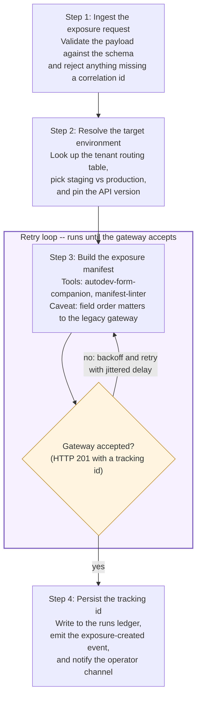

# Doc viewer — live examples

Open this file in the **Files tab** (or any tab using the shared
Markdown component) to see what the doc-viewer slices enable. Each
example states the slice that makes it work (see
[doc-viewer.md](doc-viewer.md)).

## Slice 1 — mermaid labels that wrap (SHIPPED)

Before slice 1, anything beyond a short box title was truncated —
diagrams had to be stripped to bare names. Now labels wrap and boxes
grow. This diagram is the acceptance shape: 3+-line labels, a styled
subgraph loop, multi-line edge labels.



Still true per [doc-principles.md](doc-principles.md) #6: a diagram is a
map, not the document — wrapping working doesn't mean labels should
become paragraphs.

GFM tables and code fences render alongside, unchanged:

| Slice | What it adds | Status |
|-------|--------------|--------|
| 1 | mermaid label wrapping | shipped |
| 2 | relative links + back/forward in the Files viewer | next |
| 3 | cross-repo `../` links | deferred |
| 4 | local `.html` webview | deferred |

```csharp
// code fences keep monospace + fencing
var tracked = ledger.Persist(trackingId);
```

## Slice 2 — relative links (NEXT — these will work after slice 2)

- Same-folder doc link: [doc-viewer.md](doc-viewer.md)
- Link to a file elsewhere in the repo: [CLAUDE.md](../CLAUDE.md)
- Anchor within this file: [back to slice 1](#slice-1--mermaid-labels-that-wrap-shipped)
- A `.cs` link that should open in the Files viewer, not a doc view:
  [Mermaid.jsx](../client/src/components/shared/Mermaid.jsx)

Until slice 2 lands, clicking these in the Files viewer does nothing
(links aren't intercepted there yet) — that's the gap slice 2 closes.
