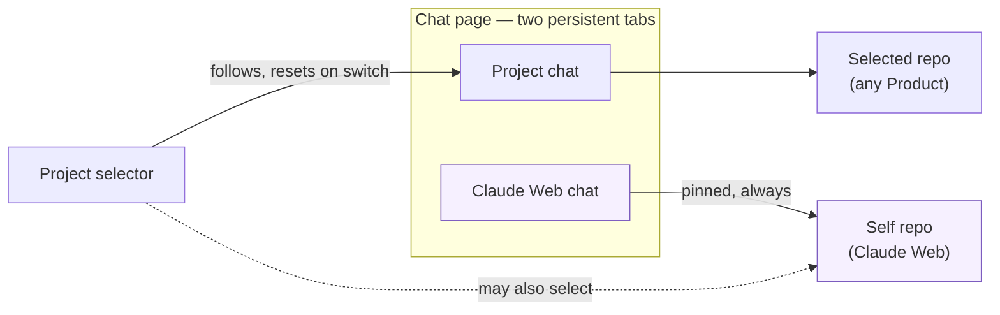

# Dual chat — a Project chat plus an always-on Claude Web chat

> **Status (2026-06-13):** Implemented on `feature/dual-chat` and
> browser-verified on :5201 — `verify-dual-chat.mjs` 24/24 (repo targeting
> per send asserted via a stubbed /api/chat, multi-turn, switch-survival,
> same-repo independence, 409 banner, basic mode; screenshots read). Not
> yet deployed. Plan v2 after the user corrected scope (v1 guessed "pin
> every chat to its birth repo" — wrong, deleted).

## Problem

The user constantly develops the Harness itself *while* working on other
Products. The conversation with Claude about Claude Web should be reachable
at all times — without switching the active project and without losing the
chat that belongs to the project being worked on.

Today there is one default chat and it follows the project selector,
resetting on every switch (`client/src/context/ChatContext.jsx:94-103`).
Agent dock tabs ([agent-dock](agent-dock.md)) are repo-pinned but are a
general-purpose, manually-managed list — not a standing "talk to the
Harness" slot.

## Design

The Chat page gets **two persistent chat tabs**:

1. **Project** — exactly today's default chat: follows the active project,
   resets on switch.
2. **Claude Web** — permanently bound to the Harness's own repo
   (Self-Development repo). Always present, regardless of the selected
   project.

If the active project *is* Claude Web, both tabs exist and are two
independent conversations over the same repo.



The dotted edge is the special case: the selector pointed at Claude Web
itself — both chats then target the self repo, independently.

### Frontend

- `ChatContext` already holds a conversations map keyed by `activeKey`
  (`'default'` or a dock-tab id). Add a second fixed key, `'harness'`,
  whose conversation is created pinned to the self repo and is exempt from
  the reset-on-switch effect.
- A two-segment switcher above the chat bar (`Chat.jsx`) drives a
  device-local **chatView** (`'agent' | 'project' | 'harness'`, localStorage
  `claudeweb_chat_view`, lives in `DockContext` next to the active-tab key).
  `'agent'` is the pre-dual behavior and stays the default; picking an agent
  in the Agents tab sets it back. Requests for the harness conversation pass
  the self repo id via the existing per-call `repoId` override
  (`client/src/api/client.js`), the same mechanism dock tabs use. How the
  visible conversation and its target repo resolve, with the dock in the
  picture:

  ```mermaid
  flowchart TD
      Q{"chatView"} -- agent --> AK["key = active tab id<br/>(or 'default' when none)<br/>repo = tab.repoId"]
      Q -- project --> DK["key = 'default'<br/>repo = selected repo"]
      Q -- harness --> HK["key = 'harness'<br/>repo = self repo"]
      style HK fill:#f6f0ff,stroke:#7c5cbf
  ```
- "Your conversations" picker and the New button act on the *visible* tab's
  repo.
- Capability `dualChat: 'advanced'` per [ui-modes](ui-modes.md) convention
  (Basic mode keeps the single project-following chat).
- i18n: en/tr labels for the switcher.

### Backend: which repo is "Claude Web"?

None needed — `GET /api/repos` already exposes `isSelf` on every entry (the
registry pins the harness's own checkout at startup, `RepoController.cs`).
If no registered repo is the self repo, the Claude Web segment renders
disabled with a hint rather than guessing; while repos are still loading,
a stored harness view degrades to the Project chat and recovers.

### Decisions

- **Not implemented as a dock tab.** The Agents list is user-managed and
  closable; this is a fixed structural slot. The dock and its
  agent→project sync ([agent-repo-sync](agent-repo-sync.md)) are untouched.
  When an agent conversation is showing (`chatView = 'agent'`) neither
  segment is highlighted; the switcher acts as a way back without touching
  the active agent — it keeps streaming in the background, and the Agents
  tab re-enters it (which sets the view back to `'agent'`).
- **Project chat behavior is unchanged** — it still follows and resets with
  the selector. Decoupling it was v1's idea, explicitly not wanted.

## Risks / constraints

- **One run per repo.** The backend allows a single concurrent run per repo
  (`_busyRepos` 409; RunSessions are per-repo,
  [detached-runs](detached-runs.md)). When the active project IS Claude
  Web, the two chats share that one slot: sending in one while the other
  streams will 409. v1 surfaces this as a friendly "the other chat is still
  running" error; relaxing the backend to per-conversation runs is out of
  scope.

  ```mermaid
  sequenceDiagram
      participant P as Project chat
      participant H as Claude Web chat
      participant B as Backend (self repo)
      P->>B: send — run starts
      H->>B: send
      B-->>H: 409 busy → "other chat still running"
      B-->>P: stream completes
      H->>B: send again
      B-->>H: run starts
  ```
- **Per-repo event stream.** Reattach (`GET /api/chat/stream?after=N`) and
  the seq watermark are per-repo — with two conversations on the same repo,
  only ONE may reattach to that repo's run on reconcile. As built: the
  conversation already carrying the run's sessionId wins; otherwise the
  harness yields to the agent/default one.

## Implementation (as built)

1. `DockContext.jsx`: device-local `chatView` + `setChatView`
   (`claudeweb_chat_view`); `openTab`/`setActiveTab` set it to `'agent'`.
2. `ChatContext.jsx`: `'harness'` key pinned to the `isSelf` repo;
   view-aware `activeKey`/`activeRepoId`; visible-tab-only status patches;
   reset-effect and cleanup-effect exemptions for the fixed keys; reconcile
   includes a harness target with the one-run-per-repo dedup; 409 →
   `chat.busyError`.
3. `Chat.jsx` + `chat.css`: `.chat__scopes` switcher, disabled state;
   `UiModeContext.jsx`: `dualChat: 'advanced'`; i18n en/tr.

## Verification

`verify-dual-chat.mjs` (Playwright, `.claudeweb-preview/playwright/`,
BASE=:5201, per [browser-testing](../docs/claude-web/browser-testing.md)) —
**24/24 on 2026-06-13**, screenshots read. `/api/chat` is stubbed via
page.route (no real CLI runs; asserts the X-Repo-Id of every send):

- Project chat targets the selected repo; Claude Web chat targets the self
  repo — **multi-turn**, with session continuation asserted (the
  detached-runs lesson).
- Switching projects in-page leaves the Claude Web conversation intact;
  the Project chat resets as before.
- Active project = Claude Web: two independent conversations on one repo
  (the project chat opens its own session, the harness one is untouched).
- 409 surfaces the busy banner; the view choice survives reload; Basic
  mode shows no switcher.
- Test hygiene: no dock tabs created, repositories/uisettings untouched,
  project selection browser-local, session logged out in finally.
