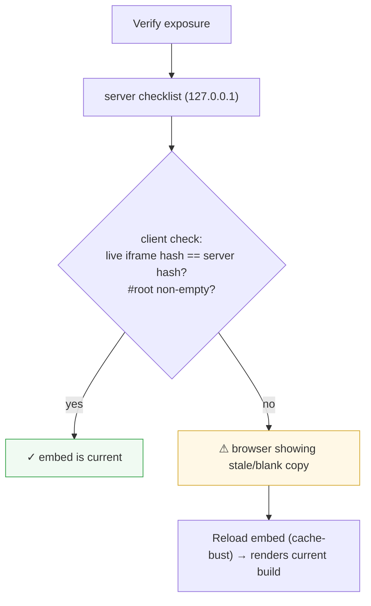

# Exposure check — catch a stale-in-the-browser embed

> Editing this plan? First read [doc principles](doc-principles.md).
> This is **slice 3 of [product onboarding](product-onboarding.md)** — read
> that for the Exposure check's design, naming, and placement; this plan only
> covers the new freshness concern. The embedding contract stays single-source
> in [../docs/networking/local-product-guide.md](../docs/networking/local-product-guide.md).

> **Status (2026-06-13):** DEPLOYED on `feature/expose-freshness-check`. All
> three layers shipped (client-side detect + Reload-embed, cache-bust Refresh,
> `Cache-Control: no-store` on proxied HTML). Verified end-to-end in a headless
> browser against the live harness (happy ✓ row, forced-stale ⚠ row +
> Reload-embed cache-bust) and confirmed working by the operator.

## Problem (a real incident, 2026-06-13)

A product (`web-flow-autodev` on :5300) was serving an old build with absolute
`/assets/<old-hash>.js` URLs, so its Local-tab embed was blank. We rebuilt it
to relative URLs and restarted it; the server was then **correct** — every
`GET /api/expose/check` row went green, and a clean browser rendered the embed
through the public URL.

But the operator **still saw blank for ten-plus minutes.** Their browser had
cached the pre-fix embed (the old `index.html` + dead asset hash), and the
iframe kept showing that stale document. It only rendered once they opened an
**incognito** window.

So "Verify exposure" said *all green* while the operator stared at a *blank
tab* — because the check is **server-side** (it probes `127.0.0.1`/`[::1]` and
parses the freshly-fetched `index.html`) and is **blind to what the operator's
own browser actually rendered**. That blind spot is the bug.

## Goal

Make the Exposure check account for the client cache: **detect** when the live
embed in *this* browser is stale (or blank) versus the current server build,
**recover** it in one click, and **prevent** it from recurring.

## Design — three layers

### 1. Detect (client-side) — the core addition

The `ExposeCheck` panel runs in the browser, as a sibling of the Local tab's
iframe (`iframe.product-frame`), which is **same-origin** (`/api/localview/…`),
so the panel can read `iframe.contentDocument`. After the server checklist
returns, run one browser-side check:

**Row: "Embed is current (not a cached copy)."**
- Fetch the proxied page fresh: `fetch('/api/localview/{id}/', { cache: 'no-store' })`,
  parse the main bundle filename (`assets/index-<hash>.js`) → the **server's
  current hash**.
- Read the **live iframe**: the bundle filename it actually loaded (from its
  `<script src*="assets/">`), and whether its `#root` is empty.
- Verdict:
  - live hash === server hash, `#root` non-empty → **ok**.
  - hashes differ, or `#root` empty while the server serves HTML → **warn**:
    "Your browser is showing a stale/blank copy (loaded `X`, current is `Y`)."

This row is a **warning, not a contract failure** — the *product* is fine; the
*browser* is stale. Keep it visually distinct from the ✗ contract rows so it
doesn't read as "the product is broken." It does **not** feed the
`fixWithAgent` prompt (there's nothing for an agent to fix).

### 2. Recover (one click)

When that row warns, show a **"Reload embed"** action that reloads the iframe
with a cache-busting token. `ExposeCheck` calls a callback up to `LocalApp`,
which owns the iframe.

### 3. Make the existing Refresh reliable + prevent at the source

- **Refresh button (`LocalApp`)**: today it only re-keys the iframe with the
  *same* `src`, so the browser can re-serve the cached document. Give the URL a
  cache-bust token that the Refresh button (and the Reload-embed action) bump,
  so a refresh truly forces a fresh load. The token rides as `?_=<n>` on the
  trailing-slash doc URL; relative `./assets/…` still resolve under
  `/api/localview/{id}/`, so this is safe.
- **Server prevention (`LocalProxyController`)**: set `Cache-Control: no-store`
  on **HTML** responses only (leave hashed JS/CSS cacheable). This is the
  server-side fix [../docs/claude-web/proxy.md](../docs/claude-web/proxy.md)
  already prescribes for the stale-HTML trap — it stops the embed going stale
  in the first place. Detection (1) remains the safety net for already-cached
  tabs and for the App-tab/ARR path we can't fully control.

## Scope / non-goals

- **Local tab first.** The App tab (`/preview/`, off-box IIS/ARR) shares the
  cause but adds traps we can't fully probe from this box; do it later if
  wanted.
- No new nav tab; this lives in the existing `ExposeCheck` panel.
- Read-only w.r.t. the product (unchanged); the only writes are the harness's
  own `Cache-Control` header and a client-side iframe reload.

## Files (anticipated)

- `client/src/components/expose/ExposeCheck.jsx` — the client freshness check +
  warn row + "Reload embed" button; new prop/callback from the parent.
- `client/src/pages/LocalApp.jsx` — cache-bust token on the iframe URL; wire
  the Refresh button and the new Reload-embed callback to bump it.
- `client/src/components/expose/expose.css` — warn-row styling distinct from ✗.
- `client/src/i18n/en.json` + `tr.json` — new strings.
- `ClaudeWeb.App/Controllers/LocalProxyController.cs` — `Cache-Control:
  no-store` on `text/html` responses.

## Verify (before claiming it works)

Headless browser (per [../docs/claude-web/browser-testing.md](../docs/claude-web/browser-testing.md)),
on an isolated preview, NOT just curl:
1. Render the embed, then swap the product build (new asset hash) WITHOUT
   reloading the tab → run the check → it must flag "stale copy" naming both
   hashes; "Reload embed" must clear it and render the current build.
2. Healthy case (no swap) → the freshness row is ✓ and silent.
3. Confirm the proxy now sends `Cache-Control: no-store` on the HTML and NOT on
   the hashed assets.
