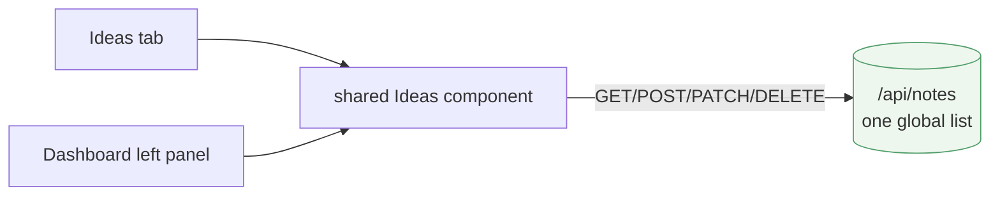

# Ideas go global, pinned left of the dashboard

> **Status (2026-06-14):** Plan — design set, not built. On
> `feature/ideas-pinned-dashboard`. Structured per
> [doc-principles.md](doc-principles.md). Visual companion:
> [ideas-pinned-dashboard.html](ideas-pinned-dashboard.html).

## ⚠️ Reverses a documented decision

[ideas-tab.md](ideas-tab.md) deliberately made Ideas **per-project**
("project-scoped," notes keyed by `repoId`). This plan makes them **global** —
one master list, the same everywhere. The user chose this knowingly; recording
it here per the repo's most-important convention.

## Goal

Ideas are a **global** feature: a single master list, not per-project and not
per-agent. Keep the **Ideas tab**, but it now shows **all** ideas. Additionally,
pin that same global list down the **left of the agent dashboard** overlay, so
your notes are in view in mission control.

## Design

### Part A — Ideas become global

- **Backend.** `NotesService` drops the `repoId` keying: `notes.json` goes from
  `{ Notes: { repoId → [Note] } }` to a single global `{ Ideas: [Note] }` list.
  `NotesController` no longer injects `RepositoryResolver` / reads `X-Repo-Id`;
  `GET/POST/PATCH/DELETE /api/notes` operate on the one list. A `Note` is
  unchanged (`{ id, text, createdAt, updatedAt }`).
- **Migration (no data loss).** On load, if the old per-repo shape is found,
  **flatten every project's notes into one list**, sorted by `createdAt`, and
  save back in the new shape. Same atomic temp+rename + never-reseed-on-unreadable
  guard as today.
- **Ideas tab (`pages/Ideas.jsx`).** Fetch once (global) instead of on every
  `currentRepoId` change; drop the project dependency. Composer/list/edit/delete
  UI is otherwise unchanged.

### Part B — pin the global Ideas left of the dashboard

- Extract the Ideas list + composer from `pages/Ideas.jsx` into a **shared
  component** (doc-principles §3) that both the tab and the dashboard panel
  render — no duplication.
- In `pages/Dashboard.jsx`, split the `.dash` body into the **Ideas panel
  (left)** + the existing `.dash__grid` (right). The header (size, view toggle,
  close) stays on top.

- **Gating:** Ideas tab keeps its `ideasTab: 'advanced'` capability; the
  dashboard panel rides the dashboard's own Advanced gating.

## Resolved

- **Whose ideas?** → **all of them, global.** No per-project / per-agent scope.
  This is the whole point of the change.

## Open questions (minor)

1. **Merge ordering** when flattening old per-repo notes — by `createdAt`
   (leaning) is the natural single timeline.
2. **Mobile.** The dashboard overlay is used on phones — does the left panel
   collapse / stack on narrow screens? (Carried over from the layout question.)
3. **Filename.** Keep `notes.json` (just reshaped) — yes, no rename needed.

## Verification (planned)

Headless Playwright on an isolated `:5200` preview:
- **Global, not per-project:** add an idea while project A is selected; switch
  to project B → the **same** idea is still shown (the old build hid it). Reload
  persists.
- **Migration:** seed an old-shape `notes.json` (notes under two repo ids),
  start the harness, confirm `GET /api/notes` returns the merged list and the
  file is rewritten to the global shape.
- **Dashboard panel:** open the overlay → the Ideas panel renders the global
  list on the left beside the agent grid; add/edit/delete round-trips.
- Hygiene: back up/restore the shared `notes.json` around the test.
