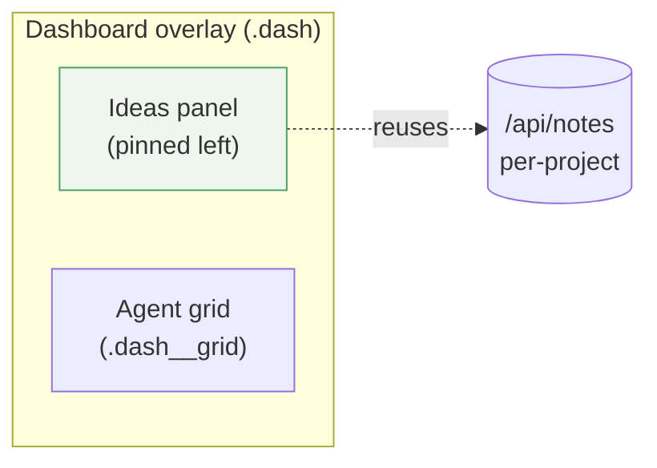

# Ideas pinned left of the dashboard

> **Status (2026-06-14):** **Plan START** — early design, not built. On
> `feature/ideas-pinned-dashboard`. Open questions below need answers before
> building. Structured per [doc-principles.md](doc-principles.md).

## Problem

The [agent dashboard](agent-dashboard.md) is the mission-control overlay: a
full-screen grid / wall-of-phones of every agent on this machine. While watching
the agents, the user wants their **[Ideas](ideas-tab.md)** (per-project notes)
**pinned to the left** — always in view, not a separate tab you navigate away to.

## Rough design (to refine)

A left **Ideas panel** inside the dashboard overlay; the agent grid takes the
rest. Reuse what's already shipped — the Ideas notes API and rendering — so this
is mostly layout, not new plumbing.

- **Backend:** none — reuse the shipped `/api/notes` (`NotesController` /
  `NotesService`, per-project via `X-Repo-Id`).
- **Frontend:** restructure `pages/Dashboard.jsx`'s `.dash` body into a
  horizontal split — Ideas panel (left) + existing `.dash__grid` (right).
  Extract the Ideas list/composer out of `pages/Ideas.jsx` into a shared
  component both the tab and the panel render, rather than duplicating it
  (doc-principles §3). Header (size stepper, Cards/Phones/Hot toggle, close)
  stays on top.
- **Gating:** Advanced-only, like both parent features.

## Open questions (answer before building)

1. **Whose ideas?** The dashboard spans **all projects**, but ideas are
   **per-project**. Show the **currently-selected project's** ideas (`currentRepoId`,
   simplest — leaning this), or add a project switcher in the panel, or a
   cross-project grouped list? **This is the load-bearing decision.**
2. **Read-only or editable?** Full composer/edit/delete (reuse the tab's UI), or
   a read-only glance with editing left to the Ideas tab?
3. **Layout / mobile.** The overlay is used on phones too — does the left panel
   collapse / move to a drawer on narrow screens, or is this desktop-only?
4. **Always shown or toggleable?** Pinned permanently, or a show/hide toggle
   (and does it eat grid width when many agents are open)?
5. **Coordination:** the agent dashboard is still evolving on
   `feature/agent-dashboard` — build this on top of merged `main`, and expect to
   rebase as the dashboard changes.

## Verification (later)

Headless Playwright on an isolated `:5200` preview: open the dashboard overlay,
confirm the Ideas panel renders the (selected project's) notes on the left
alongside the agent grid; add/edit/delete round-trips if editable; project
scoping holds; hidden in Basic mode.
