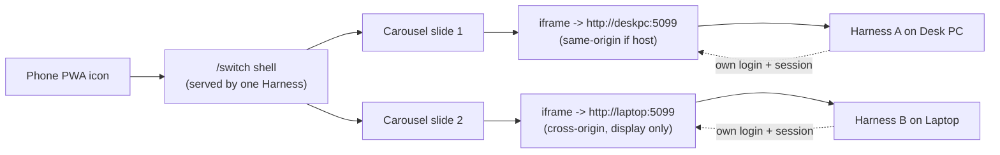
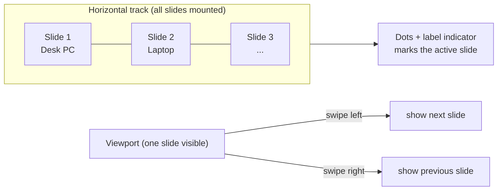

# Instance switcher — swipe between harnesses on different computers

> **Status (2026-06-13):** PLANNED — discussion draft, nothing built.
> Builds on [pwa-shell.md](pwa-shell.md) (the home-screen launcher) and reuses
> the iframe pattern from [local-app-tab.md](local-app-tab.md) /
> `components/app/ProductFrame`. Structured per
> [doc-principles.md](doc-principles.md).

## Why

The End User runs this Harness on more than one computer, each reachable at a
different web address (e.g. `http://deskpc:5099`, `http://laptop:5099`). From
the phone they want to glance at one machine, then swipe to the other —
without retyping addresses or juggling browser tabs. The existing PWA icon
opens exactly one instance; this turns it into a multi-instance switcher.

## Native vs PWA — read first

The "Android app" the user remembers is the **PWA shell**
([pwa-shell.md](pwa-shell.md)), not native code. This plan stays a **web/PWA
shell**, consistent with that and with the repo's stack (.NET + React — there
is no Android/Kotlin toolchain here). A true native APK (WebView + ViewPager)
would be a separate, large project outside these conventions; **not proposed**
unless the user explicitly wants it.

Because every target is our **own** Harness, the iframe approach is sound:
the harness sends no `X-Frame-Options`/CSP `frame-ancestors` headers
(verified 2026-06-13), so it embeds freely — the hosting instance same-origin,
the others cross-origin (display only, which is all we need).

## What

A new full-screen shell route, e.g. `/switch`, served by the Harness like any
SPA route:

- Holds a list of **instances** `{ label, url }` (e.g. "Desk PC" →
  `http://deskpc:5099`).
- Renders each instance as a full-screen `<iframe>` in a horizontal carousel.
  **Swipe left/right** flips between them (the core gesture); a small
  dots+label indicator shows which machine is in view. Desktop fallback:
  arrow buttons / left-right keys.
- An edit affordance to add/rename/remove/reorder instances.
- The PWA `manifest.start_url` can point here so the home-screen icon opens
  the switcher (see decision 2).

Each iframe authenticates **independently** against its own origin — the
password gate renders inside the frame and the user logs in once per instance;
that instance's own session keeps it logged in. The parent shell never reads
into a cross-origin frame (it can't, and doesn't need to).

The swipe gesture just moves a viewport across pre-mounted slides; the iframes
stay alive, so flipping back is instant:

## Open decisions (discuss before building)

1. **Config storage — device-local vs backend-synced.** The list of computers
   is inherently per-device/per-network, and the shell may be served by
   *either* instance, so backend-syncing it to one instance's
   `uisettings.json` is awkward. *Proposed:* device-local `localStorage`.
   **Confirm.**
2. **PWA `start_url`.** Switch the home-screen icon to open `/switch` by
   default, or keep `/studio` and reach the switcher via a link/button?
   *Proposed:* keep `/studio` as default, add `/switch` as an opt-in the user
   can set as their installed start page — least disruptive. **Confirm.**
3. **Phone interaction model.** A phone can't usefully show two full Harness
   UIs side-by-side. *Proposed:* swipe-to-**switch** (full-screen carousel,
   one instance visible at a time), not split. **Confirm.**
4. **How many instances.** Generalize to N (recommended — same code for 2 or
   5) rather than hard-coding two. **Confirm.**
5. **Keep-alive vs lazy mount.** N live iframes = N full app instances in
   memory. For 2 it's fine to keep all mounted (instant swipe). For more,
   mount the current + neighbours and reload the rest on demand. *Proposed:*
   keep all mounted at N≤3, lazy beyond. **Confirm.**

## Caveats

- **Mixed content.** If the shell is ever served over HTTPS, browsers block
  iframing plain-HTTP instances. Today everything is HTTP on the LAN, so this
  is fine; flagged for the eventual HTTPS proxy (same caveat family as
  pwa-shell.md).
- **Reachability.** An instance URL only loads when the phone can route to it
  (same LAN / VPN). Out-of-network instances show the browser's own
  connection error inside the frame — the shell can't mask that, but the
  label + indicator make it obvious which machine failed.
- **No cross-instance state.** This only *displays* each instance; it does not
  share chat/projects between them. Each is fully separate.

## Not doing (unless asked)

- A native Android APK (see "Native vs PWA").
- Sharing/syncing data between instances.
- Embedding non-Harness external sites (that was the earlier Google-Translate
  idea — blocked by other sites' framing headers; this plan deliberately
  scopes to our own Harness only).

## Verification (Done criteria, when built)

Headless with **two** isolated preview instances (`:5201` + `:5202`,
self-dev rules):

- Shell route lists both instances from its config; each renders an iframe
  whose `src` is the right origin and which loads that instance's login gate.
- Swipe (synthetic touch / arrow control) advances the carousel; the
  indicator updates to the active instance.
- Config edits (add/rename/remove/reorder) persist across reload
  (localStorage per decision 1).
- Assert the harness still serves frames un-blocked (no `X-Frame-Options`).
- Single-instance / empty-config states render a sensible prompt, not a blank
  screen.
