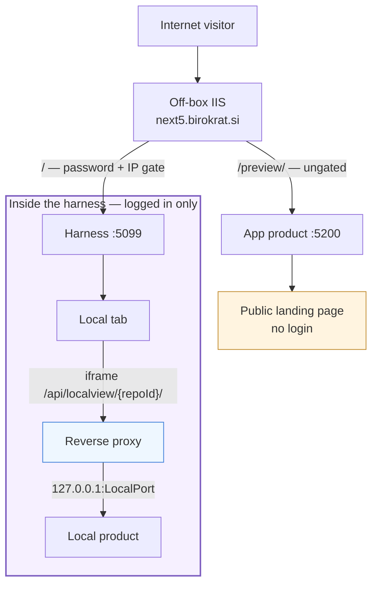
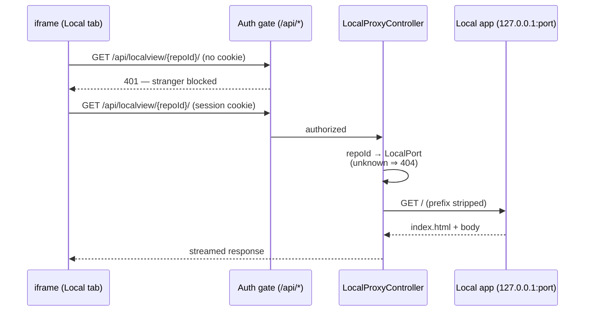
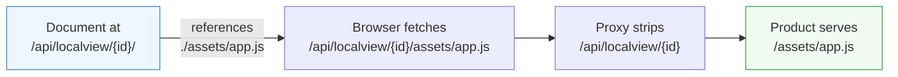

# Local tab over the internet — harness-proxied, authenticated, not on the landing

> **Status (2026-06-13):** Deployed and confirmed — works over the internet
> from the user's phone (WiFi off), so the off-box IIS forward of the
> harness root DOES hold (the one assumption I couldn't test from the box).
> Live :5099 round-trip OK: 401 unauth, 200 auth, proxied api/forms = 408.
> Rollback disarmed; health 200, bundle hash match. Browser-verified on
> :5201 first — `verify-local-app-proxy.mjs` 7/7. Pilot made sub-path aware
> on `feature/web-pilot` (Vite base './', relative fetch). On
> `feature/local-app-proxy`, not yet merged to main. Decisions locked
> (user said "start work", accepting the reversal):
> 1) the selected project's local product is **exposed to the internet
> behind the harness password** — LAN-only is reversed on purpose;
> 2) **proxy-only** — the LAN-direct iframe is replaced, not kept
> (also fixes the earlier IPv6/HTTPS/mixed-content failures);
> 3) gating is the **global session+IP gate** via the `/api/` path, no
> extra per-path restriction.
> One assumption still verified during testing, not blocking: the harness
> root is internet-reachable through `next5.birokrat.si` (Guests/IP-intel
> imply yes). The proxy design is correct over any origin that reaches the
> harness regardless; this only decides whether "internet" literally works.

> **Related:** making a product repo *set itself up* to be exposed here
> (instead of hand-copying the contract) is the
> [product-onboarding](product-onboarding.md) design.

## What the user wants

Make the Local tab's per-project product reachable **over the internet**,
not just the LAN. The contrast they drew:

- **App tab** → its product is the **public landing page** (`/`,
  `Landing.jsx`), shown to anyone with no login.
- **Local tab** → its product should be visible **only inside the harness,
  after clicking the Local tab** — gated by the harness login, never on the
  landing page.

## User stories — what this actually feels like

Concrete walkthroughs of the feature in use, to ground the design above.

**1. The operator views a private tool from the train.**
> *As the operator, away from the office, I want to open the web-flow-autodev
> exposure matrix on my phone, so that I can check progress without being on
> the LAN.*

I open `next5.birokrat.si` on my phone and log in. I pick **web-flow-autodev**
in Projects, tap the **Local** tab, and the exposure matrix loads right
there in the tab. Behind the scenes the harness fetched it from
`127.0.0.1:5300` on the host and streamed it back to me — I never needed to
be on the LAN, and the port was never opened to the internet directly.
Before this feature the tab was blank off-LAN; now it just works.

**2. A stranger cannot see it.**
> *As the operator, I want the local tool to stay private, so that exposing
> it remotely doesn't leak internal data.*

Someone who finds `next5.birokrat.si/api/localview/...` without logging in
gets a flat **401** — the same password gate that guards everything else.
The tool only appears *inside* the harness, after login, when I click the
Local tab. It is never on the public home page (that spot belongs to the App
tab's product).

**3. The operator sets up a new project's preview once.**
> *As the operator, I want to point the Local tab at any project's app, so
> that each project shows its own running app.*

On a project with no local app configured, the Local tab shows a small form:
"which port does this serve on?" I type `5300`, hit save, and from then on
that project's Local tab shows its app. The port is remembered on the
backend, so it's already set the next time I open the project — on any device.

**4. The App tab is the public face; the Local tab is the private one.**
> *As the operator, I want a public demo page AND a private internal view, so
> that visitors see the product but only I see the tooling.*

The **App tab**'s product is what anyone sees at the site root with no login —
the shop window. The **Local tab**'s product is the back office: same idea of
"show a running app," but reachable only through my logged-in session. Same
feature shape, opposite audience.

The App product is reachable with no login (it *is* the home page); the
Local product is only ever reached through the gated harness origin.

## ⚠️ Convention + security reversal (must confirm first)

1. **Reverses LAN-only.** [local-app-tab](local-app-tab.md) deliberately
   served the local port by **direct iframe on the LAN**, with *none* of the
   `/preview/` proxy machinery, precisely so project data (e.g. the
   web-flow-autodev exposure database — internal VB6 form data) never leaves
   the LAN. This plan puts it on the internet. That data becomes
   internet-reachable — **behind the harness password**, but off-LAN. The
   user chose the opposite earlier; confirm the reversal.
2. **Re-introduces the five proxy traps.** Serving the product through the
   harness means serving it under a **sub-path**, which brings back exactly
   the base-href / asset-URL / API-URL / cache / HTTP-411 traps documented
   in [proxy guide](../docs/claude-web/proxy.md) — the thing the Local tab
   was built to avoid. The embedded product must become sub-path-aware.
3. **Unlike `/preview/`, this path will be AUTHENTICATED.** The off-box IIS
   forwards `/preview/`→:5200 ungated (a recorded, accepted hole). The new
   path rides the harness's own origin and sits **behind the session
   cookie** — strictly better for privacy.

## Why it must be a harness-side proxy (not an IIS rule)

The public proxy (`next5.birokrat.si` → off-box IIS at 89.212.3.156) is
**not editable from this box** (project memory). So we cannot add a
`/localpreview/`→:5300 forward there. The only way to expose the local port
over the internet is to ride the harness's **own** origin (:5099), which the
IIS already forwards. So the harness reverse-proxies the local port itself.

> **Assumption to confirm:** the harness UI (`:5099` root) is already
> reachable from the internet through `next5.birokrat.si`, behind the
> password + IP filter (the Guests/IP-intel features imply it is). If the
> root is *not* forwarded and only `/preview/` is, this approach can't reach
> the internet either and we'd need an off-box IIS change (impossible from
> here).

## Design

### Authenticated reverse proxy in the harness

`GET/POST/... /api/localview/{repoId}/{**rest}` →
`http://127.0.0.1:{repo.LocalPort}/{rest}`.

- **Under `/api/`** so the existing `PasswordAuthMiddleware` gates it with
  zero security-critical middleware edits — the same-origin iframe sends the
  session cookie automatically, so a logged-in operator sees it and a
  stranger gets 401.
- **SSRF-bounded:** the path carries a **repoId**, resolved to that repo's
  configured `LocalPort`; the proxy only ever connects to
  `127.0.0.1:<that port>`. No arbitrary host/port from the URL — only
  localhost ports the operator explicitly set.
- Streams request/response bodies and copies status + headers; drops
  hop-by-hop headers. `HttpClient` (registered singleton / `IHttpClientFactory`).

### Sub-path handling (the unavoidable cost)

The product is served under `/api/localview/{repoId}/`. As built, the
sub-path resolves itself with **two cheap rules — no HTML rewriting**:

- The Local-tab iframe `src` ends in a **trailing slash**
  (`/api/localview/{repoId}/`), so the browser treats it as the base
  directory and resolves every **relative** URL under it.
- The product emits **relative URLs** (Vite `base: './'`, `fetch('api/...')`
  with no leading slash) — the [proxy guide](../docs/claude-web/proxy.md)
  playbook. The **web-flow-autodev pilot** (`feature/web-pilot`) is the first
  consumer updated this way. The proxy then just **strips the prefix** before
  forwarding; it does not parse or inject anything into the HTML.

An **absolute** URL (`/assets/app.js`) would escape the prefix and hit the
harness instead — that's why the product must stay relative.

### Frontend (Local tab)

`LocalApp.jsx` iframes the **same-origin** path
`/api/localview/{currentRepoId}/` instead of `http://<host>:<port>` directly.
Bonus: this also fixes the earlier **IPv6/localhost/mixed-content** failures
for free — the connection to `127.0.0.1:port` happens **server-side**, and
the iframe is same-origin/same-scheme as the harness. The LAN-only fallback
(today's direct iframe) can stay as an option or be dropped — see Q2.

### Landing page is untouched

`Landing.jsx` keeps showing only the App-tab product (:5200). The Local
product is never added to `/`, satisfying "only when I click the Local tab."

## Resolved (was: open questions)

1. Reversal **accepted** — internet-reachable behind the harness password.
2. **Proxy-only**; the LAN-direct iframe is removed.
3. Gating is the existing global session + IP-allowlist gate (the `/api/`
   path inherits it); no extra per-path restriction.

## Implementation

1. Backend: `LocalProxyController` at `/api/localview/{repoId}/{**rest}`,
   `HttpClient` wiring, repoId→LocalPort resolution, prefix strip (the
   catch-all `rest` is forwarded as-is), header/stream copy, 502 on a dead
   app. No HTML rewriting — the product carries relative URLs.
2. Frontend: `LocalApp.jsx` → same-origin iframe; tidy the port form copy
   (it's now an internet-reachable preview).
3. Pilot: make `web-flow-autodev/web` sub-path-aware (relative base + API).
4. i18n; plan/dashboard updates.

## Verification (planned)

`verify-local-app-proxy.mjs` on :5201: with a marker app on a test port and
a test repo's `LocalPort` set, the iframe at `/api/localview/{repoId}/`
renders it; an **unauthenticated** request to the same path gets **401**
(the gate works); a repoId with no LocalPort 404s; SSRF probe (path tricks)
can't reach a non-registered port; landing page still shows only the App
product. Then end-to-end with the pilot through the proxy path, screenshot
read.
