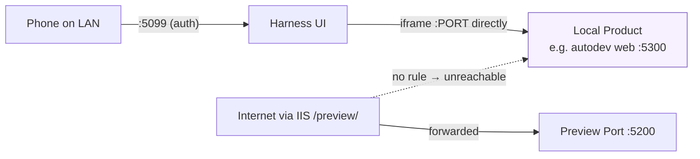

# Local tab — preview any local port, never published

> **Status (2026-06-13):** Implemented on `feature/local-app-tab` (`d3e23a0`)
> and browser-verified on :5201 — `verify-local-app-tab.mjs` 9/9 (cross-origin
> iframe render, persistence, dead-port empty state, basic-mode hidden), plus
> end-to-end with the first real consumer: the web-flow-autodev pilot on
> :5300 (`shot-autodev-pilot.mjs`, screenshots read). Not yet deployed.
> NOTE until deployed: the live binary predates `LocalPort` — any registry
> save through live :5099 (e.g. adding a project) strips the field from
> repositories.json. Deploy closes the window.

## Problem

The App tab previews the Preview Port (5200), which is also what the off-box
IIS forwards to the internet as `/preview/` — so anything shown there must
implement the five sub-path proxy traps ([proxy guide](../docs/claude-web/proxy.md))
and is publicly reachable. For Products that should stay private (first case:
the web-flow-autodev pilot), all of that is unnecessary baggage. The user
wants a tab that simply iframes a port on the host — LAN-only, zero proxy
machinery, port chosen per project.

## Design

A new **Local tab** (advanced-only). The existing App tab is untouched.

- **Per-project port**: each repo entry gets a nullable `LocalPort`
  (repositories.json, backend-synced like `Visibility`). The tab shows the
  current project's port; when unset it offers a port form.
- **Direct iframe**: `<protocol>//<ui-hostname>:<port>` — the same host the
  UI was loaded from, no `/preview/` path, no rewriting. Reuses
  `ProductFrame` (liveness probe + empty state + reload).
- **Local-only by construction**: no IIS rule forwards the port, so it is
  unreachable from the internet. Browsing the harness remotely makes this
  tab show its offline state — that is the feature, not a bug. A hint in
  the bar says so.
- The Product just binds `0.0.0.0:<port>` and serves at root — apps that
  know nothing about Claude Web work unmodified.

### API

- `GET /api/repos` entries gain `localPort` (null when unset).
- `POST /api/repos/{id}/localport` `{ port }` — 1..65535 sets, null/0 clears.

### Decisions

- `localAppTab: 'advanced'` capability (convention default).
- Port lives on the repo entry, not uisettings — it describes the Product,
  not the device; it also ends the single-occupancy fight over :5200.
- No liveness identity lookup (App tab's netstat/WMI identity stays
  App-tab-only); the Local tab trusts the port the user assigned.
- LAN trust unchanged: the port is open to the LAN without auth, exactly
  like :5200 today.

## Implementation

1. Backend: `RepositoryConfig.LocalPort` (int?), registry
   `SetLocalPort`/`ToInfo`/`Clone`, `RepoController` list/add payloads +
   `POST {id}/localport`; `SettingsController.KnownTabs` += `localapp`.
2. Frontend: `pages/LocalApp.jsx` + `localapp.css` (port form / ProductFrame
   view), tabRegistry + App.jsx route `/studio/local`, `localAppTab`
   capability, i18n en/tr.

## Verification

`verify-local-app-tab.mjs` (:5201): set a port on a NON-self test repo via
the UI form, serve a marker page on that port from the test itself, assert
the iframe renders it cross-origin, port persists in repositories.json,
empty state when nothing listens, tab hidden in Basic mode. Hygiene:
repositories.json is shared with live — clear the test repo's localPort in
finally; kill the marker server.
