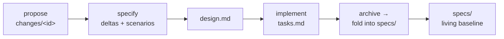

# OpenSpec — investigate it and adopt its flow

> Editing this plan? First read [doc principles](doc-principles.md).

> **Status (2026-06-18): DECIDED — Path A (adopt the tooling). Port plan below.** On
> `feature/openspec-flow`. Calibrated 2026-06-17 (throwaway `new change → validate →
> archive` cycle, real `openspec` CLI v1.4.1 — findings under "Calibration findings").
> The user has chosen to **adopt OpenSpec wholesale** (the CLI + `openspec/` tree +
> `.claude/opsx` commands), overriding spec-baseline's "borrow, don't adopt" and the
> calibration lean toward Path B. **Supersedes [spec-baseline.md](spec-baseline.md).**
> The two-sources-of-truth risk both docs name is **not waved away** — Phase 3
> (harness rendering) is the deliberate answer to it.
>
> **Refinement (2026-06-19): scope is the *planning layer*, and the harness stays.** OpenSpec
> replaces our planning convention (`plans/*` + `understanding.md`) from now on; the **Claude
> Web harness is retained** as the development environment (the user's tuned "emacs"). This
> **elevates Phase 3 from optional to essential** — the harness renders `plans/*` +
> `understanding.md` today but **not** `openspec/`, so the instant we switch, planning goes
> *dark inside the harness* until Phase 3 lands. Immediate next steps: **Phase 0** (`openspec
> init` + commit the tree) and the **`CLAUDE.md` update**, so the documented convention matches
> actual practice.

## Goal

Investigate OpenSpec's spec-driven flow and adopt it for Claude Web — so every feature has a
**living spec baseline** (what the system does today) plus **change proposals as deltas**
against it, reviewed *before* code, archived *after* ship. The bet: this hardens the
intent-before-code ritual we already do loosely and gives us the retrospective "what does
this do now?" truth our forward-looking plans lack.

**Scope (clarified 2026-06-19).** OpenSpec is the new **planning layer** — it replaces
`plans/*` + `understanding.md`, **not** the harness. The Claude Web harness stays the
development environment; the goal is to plan *in* OpenSpec yet keep reading those plans
*through* the harness — which is why Phase 3 (harness rendering) is essential, not optional.

## What OpenSpec is (investigation findings)

OpenSpec (`@fission-ai/openspec`, MIT, Node CLI + AI slash-commands) is a spec-driven
workflow for AI coding assistants. Three dirs and a change lifecycle:

- **`specs/`** — the living baseline: requirements + scenarios for what the system *does
  today*, grouped by capability.
- **`changes/<id>/`** — one folder per in-flight change, holding `proposal.md` (why/what),
  `design.md` (technical approach), `tasks.md` (implementation checklist), and a `specs/`
  subdir of **deltas** (`ADDED` / `MODIFIED` / `REMOVED` requirements with GIVEN/WHEN/THEN
  scenarios).
- **`archive/`** — completed changes, date-stamped; archiving folds the change's deltas into
  the root `specs/` baseline.



Tooling: `openspec init` (scaffolds the dirs + an `AGENTS.md` of agent instructions),
`openspec list` / `validate` / `archive`, and slash-commands for 25+ assistants —
`/opsx:propose <idea>`, `/opsx:apply`, `/opsx:archive`. Philosophy: "fluid not rigid" — edit
any artifact anytime, no hard phase gates.

## Relationship to spec-baseline (the tension to resolve)

[spec-baseline.md](spec-baseline.md) already analyzed OpenSpec and recommended **borrow, don't
adopt**: take only the "living baseline" idea as a plain `docs/capabilities.md` + a per-plan
delta line, and explicitly **NOT** the CLI, the `changes/`+`archive/` dirs, or
GIVEN/WHEN/THEN everywhere — to avoid a second toolchain and a second source of truth that
drifts from the harness.

This feature **reopens that decision** at the user's request ("adopt its flow"). The core
risk spec-baseline named is still real and must be answered here: **two sources of truth**
(OpenSpec's dirs vs our `plans/*` + harness rendering) is the exact drift we keep fighting.
So adoption is not free — the open question is *how much* of the flow to take.

## Decisions to make (the investigation's job)

1. **Tooling vs convention.** Adopt the real `openspec` CLI + `/opsx:*` slash-commands, or
   reimplement the *flow* in our existing `plans/*` convention (proposal/design/tasks/deltas
   as sections we already write)? Trade-off: real tool = proven + maintained but a parallel
   toolchain the harness doesn't render; our convention = single source of truth but we
   re-build the lifecycle.
2. **Map OpenSpec → our artifacts.** `proposal.md`/`design.md`/`tasks.md` ≈ our
   `understanding.md` + `plans/<feature>.md`; `archive/` ≈ Recently-shipped + status headers.
   What's genuinely new is the **`specs/` baseline + deltas**. Decide what to add vs rename.
3. **Harness integration.** If we adopt the dirs, the Plan/Files tabs and doc viewer must
   render them, or we lose the integration that makes our convention worth keeping.
4. **Calibration first.** Per spec-baseline's own advice: run OpenSpec on **one throwaway
   change** in this branch (an afternoon) to *feel* the flow before committing.

## Calibration findings (2026-06-17, real `openspec` CLI v1.4.1)

Ran a full throwaway cycle in `../openspec-calibrate` (outside this repo, so the
branch stays clean): `init --tools claude` → `new change "add-dark-mode-toggle"`
→ authored `proposal.md` / `specs/theme-toggle/spec.md` / `design.md` /
`tasks.md` → `validate` (passed) → `archive`. What the flow actually felt like:

- **The fold is the real value.** `archive` took the change's `## ADDED
  Requirements` delta and wrote it into the living baseline at
  `openspec/specs/theme-toggle/spec.md`, then date-stamped the whole change into
  `openspec/changes/archive/2026-06-17-add-dark-mode-toggle/`. The
  "what does the system do *today*" baseline is the one thing our forward-looking
  `plans/*` genuinely lacks (this matches spec-baseline's read).
- **CLI-orchestrated, agent-authored.** Nothing is magic: `status --json` gives
  the artifact build order + `applyRequires`; `instructions <artifact> --json`
  hands the agent a template + rules; the agent writes the files; `validate`
  enforces the spec shape (notably scenarios MUST be exactly `####`, requirements
  MUST use SHALL/MUST and have ≥1 scenario). The `/opsx:*` slash-commands are just
  prompt wrappers around these primitives.
- **v1.4.1 differs from this plan's earlier notes.** `init` now scaffolds
  `.claude/commands/opsx/*` + `.claude/skills/openspec-*` and an `openspec/` tree
  (`specs/`, `changes/`, `changes/archive/`) — there is **no** top-level
  `AGENTS.md`, and no `openspec.json`. The change dir carries a `.openspec.yaml`.
- **Archive is not gated on implementation.** It warned `0/6 tasks` incomplete but
  proceeded with `--yes`, and seeded the new baseline spec with a literal
  `## Purpose\nTBD - update Purpose after archive` placeholder — a manual
  follow-up the tool won't fill in.
- **It is unmistakably a second source of truth.** The entire `openspec/` tree +
  `.claude/` scaffolding live alongside our `plans/*`, and the **harness renders
  none of it**. This is exactly the drift risk spec-baseline named — calibration
  confirms it rather than dispels it.

**Mapping to our artifacts** (confirmed by the run): `proposal.md` ≈ the why/what
of `understanding.md`; `design.md` ≈ the Approach section of `plans/<feature>.md`;
`tasks.md` ≈ our Slices; `archive/` ≈ Recently-shipped + status headers. The
**only genuinely net-new artifact is `specs/<cap>/spec.md`** — the living baseline
with delta operations. (Same 1-of-N conclusion the understanding-app already draws.)

## DECISION (2026-06-18): Path A — adopt the tooling

The user chose to **use OpenSpec for real**, not just borrow its baseline idea. Calibration
leaned Path B and `spec-baseline.md` argued against full adoption; this decision overrides
both, knowingly. The winning argument: the CLI's `validate` (enforced spec shape) and the
deterministic `archive` fold are real, maintained machinery we'd otherwise rebuild by hand,
and a true spec-driven flow is worth a one-time port. The accepted cost — a second source of
truth the harness can't see — is **paid down in Phase 3**, not ignored.

## The port plan

Ordered so every phase before the last is **additive and reversible** — `openspec/` sits
*alongside* `plans/*` until Phase 5. Rollback before Phase 5 = delete `openspec/` +
`.claude/commands/opsx` + `.claude/skills/openspec-*`.

### Phase 0 — Init & foundation (½ day, reversible)
- **CLI**: already installed globally (`@fission-ai/openspec` v1.4.1, on PATH). Pin the version
  in a dev note so future boxes match; decide global-vs-`npx` (lean: pin via a `package.json`
  devDependency so the version travels with the repo).
- **Init**: run `openspec init --tools claude` at the repo root. Scaffolds the `openspec/` tree
  (`specs/`, `changes/`, `changes/archive/`) + `.claude/commands/opsx/*` +
  `.claude/skills/openspec-*`.
- **`.claude/` reconcile**: the repo already commits `.claude/skills/defined-terms` — init adds
  `opsx` commands + `openspec-*` skills beside it; **no name collision**, but verify init
  doesn't rewrite shared files. `.claude/` is committed (not gitignored), so the new commands
  ship with the repo.
- **Commit `openspec/`** — it is *not* gitignored, and it is now intended to be the source of
  truth, so it is committed (unlike `.claudeweb-preview/`).
- **Exit check**: `openspec list` / `openspec validate` run clean on the empty scaffold.

### Phase 1 — Backfill the living baseline `openspec/specs/` (the big lift, 2–4 days)
This is the bulk of the work: distil **~110 `plans/*` + `CLAUDE.md` + `docs/`** into a
capability-grouped baseline of "what Claude Web does **today**."
- **Group by capability**, not by plan — candidate areas: `chat`, `files`, `git`,
  `local-app-preview`, `deploy`, `auth-gates`, `dashboard-docks`, `autopilot`, `understanding`,
  `ui-modes`, `projects`, `terminal`, `scoreboard`. (Map the plan corpus → these buckets first.)
- For each capability write `openspec/specs/<cap>/spec.md`: a `## Purpose` + requirements in
  **SHALL/MUST** form, each with ≥1 `####`-level scenario (validate **rejects** anything else —
  scenarios must be exactly `####`, every requirement needs a scenario).
- **Source of truth for behavior = the running app + Recently-shipped**, not aspirational plans.
  Backfill what *ships*, not what was once proposed-and-dropped.
- Run `openspec validate --strict` until clean. This phase is a good **multi-agent sweep**: one
  agent per capability bucket reading its plans + code, emitting a validated `spec.md`.
- **Out of scope for backfill**: superseded/abandoned plans; pure-rationale docs (`ANALYSIS.md`,
  `CLAUDE.md`) stay as rationale — link, don't fold.

### Phase 2 — Adopt the change lifecycle for NEW features (1 day + ongoing)
New-feature flow becomes the OpenSpec cycle, mapped onto rituals we already run:
| OpenSpec artifact | Our current equivalent | Action |
|---|---|---|
| `changes/<id>/proposal.md` | `understanding.md` (why/what) | author via `/opsx` |
| `changes/<id>/design.md` | Approach section of `plans/<feature>.md` | author via `/opsx` |
| `changes/<id>/tasks.md` | our Slices | author via `/opsx` |
| `changes/<id>/specs/` deltas | *(net-new)* | the one genuinely new artifact |
| `archive/<date>-<id>/` | Recently-shipped + status headers | `openspec archive` |
- Patch the **deploy/"keep it" ritual** to run `openspec archive` (folds deltas into the
  baseline) as the definition of done — the calibration warning is that archive does **not**
  gate on tasks and seeds a `Purpose: TBD` placeholder, so the ritual must include filling that.
- Update `CLAUDE.md` to point new work at the `/opsx:*` flow.

### Phase 3 — Harness rendering (essential, not optional · 2–3 days, real code)
Until the harness shows `openspec/`, it's invisible on the phone — the exact two-sources drift
both prior docs warned about. **And the harness is retained as the dev environment** (scope
refinement up top), so the moment we plan in OpenSpec the planning goes *dark inside the harness*
that the user explicitly keeps. That makes this phase non-negotiable, not a nice-to-have. So we
**make the harness a first-class OpenSpec viewer**:
- A Plan-tab / doc-viewer surface that renders `openspec/specs/` (the baseline) and active
  `openspec/changes/` (in-flight deltas), reusing the existing markdown + Mermaid doc viewer.
- Show change **status** (proposed / in-progress / archived) the way `plan.md` shows Active vs
  Recently-shipped today.
- Wire to `ClaudeWeb.App` (a controller exposing the `openspec/` tree) + a client tab, following
  `plans/INTEGRATION.md`. This is the phase that turns "second source of truth" back into "one
  visible source."

### Phase 4 — Migrate / retire the old convention (1 day, the point of no return)
- Decide the fate of `plans/*`: freeze as historical, or archive into `openspec/changes/archive`.
  (Lean: freeze in place, stop adding to it — cheap, preserves history, no churn.)
- Mark `spec-baseline.md` superseded (already implied). **`understanding.md` is already retired
  (DECIDED 2026-06-20):** the user dropped it from the workflow — the "Understanding panel —
  write your understanding first" section was removed from `CLAUDE.md` and the root
  `understanding.md` deleted. `proposal.md` now owns the restate-intent-before-code role; the
  Understanding *app* (`understanding-app/`) is unaffected and stays.
- Update `CLAUDE.md`, `docs/understanding-app-convention.md`, and `plan.md`'s dashboard to
  describe the OpenSpec flow as the canonical one.

## Open decisions for the user (before Phase 0)
1. **Dual-write or hard cut?** Keep `plans/*` alive in parallel through Phases 1–3 and only
   retire at Phase 4 (safe, my recommendation), or stop using it now? *(`understanding.md` is
   no longer part of this question — retired 2026-06-20, see Phase 4.)*
2. **Harness rendering — *sequencing*, not whether.** *(Settled 2026-06-19: it happens — the
   harness is retained, so planning must be visible there; see Phase 3.)* The only open knob is
   timing: start planning in OpenSpec via Phases 0–2 now and tolerate planning being dark in the
   harness until Phase 3, or hold the switch until Phase 3 ships?
3. **Backfill depth.** Full ~110-plan sweep into a complete baseline, or seed only the
   currently-shipped surface and grow the baseline as features change it?
4. **CLI provenance.** Pin as a repo devDependency (travels with the repo) vs rely on the
   global install already on this box.

## Out of scope
- Re-litigating the decision — Path A is chosen.
- Replacing the harness's existing markdown/Mermaid rendering engine (Phase 3 reuses it).

## Phase 4 — ready-to-swap `CLAUDE.md` block (paste at merge)

When the transition completes and this branch merges to `main`, **replace** the
interim "Planning convention is in transition" section in `CLAUDE.md` with the block
below. It flips the convention to OpenSpec and tells any straggler agent (whose branch
predates the merge and still uses `plans/*`) exactly how to cope — pointing at the
concrete recipe in `docs/openspec-migration.md`. Drafted now so the Phase-4 swap is a
paste, not a rewrite.

```markdown
## Planning convention — OpenSpec (spec-driven)

Plan **in OpenSpec**, not `plans/*`. A change goes **propose → specify → design →
implement → archive** via the `/opsx` commands:

- `openspec/specs/<cap>/spec.md` — the **living baseline** ("what the system does
  today"); `openspec list --specs` / `openspec show` to read it.
- `openspec/changes/<id>/` — an in-flight change: `proposal.md` (intent), `design.md`,
  `tasks.md`, and **delta specs** (`specs/<cap>/spec.md` as ADDED/MODIFIED/REMOVED).
- `openspec validate --strict` gates shape before code; `openspec archive <id>` folds
  the delta into the baseline on ship.
- `plans/*` and the `plan.md` dashboard are **frozen/historical** — do not add to them.
  `openspec list` is the new dashboard. The **Understanding app** convention is
  unchanged (still build one for non-trivial work).

**Merging in a branch that still uses the old `plans/*` system?** You'll hit a
conflict in `plan.md` and/or `CLAUDE.md` — that's expected, nothing is broken. Before
you merge, translate your plan into an OpenSpec change: follow
**`docs/openspec-migration.md`** step by step (it's written for exactly this), then
resolve the conflicts (take theirs for `plan.md`/`CLAUDE.md`, drop your dashboard row)
and merge.
```
