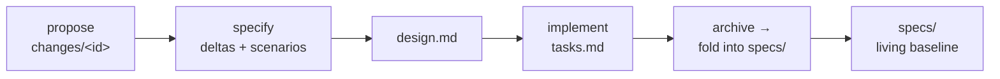

# OpenSpec — investigate it and adopt its flow

> Editing this plan? First read [doc principles](doc-principles.md).

> **Status (2026-06-17): KICKOFF — investigating.** On `feature/openspec-flow`.
> Goal is to investigate [OpenSpec](https://github.com/Fission-AI/OpenSpec) hands-on and
> **adopt its flow** into our convention. **Supersedes [spec-baseline.md](spec-baseline.md)**
> (which proposed borrowing *one idea* and explicitly *not* adopting the tooling) — see
> "Relationship to spec-baseline" below; we are now deliberately going further.

## Goal

Investigate OpenSpec's spec-driven flow and adopt it for Claude Web — so every feature has a
**living spec baseline** (what the system does today) plus **change proposals as deltas**
against it, reviewed *before* code, archived *after* ship. The bet: this hardens the
intent-before-code ritual we already do loosely and gives us the retrospective "what does
this do now?" truth our forward-looking plans lack.

## What OpenSpec is (investigation findings)

OpenSpec (`@fission-ai/openspec`, MIT, Node CLI + AI slash-commands) is a spec-driven
workflow for AI coding assistants. Three dirs and a change lifecycle:

- **`specs/`** — the living baseline: requirements + scenarios for what the system *does
  today*, grouped by capability.
- **`changes/<id>/`** — one folder per in-flight change, holding `proposal.md` (why/what),
  `design.md` (technical approach), `tasks.md` (implementation checklist), and a `specs/`
  subdir of **deltas** (`ADDED` / `MODIFIED` / `REMOVED` requirements with GIVEN/WHEN/THEN
  scenarios).
- **`archive/`** — completed changes, date-stamped; archiving folds the change's deltas into
  the root `specs/` baseline.

Tooling: `openspec init` (scaffolds the dirs + an `AGENTS.md` of agent instructions),
`openspec list` / `validate` / `archive`, and slash-commands for 25+ assistants —
`/opsx:propose <idea>`, `/opsx:apply`, `/opsx:archive`. Philosophy: "fluid not rigid" — edit
any artifact anytime, no hard phase gates.

## Relationship to spec-baseline (the tension to resolve)

[spec-baseline.md](spec-baseline.md) already analyzed OpenSpec and recommended **borrow, don't
adopt**: take only the "living baseline" idea as a plain `docs/capabilities.md` + a per-plan
delta line, and explicitly **NOT** the CLI, the `changes/`+`archive/` dirs, or
GIVEN/WHEN/THEN everywhere — to avoid a second toolchain and a second source of truth that
drifts from the harness.

This feature **reopens that decision** at the user's request ("adopt its flow"). The core
risk spec-baseline named is still real and must be answered here: **two sources of truth**
(OpenSpec's dirs vs our `plans/*` + harness rendering) is the exact drift we keep fighting.
So adoption is not free — the open question is *how much* of the flow to take.

## Decisions to make (the investigation's job)

1. **Tooling vs convention.** Adopt the real `openspec` CLI + `/opsx:*` slash-commands, or
   reimplement the *flow* in our existing `plans/*` convention (proposal/design/tasks/deltas
   as sections we already write)? Trade-off: real tool = proven + maintained but a parallel
   toolchain the harness doesn't render; our convention = single source of truth but we
   re-build the lifecycle.
2. **Map OpenSpec → our artifacts.** `proposal.md`/`design.md`/`tasks.md` ≈ our
   `understanding.md` + `plans/<feature>.md`; `archive/` ≈ Recently-shipped + status headers.
   What's genuinely new is the **`specs/` baseline + deltas**. Decide what to add vs rename.
3. **Harness integration.** If we adopt the dirs, the Plan/Files tabs and doc viewer must
   render them, or we lose the integration that makes our convention worth keeping.
4. **Calibration first.** Per spec-baseline's own advice: run OpenSpec on **one throwaway
   change** in this branch (an afternoon) to *feel* the flow before committing.

## Proposed slices (refine after calibration)

1. **Calibrate** — `openspec init` in a scratch dir, run one `/opsx:propose → apply →
   archive` cycle on a trivial change; write up what the flow felt like vs ours.
2. **Decide** — pick tooling-vs-convention and the artifact mapping (decisions 1–3 above),
   recording the call in this plan.
3. **Adopt slice 1** — land the chosen baseline mechanism (the `specs/`-equivalent + delta
   step in the ritual), backfilled once from current features.
4. **Harness render (optional)** — surface the baseline in the harness if it earns it.

## Out of scope (for now)

- No wholesale rip-and-replace of `plans/*` until calibration justifies it.
- No decision locked in before the throwaway calibration run.
