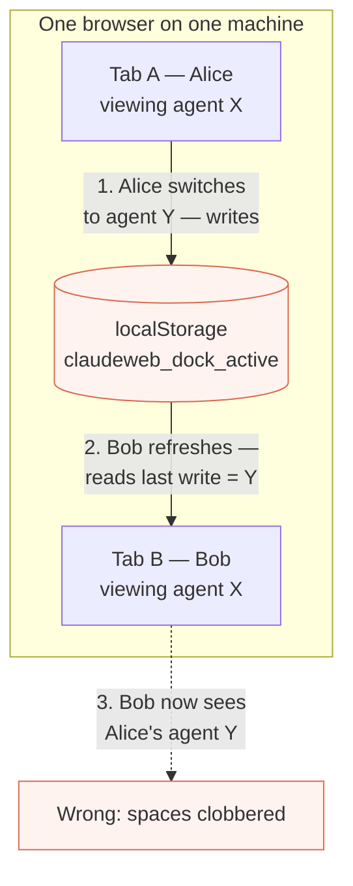
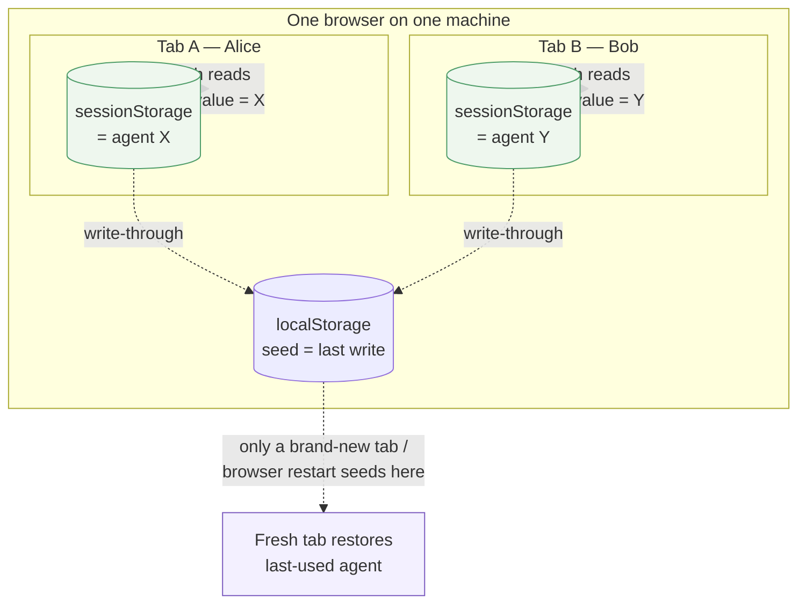
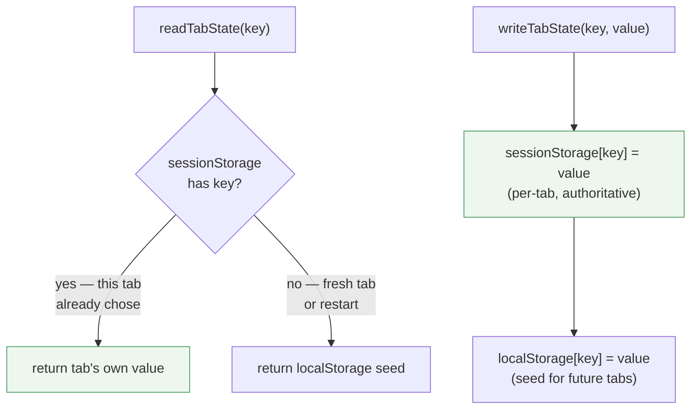

# Per-tab agent spaces — two tabs on one machine stay independent

> **Status (2026-06-13):** Shipped. Merged to main, deployed to the live
> `:5099` harness (deploy `25fb5b8`), and confirmed by the End User.
> **Browser-verified before/after** on an isolated `:5210` harness
> (`.claudeweb-preview/playwright/verify-per-tab.mjs`): the original build
> reproduces the clobber (Tab B inherits Tab A's agent on refresh), the fixed
> build keeps each tab independent.

## Problem

Two browser tabs of the **same browser on one machine** (e.g. two people, or
one person with two tabs) shared a single "currently open agent." When one tab
switched to a different agent, the other tab inherited it on its next page
refresh. Reported by the End User.

Root cause: the agent *tab list* is backend-owned and shared on purpose
(`dock.json`, see [dock-sync](dock-sync.md)), but *which agent a viewer is
looking at* was kept in **`localStorage`**, which every tab of the same browser
shares. So a refresh re-read the other tab's last write. Three keys were
affected — the active agent, the chat surface, and the selected project (which
follows the agent).

## Design

Move the three "which space is THIS tab looking at" keys from `localStorage`
(shared per browser) to **`sessionStorage`** (scoped per browser tab, survives a
refresh). Keep a write-through `localStorage` *seed* so a brand-new tab or a
browser restart still restores the last-used selection, while two open tabs each
diverge in their own `sessionStorage` and never clobber each other on refresh.

`readTabState`/`writeTabState` (in `viewState.js`) encode the seed rule:

| Key | Meaning |
|-----|---------|
| `claudeweb_dock_active` | active agent tab |
| `claudeweb_chat_view` | chat surface: agent / project / harness |
| `claudeweb_repo` | selected project (follows the active agent) |

Genuine per-user prefs (Simple/Advanced UI mode, language, model, chat/term
toggle) stay in `localStorage` — sharing those across a browser's tabs is
correct.

This refines [dock-sync](dock-sync.md)'s "Active Tab" from **device-local** to
**tab-local**; that plan's glossary + "Per-tab spaces" section point here.

## Files touched

| File | Change |
|------|--------|
| `client/src/api/viewState.js` | New: `readTabState`/`writeTabState` (sessionStorage + localStorage seed). |
| `client/src/api/client.js` | `_repoId` reads/writes via the helper instead of raw `localStorage`. |
| `client/src/context/DockContext.jsx` | `activeTabId` + `chatView` via the helper. |
| `plans/dock-sync.md` | "Active Tab" is now tab-local; pointer to this plan. |

## Verification

Isolated `:5200` instance, two Playwright tabs **in one browser context**
(shared storage): tab A opens agent X, tab B opens agent Y, A refreshes and must
still show X (not Y). Plus the existing dock/chat regression tests
(`verify-dock-sync.mjs`, `verify-two-turns.mjs`) must still pass.

Same deploy safety as always: build isolated, test on `:5200`, never touch the
running `:5099` harness until the user says deploy.
