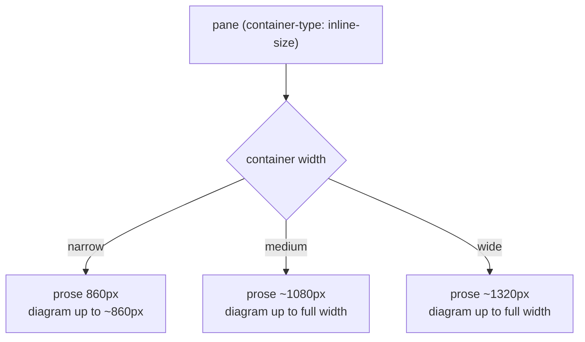

# Plan-tab stretch -- content width tracks the pane

> **Status (2026-06-13):** BUILT & browser-verified on the :5201 preview
> (`.preview-test/plan-stretch-test.mjs`, 9/9: narrow pane = 860px column,
> Plan pane stretched to span 4 -> `.plan` grows to ~1842px in a 2079px pane,
> resets to 860 when un-stretched, settings restored). Not yet merged/deployed.
> Structured per [doc-principles.md](doc-principles.md).

## Why

The Plan/doc content is a fixed centred reading column (`.plan { max-width:
860px; margin: 0 auto }`). When the user widens its pane via
[pane-widths.md](pane-widths.md) (spanning 2-3 slots), the pane grows but the
content stays pinned at 860px -- the extra space becomes side margin and the
mermaid diagrams cannot use it. The user wants a stretched pane to fill with
content, with diagrams rendered larger.

## What -- tiered, not full-bleed

Full-bleed (content always fills) was rejected: prose lines become unreadably
long at 3 slots wide. Instead the content width steps up in **tiers** as the
pane gets wider, and **diagrams are allowed to grow wider than the prose
column** at every tier.

Keyed off the pane's **actual rendered width** via a CSS **container query**
(not the slot count), so it behaves correctly at any monitor size, in single
or multi-pane, and as flex weights change.

### Mechanism

1. Make the pane a query container: `.app-content { container-type: inline-size }`
   (or `.pane`). One declaration; affects only descendants.
2. Replace the single `.plan max-width` with container-query tiers (as built):
   - default / narrow: `max-width: 860px` (today's readable column)
   - `@container (min-width: 1040px)`: `max-width: 1080px`
   - `@container (min-width: 1480px)`: `max-width: 1320px`
   - `@container (min-width: 1900px)`: `max-width: 90%` (very wide panes keep
     filling, with ~10% breathing room so it never goes full-bleed)
3. Let diagrams break out of the prose cap: the mermaid/diagram wrapper gets
   its own wider allowance (up to the full content box) so a wide pane renders
   bigger diagrams while prose stays readable.

`margin: 0 auto` stays, so within each tier the column is still centred -- it
just grows in steps instead of being frozen at 860px.

## Caveats

- Container queries need the container to have a defined inline size; the pane
  already lays out with flex width, so `container-type: inline-size` is safe
  and does not change layout by itself.
- This touches the doc/plan viewer styling only. If the same `.plan` styles are
  shared by another surface, verify that surface still reads well (check during
  build).

## Not doing

- Full-bleed prose (rejected: unreadable line length).
- A user-facing width control -- the tiers are automatic from pane width.
- Changing pane-widths/multi-pane mechanics themselves.

## Verification (Done criteria, when built)

Headless on an isolated preview (self-dev rules), Advanced mode:

- Plan tab at 1 slot: prose column ~860px, centred (unchanged from today).
- Same tab stretched to 2-3 slots: measured content width steps up to the
  next tier; a mermaid diagram on the page renders visibly wider than at 1 slot.
- Prose line length stays within the tier cap (not full-bleed) at the widest
  tier.
- No regression to other tabs sharing the pane container.
