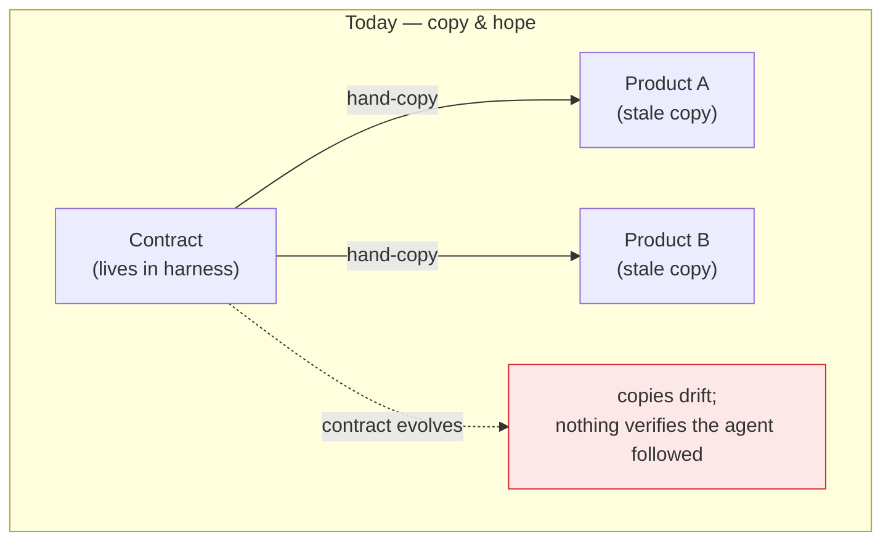
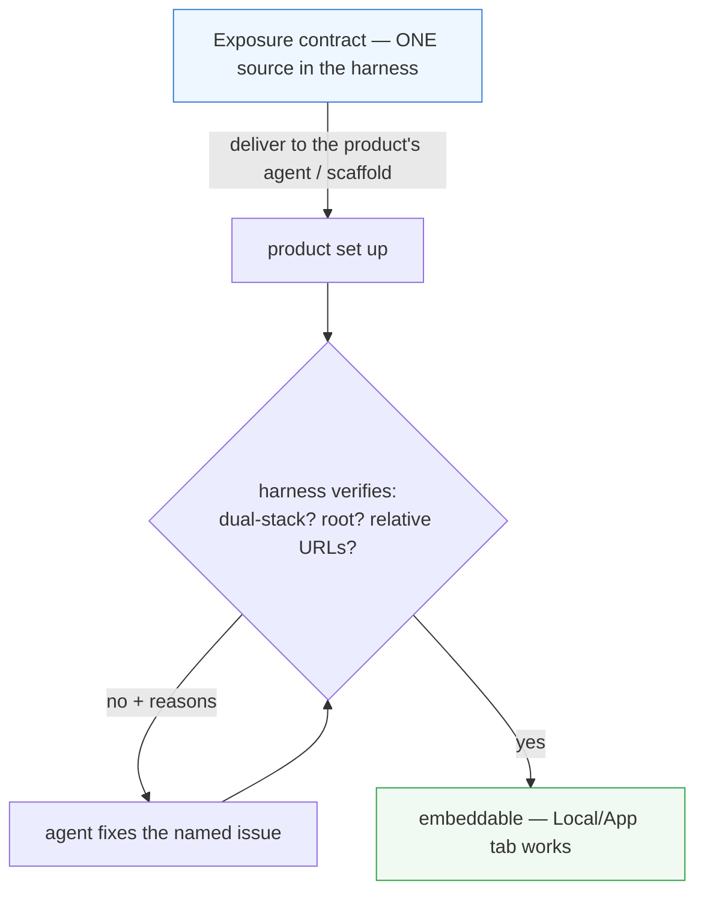
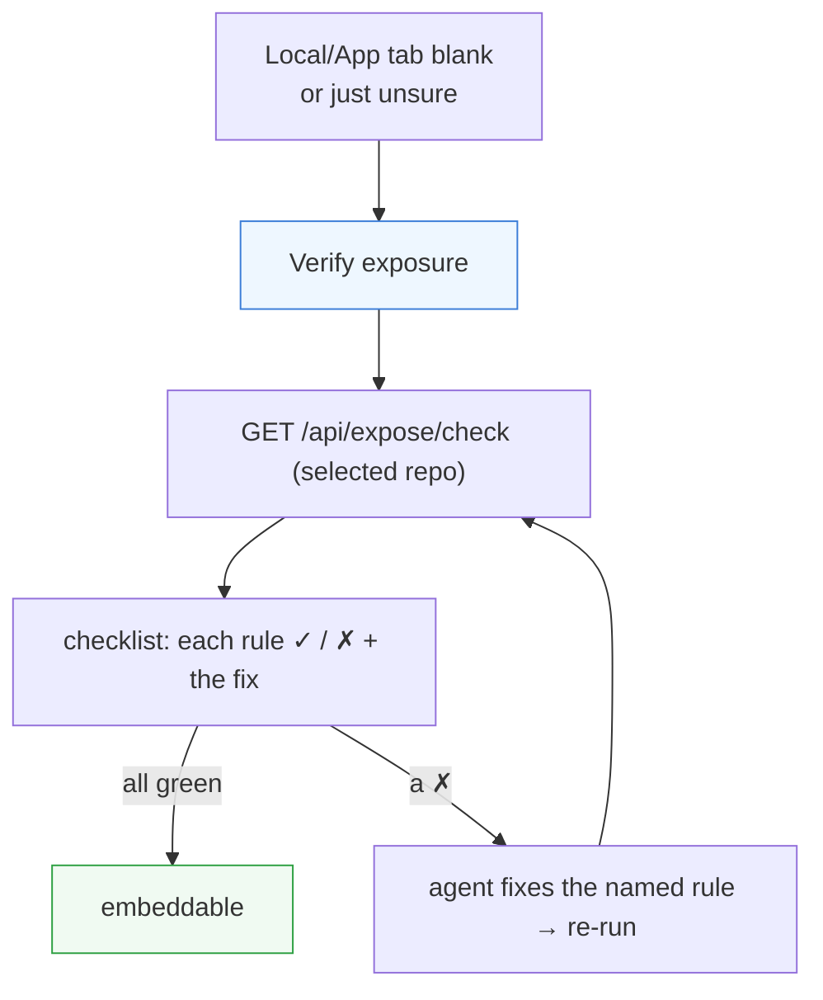

# Product onboarding — set a product repo up to expose itself, harness-driven

> **Status (2026-06-13):** Proposed — design/discussion, not built. Slice 1
> (the **Exposure check** diagnostics assistant) is now designed concretely
> below; ready to build on the word. Builds on the exposure contract in
> [../docs/networking/local-product-guide.md](../docs/networking/local-product-guide.md).

## Problem

When a product needs a web surface for our **Local tab** (local product) or
**App tab** (app product, via `/preview/`), the workflow has been:

1. Build the web service inside the product's repo, and
2. **Hand-copy the exposure instructions** (dual-stack bind, serve-at-root,
   relative URLs, the five `/preview/` traps…) from here into that repo.

Step 2 is the worse idea, confirmed in practice (web-flow-autodev): a copied
static instruction set is a **duplicate of a moving target**.

## Why "copy the instructions in" fails

- **Drift.** The contract here evolves (we *just* learned the IPv6 dual-stack
  rule); the copy in the product repo doesn't. The product silently follows
  stale rules.
- **Prose-and-hope.** It relies on the product's agent reading and faithfully
  applying prose. Nothing checks that it did — a wrong bind or an absolute
  `/assets` URL only surfaces as a blank tab later.
- **Per-repo, forever.** Every new product repeats the copy + the same class
  of mistakes. No leverage.
- **Precedent is the same shape.** "Prepare for preview" (`PreviewDoc.cs`)
  already writes managed guides *into* a product repo — but it's still
  write-docs-and-hope, so it inherits the same brittleness.

## Goal

Make product onboarding **harness-driven, single-source, and verifiable**,
for both Local and App products:

- the exposure contract has **one** authoritative home (no copies to rot);
- the harness **actively** sets the product up and/or **delivers the current
  contract to the agent** working in it (not a static paste);
- "did it expose correctly?" becomes a **machine check**, not a prose
  judgement made visible only when a tab is blank.

## Design directions (not mutually exclusive)

### A. Single source of truth (cheapest; partly done)

The contract lives once — [local-product-guide.md](../docs/networking/local-product-guide.md)
(+ the `/preview/` proxy guide). Product repos **reference it, never copy**.
A product's `CLAUDE.md` gets a one-line pointer, not the body. Kills drift at
the doc level. (We already wrote the canonical guide; the discipline is "link,
don't paste".)

### B. Machine-checkable exposure contract (highest leverage)

A verifier the harness runs against a product on demand: it actually *probes*
the behaviour, stack-agnostic, and reports pass/fail **with the specific
reason**. Candidate checks (all HTTP-level, so any stack):

- answers on **both** `127.0.0.1:port` and `[::1]:port` (dual-stack);
- `GET /` returns HTML whose asset URLs are **relative** (no leading-slash
  `/assets`);
- a known asset resolves **through** `/api/localview/{repo}/…`;
- (app product) the same over `/preview/` including the 411 / cache traps.

Surfaced as a **"Verify exposure"** action in the Local/App tab → green check
or a checklist of what's wrong. This converts "agent read the prose?" into an
automated gate, and it catches **drift for free** (the check encodes the
current contract).

### C. Harness-driven scaffold / agent task on init

An **"Initialize web surface"** action: the harness scaffolds the
bind/base/relative-URL wiring (or, since stacks differ, **emits an agent task
pre-loaded with the *current* contract** and the target port) instead of the
operator copying prose. The agent then receives authoritative, current
instructions as its task — not a stale repo file. Pairs naturally with (B):
scaffold, then verify.

### D. Live contract delivery to in-repo agents

When an agent is spawned in a product repo through the harness (Agents/dock),
inject the current exposure contract into its task context. Same idea as C's
task, generalized: the knowledge arrives **live from the single source** every
time, so it can't be stale.

## Trade-offs / open questions

- **Verify-first vs scaffold-first?** (B) is stack-agnostic, cheap, and
  catches drift — strong first slice. (C) is more proactive but per-stack
  (.NET/Node/Python) and heavier. Lean: **B first, then C** for the common
  stacks.
- **Where the check runs.** The harness reaching a product's port it already
  does (the Local proxy). The check is just structured probes + parsing
  `index.html`. Low risk.
- **App vs Local.** Local is simpler (3 rules). App/`/preview/` adds the five
  traps and the off-box IIS (which we can't test from this box — the verifier
  can only check the LAN side). Scope Local first.
- **Editing the product repo.** Scaffolding (C) means the harness writes code
  into another repo — precedent exists (Prepare for preview), but it's a
  bigger trust/UX step than a read-only verifier.
- **Naming/UI.** Resolved in *Slice 1 design* below.

## Slice 1 design — the Exposure check (per-project diagnostics assistant)

The concrete first build: a per-project "is this product correctly web-exposed,
and if not, exactly why?" assistant. This is design direction **(B)** with a
home in the UI.

### Decisions (my calls — adjustable)

- **Name: "Exposure check" (verb: *Verify exposure*). NOT "Deployment".** We
  already have a **Deploys** tab — but that's deploying *the harness itself*
  (rollback countdown, what's-live, [deployments-tab](deployments-tab.md)).
  This is about a *project's product*. Same word, different concern; keeping
  them distinct avoids real confusion.
- **Placement: a panel/action on the Local & App tabs first, not a new nav
  tab.** The problem *appears* on the Local/App tab when it's blank — so a
  **"Verify exposure / Why is this blank?"** button there, opening the
  checklist in context, is the highest-value spot. Promote to its own tab
  later only if it grows setup actions (slice 2). Less nav weight, more
  context.
- **Advanced-only** (operator/dev concern), per convention.
- **Read-only.** Slice 1 only *probes and reports* — it never edits the
  product. (Scaffolding is slice 2.)

### The checks (stack-agnostic, all HTTP-level)

`GET /api/expose/check` (scoped to the selected repo via `X-Repo-Id`) runs
these and returns a structured pass/fail-with-reason list:

| Check | How | Fail → fix |
|-------|-----|-----------|
| Port configured | repo has a `LocalPort` | set it on the Local tab |
| Listening (IPv4) | connect `127.0.0.1:port` | start the product |
| Listening (IPv6) | connect `[::1]:port` | bind **dual-stack** (`ListenAnyIP`) — the #1 footgun |
| Serves at root | `GET /` → 200 HTML | serve at `/`, no server base path |
| Relative assets | parse `/` HTML: no leading-slash `/assets` | Vite `base:'./'` |
| Resolves through proxy | `GET /api/localview/{repo}/` + a sample asset → 200 | relative URLs |
| App's own API works | a known app endpoint through the proxy → 200 | relative `fetch('api/…')` |

Each row links the offending rule in
[local-product-guide.md](../docs/networking/local-product-guide.md). App
products add the `/preview/` checks — but **LAN-side only**; the off-box IIS
forward can't be probed from this box (say so, don't pretend).

### Backend / frontend sketch

- `ExposeService` + `ExposeController` (`GET /api/expose/check`, advanced,
  behind the global gate): runs the probes (reuse the `LocalProxy` plumbing +
  `RepositoryRegistry` for the port), parses `index.html`, returns
  `[{ key, ok, detail, fixHref }]`.
- Frontend: a `Verify exposure` button + results panel on `LocalApp.jsx` (and
  the App tab), each row ✓/✗ with the fix link. Re-run button.

## User story — using the Exposure check

How it actually feels in your hands, both to *verify* and to *assist*.

**1. Verify a freshly-built web surface (the common case).**
> *As the operator, I just had Claude add a web UI to a project. I want to
> know it's embeddable here without the curl-IPv4-then-IPv6 ritual.*

I'm on the project in Claude Web. I built its web app, started it, set the
Local port — and the **Local tab is blank**. Instead of guessing, I hit
**Verify exposure**. A checklist appears: ✓ port configured, ✓ listening on
IPv4, ✓ serves at root, ✓ relative assets — but ✗ **listening on IPv6**, with
"bind dual-stack (`ListenAnyIP`)" and a link to the rule. In five seconds I
know the *exact* problem, not just "blank."

**2. Assist the fix without re-deriving anything.**
> *As the operator, I want the failing check to tell me — or my agent —
> precisely what to change.*

I flip to Chat and type: *"Verify exposure says the app isn't listening on
IPv6 — bind it dual-stack."* The agent already has the contract (it's
single-source), patches the bind, restarts. I tap **Re-run** on the panel:
every row goes green, and the Local tab now renders the app. I never opened a
terminal, never recalled the `::1` footgun myself — the check carried that
knowledge.

**3. Confirm before sharing the link.**
> *As the operator, before I send someone the internet URL, I want proof it
> works over the proxy, not just on my laptop.*

All-green in the Exposure check means the same-origin `/api/localview/` path —
assets and the app's own API — resolves through the harness, so I trust the
public link instead of finding out from the other person that it's broken.

**4. Catch a regression on something that used to work.**
> *As the operator, a product that worked last week is suddenly blank.*

One **Verify exposure** click: ✗ "listening" — someone changed the port in
the build. The checklist points straight at it; I fix the Local port (or the
app's port) and re-run. The check turned a mystery into a one-line diagnosis.

The thread through all four: the panel converts "is it exposed right?" from a
manual, knowledge-dependent ritual into a **one-click answer that names the
fix** — and (slice 2) eventually offers to apply it.

## Recommendation (phasing)

1. **Slice 1 — the Exposure check (above).** Read-only verifier as a
   Local/App-tab panel. Highest leverage, lowest risk, kills drift.
2. **Slice 2 — scaffold / agent-task (C/D)** for the common stacks, reusing
   the verifier as the done-condition; this is where "promote to its own tab"
   may earn itself.
3. Throughout — **(A)**: the contract stays single-source; repos link, never
   paste.
