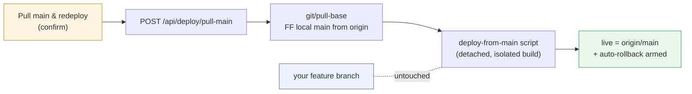

# Pull main & redeploy — one-button "make live = latest main"

> **Status (2026-06-14):** **Slice 1 (backend) BUILT & VERIFIED via dry-run**
> on `feature/pull-main-redeploy` (commit `95ee974`); not merged. Scope =
> [option (A)](#decision). `POST /api/deploy/pull-main` (typed `DEPLOY-MAIN`
> confirm) → `scripts/deploy-main.ps1` builds `origin/main` in an isolated git
> worktree, health-checks the new build on a temp port (:5201), and only then
> would swap live. Verified end-to-end through the endpoint with `noSwap=true`:
> copy deps → vite build → dotnet build → healthy on :5201 → stop before swap,
> with live (:5099) and the branch checkout untouched throughout. **Not yet
> exercised:** an actual live swap (`noSwap=false`) — deferred while a second
> checkout is actively redeploying live; the health gate makes it safe to run.
> Slice 2 (UI button) not started.

## Problem

You're mid-feature on a branch; another checkout ships to `main` and deploys
("last deploy wins" — `birocode` / `birocode-copy`). To get live (`:5099`) back
onto latest `main` you must leave your branch, fast-forward, run the self-dev
deploy scripts by hand, and switch back. No in-app "make live = latest main."

## Goal

One button that, from **any** branch, makes live run the latest `origin/main`
and leaves your branch checkout untouched:

### Decision

**(A) Deploy `origin/main` itself** (confirmed by the user) — live catches up to
latest main; the branch checkout never switches (the diagram above). *Not* (B),
"merge main into the current branch then redeploy," which would add a merge
commit and so isn't "untouched."

## Build on what exists — the gap is a *forward* deploy

| Half | Already there | Where |
|------|---------------|-------|
| Pull main | `POST /api/git/pull-base` (and `merge-base`, `pull-current` for B) | `GitController` |
| Deploy | ledger + `GET /api/deploy/status` + detached `rollback.ps1` trigger | `DeployService`, `plans/deployments-tab.md` |

`DeployService` only rolls *back*. The new work is the **forward** equivalent: a
`swap.ps1`-style script that builds `origin/main` in an isolated worktree and
swaps it live (obeying `docs/claude-web/self-dev.md` — never the running bin/port),
fired detached the way `TriggerRollback()` fires `rollback.ps1`, behind a new
`POST /api/deploy/pull-main`. Reuse the armed auto-rollback so a bad main can't
brick live.

## Slices

1. **DONE (dry-run verified).** Backend `POST /api/deploy/pull-main` →
   `scripts/deploy-main.ps1`: fetch + FF local main (best-effort), build
   `origin/main` in an isolated worktree, temp-port health check, swap live,
   remove the worktree. The plan's original ledger-entry + armed-rollback step
   was **dropped on this machine** — that infrastructure (`DeployScriptsDir`,
   `swap.ps1`/`rollback.ps1`, `deploys.jsonl`) is absent here (it points at a
   non-existent `Administrator` path); re-add it as a follow-up if/when the
   production rollback tooling is present. Remaining: exercise a real
   `noSwap=false` swap.
2. UI button on the Deployments tab — confirm + spinner, reusing the rollback
   button's confirm pattern.
3. *(maybe)* same button on the Git tab, by the ahead/behind-vs-origin rows.

### Implementation notes (slice 1 — hard-won)

The script runs **detached from the harness**, which made the build fight a
string of Windows/PowerShell traps, all now handled in `deploy-main.ps1`:
`ErrorActionPreference='Stop'` turns git's informational stderr into a fatal
error (use `Continue` + explicit `$LASTEXITCODE`); a helper named `Git` shadows
the `git` exe and recurses; an interrupted `worktree add` leaves it LOCKED
(needs `-f -f`); node isn't on the spawned PATH and the inherited PATH isn't
usable by `cmd`, so the build sets an explicit Windows PATH; `Set-Location`
doesn't change a native child's cwd, so vite is run via `cmd /c cd`. Crucially,
node_modules is **copied** into the worktree, never junctioned — a junction
inside the worktree is a footgun (a recursive delete follows it and wipes the
real shared `node_modules`; this bit twice during development).

## Verification (when built)

Browser test (`docs/claude-web/browser-testing.md`): on a feature branch with
live behind origin/main, click → confirm → live restarts → `GET
/api/deploy/status` shows live contains `origin/main`, and `GET /api/git/status`
shows the working-tree branch unchanged.
