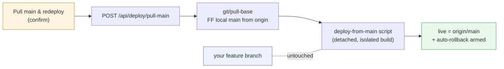

# Pull main & redeploy — one-button "make live = latest main"

> **Status (2026-06-14):** **PLAN ONLY — not started.** Branch
> `feature/pull-main-redeploy`. The [open question](#open-question) needs the
> user's call before slicing.

## Problem

You're mid-feature on a branch; another checkout ships to `main` and deploys
("last deploy wins" — `birocode` / `birocode-copy`). To get live (`:5099`) back
onto latest `main` you must leave your branch, fast-forward, run the self-dev
deploy scripts by hand, and switch back. No in-app "make live = latest main."

## Goal

One button that, from **any** branch, makes live run the latest `origin/main`
and leaves your branch checkout untouched:

### Open question

"Redeploy **it**" — two readings; plan **defaults to (A)**:

- **(A) Deploy `origin/main` itself.** Branch checkout never switches. The
  diagram above.
- **(B) Merge main into the current branch, then redeploy.** Adds a merge commit
  to your branch (`pull-base` → `merge-base` → deploy); not "untouched."

## Build on what exists — the gap is a *forward* deploy

| Half | Already there | Where |
|------|---------------|-------|
| Pull main | `POST /api/git/pull-base` (and `merge-base`, `pull-current` for B) | `GitController` |
| Deploy | ledger + `GET /api/deploy/status` + detached `rollback.ps1` trigger | `DeployService`, `plans/deployments-tab.md` |

`DeployService` only rolls *back*. The new work is the **forward** equivalent: a
`swap.ps1`-style script that builds `origin/main` in an isolated worktree and
swaps it live (obeying `docs/claude-web/self-dev.md` — never the running bin/port),
fired detached the way `TriggerRollback()` fires `rollback.ps1`, behind a new
`POST /api/deploy/pull-main`. Reuse the armed auto-rollback so a bad main can't
brick live.

## Slices (provisional — pending the A/B call)

1. Backend `POST /api/deploy/pull-main` = `pull-base` + detached deploy-from-main
   + ledger entry + armed rollback. Verify via `GET /api/deploy/status`
   (live commit contains `origin/main`).
2. UI button on the Deployments tab — confirm + spinner, reusing the rollback
   button's confirm pattern.
3. *(maybe)* same button on the Git tab, by the ahead/behind-vs-origin rows.

## Verification (when built)

Browser test (`docs/claude-web/browser-testing.md`): on a feature branch with
live behind origin/main, click → confirm → live restarts → `GET
/api/deploy/status` shows live contains `origin/main`, and `GET /api/git/status`
shows the working-tree branch unchanged.
