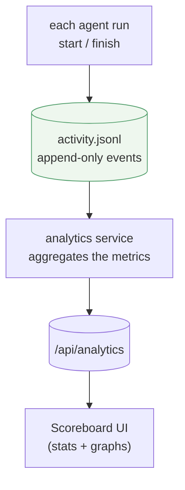
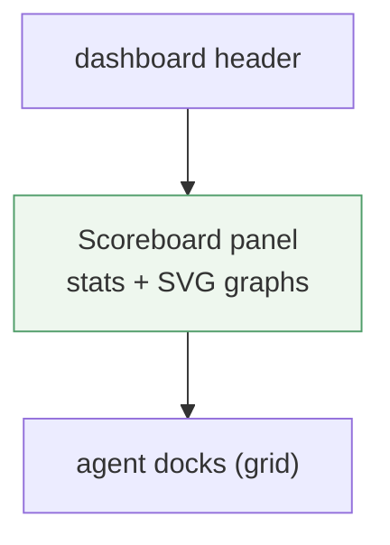

# Scoreboard / analytics

> **Status (2026-06-16):** Built (v2 redesign) on `feature/scoreboard-analytics`,
> verified on an isolated :5201 preview. Decisions locked: **new `activity.jsonl`
> events ledger**; UI = a **collapsible panel on the dashboard, above the agent
> docks**; **hand-rolled SVG/CSS** charts (no lib); "today" = **local midnight on
> the host**; **backfill deferred**. Structured per
> [doc-principles.md](doc-principles.md).

## v2 redesign (2026-06-16) — what shipped over the first cut

The first cut's metrics were correct but answered the wrong question, so the
panel was reworked:

- **Dropped work-vs-idle.** Idle was `(lastFinish − firstStart) − work` over an
  agent's *all-time* span, so episodic use always read ~99% idle — no signal.
- **One shared timeframe.** A **Today / 7 days / All** toggle drives the whole
  panel; `GET /api/analytics?window=…` scopes every scalar (prompts, peak,
  longest, total work, cost) to it. (v1 mixed "today" with all-time.)
- **Real time-series.** A **concurrency-over-time** step-area chart (the hero —
  *agents running at the same time*, with its shape, not just a scalar) and a
  prompts-per-day **activity strip** (originally fixed to the last 7 days —
  **superseded**, now window-scoped; see the v3 note below). These are the
  "graphs" the original ask wanted.
- **Per-agent leaderboard** (runs · total work · longest · last used), ranked by
  work — replaces v1's per-agent work/idle bars.
- **Cost.** The CLI result's `CostUsd` now rides the `finish` event; the panel
  totals spend per window (historical lines lack it ⇒ $0; the card hides at $0).
- **Firmer folding.** Orphan `start`s (crash / still-running) are dropped from
  duration metrics; durations are clipped to the window so straddling runs only
  contribute their in-window slice.

Endpoint shape (v2): `{ window, windowStart, windowEnd, longestRun, peakConcurrency,
prompts, totalWorkMs, totalCostUsd, totalRuns, concurrency[{ts,level}],
daily[{date,prompts,workMs}], agents[{agent,workMs,longestMs,lastUsed,runs}] }`.

## v3 (2026-06-26) — activity strip follows the window

Planned in OpenSpec (`openspec/changes/scoreboard-render-all`). The v2 activity
strip was hardcoded to the trailing 7 calendar days (`AnalyticsService.Daily()`
looped `i = 6 → 0`) **regardless of the window toggle**, so "All" widened every
scalar but the trend still showed only a week — the panel claimed to show all but
didn't.

- **The strip's day span now tracks the selected window** (same as the scalars and
  the concurrency series): `today` → 1 day, `7d` → the trailing 7 days (unchanged),
  `all` → every calendar day from the earliest recorded run through today. An empty
  ledger on `all` falls back to a single current-day entry; days stay bounded by
  host-local midnight.
- `daily[]` is now **variable-length** (the `Analytics` record shape is otherwise
  unchanged — `GET /api/analytics?window=` needs no new params). The frontend
  `ActivityStrip` renders one bar per entry (no fixed 7) and **labels the strip
  with the actual span** (e.g. "Activity — all · N days"). `scoreboard.css` lets
  the strip scroll horizontally with a per-bar min-width as the count grows.
- **Decision:** the strip tracks the window rather than *always* spanning full
  history, so the whole panel tells one consistent story (no year of bars under
  "Today").

**Deferred follow-up — long-history density.** Once the ledger spans many weeks or
months, one-bar-per-day will outgrow even a horizontal scroll. Bucketing into
weeks/months (or a zoom) is the future fix — out of scope here (history is ~10
days old today).

## Problem / goal

A **scoreboard** that quantifies how the agents are being used — at a glance and
over time. Metrics:

| Metric | Meaning |
|--------|---------|
| Longest-running agent | the single longest run (and/or largest total run time) |
| Peak concurrency | the most agents running **at the same time** |
| Prompts today | count of prompts sent since local midnight |
| Per-agent window | first → last use, with **work time** vs **idle time** |
| Total work time | all agents' work time summed |
| Graphs | a timeline of activity + charts for the above |

## Data source — the load-bearing decision

Every metric is a function of a **time series of run events** (per agent run:
when it started, when it finished, which repo). What exists today:

- **`CallLog`** (`Services/Monitoring/CallLog.cs`) — each run is a `CallRecord`
  with `StartedAt` / `FirstTokenAt` / `FinishedAt`, status, sessionId, repo. But
  it's **in-memory, capped at 200, lost on restart** — no history, no "today".
- **Session transcripts** on disk — per-message timestamps; durable but
  scattered and expensive to scan; "work vs idle" must be inferred.

**Decision: a new append-only events ledger** — `activity.jsonl` in
`%APPDATA%\ClaudeWeb\`, one line per run lifecycle event (`{ ts, event:
start|finish, repoId, sessionId }`), written where `CliRunnerService` already
calls `CallLog.StartCall` / finalizes. Same atomic-append discipline as
`deploys.jsonl`. An analytics service folds the ledger into the metrics; a
`GET /api/analytics` endpoint serves them. Accurate (real concurrency +
durations), durable, cheap to read. (Mining transcripts was the rejected
alternative: slower and fuzzier.)

## Defining work vs idle (locked)

An agent = a repo's runs. A **run** is one prompt→answer (CLI process
`StartedAt`→`FinishedAt`).

- **Work time** = sum of a run's `FinishedAt − StartedAt` (the CLI was actually
  running). All-agents total work time = sum across every run.
- **An agent's used window** = its first run start → its last run finish.
- **Idle time** = `window − work time` (time the agent existed but wasn't running
  — the gaps between bursts, waiting for the user).
- **Peak concurrency** = the most run-intervals overlapping at any instant.
- **Longest-running agent** = the agent with the largest single run (and we'll
  also show largest total work time).
- **Prompts today** = `start` events since **local midnight on the host**.

## Design

- **Backend:** `ActivityLog` service (append + read `activity.jsonl`); hook its
  append into `CliRunnerService` at run start/finish (right next to the existing
  `CallLog` calls). An `AnalyticsService` folds the ledger into the metrics
  (longest run, peak concurrency, prompts-today, per-agent work/idle, total work
  time). `AnalyticsController` → `GET /api/analytics`. DI via a
  `AddAnalyticsModule()` extension (the per-module convention).
- **Frontend — a panel on the dashboard, ABOVE the agent docks.** In
  `pages/Dashboard.jsx`, render a `Scoreboard` component between the header and
  the agent grid (full-width strip): the headline numbers + graphs, with the
  agent docks below as today. Polls `/api/analytics` while the overlay is open
  (the dashboard's existing poll cadence). Advanced-mode gated (rides the
  dashboard's gating).
- **Charts — hand-rolled SVG** (no lib bundled, the easier/lighter option): a
  horizontal **timeline** of run intervals (rows per agent, overlap shows
  concurrency) + a couple of simple **bar** rows (work time per agent, prompts).

## Resolved

1. **Data source:** new `activity.jsonl` events ledger.
2. **Work/idle:** defined above (run = CLI start→finish; idle = window − work).
3. **"Today":** local midnight on the host.
4. **UI home:** a panel on the **dashboard, above the agent docks** (not a tab).
5. **Charts:** hand-rolled SVG (no lib).

## Deferred (future feature)

- **Backfill.** Analytics start empty the moment the ledger ships — no history
  before then. Reconstructing past activity from existing **session transcripts**
  is its own future feature; noted here, out of scope for this slice.
- **Token counts.** Only per-run **cost** is on the call record today; token
  in/out would need transcript parsing — deferred with backfill.
- **Note:** the v1 work/idle definition below is **superseded** — see the v2
  redesign section above. Kept for history.

## Verification (later)

Seed a known `activity.jsonl` (overlapping intervals, some today/some earlier);
assert the API returns the expected longest run, peak concurrency, prompts-today,
per-agent work/idle, and total work time; then browser-verify the Scoreboard
renders them + graphs on an isolated preview.
