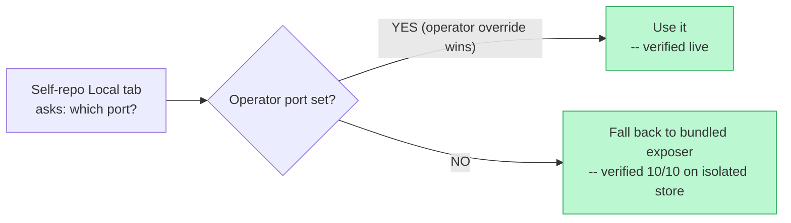
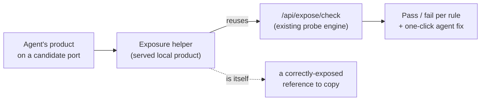

# Serving model clarity — a served helper that gets agents' local products exposed right

> Editing this plan? First read [doc principles](doc-principles.md).

> **Status (2026-06-16):** **Slice 1 built.** On `feature/serving-model-clarity`
> (branched off main synced with origin/main). The harness now serves the bundled
> Exposure Helper (`exposer/`) as its own Local-tab product via `ExposerHost` (a
> loopback dual-stack static server) + a read-time self-repo `LocalPort` fallback —
> the existing proxy, Local tab, and Exposure check all light up with **zero
> frontend changes**. Verified on an isolated `:5210`/`:5298` preview: exposer
> binds **both 127.0.0.1 and [::1]**, serves at root, relative assets resolve, no
> absolute refs (OS netstat + curl), and it **renders in a headless browser with
> its relative JS executing**, AND (via the `CLAUDEWEB_DATADIR` isolation knob
> below) the **fallback happy-path end-to-end: 10/10** — proxy serves the exposer
> (200, no-store), relative asset resolves under the proxy prefix, Exposure check
> all 6 rules green, embedded JS runs. Slices 2-4 below not started.

## Slice 1 verification — resolved (10/10)

The one branch that couldn't be tested against the live store — the fallback
happy path (self-repo Local tab → bundled exposer) — is now fully verified.

**Why it was blocked, and the fix.** Every store (`repositories.json`,
`auth.json`, ...) lives in `%APPDATA%\ClaudeWeb`, and `Environment.GetFolderPath`
ignores the `APPDATA` env var on Windows (known-folder API), so a preview could
not be isolated and always read the live operator's store. That store carried an
explicit (and stale/dead) self-repo port `5305`, which shadowed the fallback. We
chose **Option 2**: route every store through a single `AppPaths.DataDir` that
honors a `CLAUDEWEB_DATADIR` override (see docs/claude-web/self-dev.md). A preview
on an isolated store has a freshly-pinned self repo with no port, so the fallback
fires — verified `10/10`, with the live store never touched.

> Aside surfaced during verification: your live store's self-repo port `5305` is
> stale (nothing listens), so the live self-repo Local tab is currently dead.
> Clearing that override would let the fallback serve the exposer there too —
> takes effect on the next live-harness restart. Left for you to do out-of-band.

## The problem we're solving

Help an agent **expose its web app as a local product on our application** —
and get it right the first time, instead of reading docs and hoping. The
harness serves a Repo's Product two ways with inverted threat models; the Local
path (per-repo `/api/localview` proxy, behind login) is the one agents need to
get right, and its contract (dual-stack bind, root-serve, relative URLs) is easy
to miss. Full map + danger surface: [the two serving paths](serving-model-paths.md).

## Centerpiece: the served exposure-helper product

A small web app the **harness serves on the Local tab for whichever repo is
active**. It is the tool *and* the proof:

- **It dogfoods the path.** To exist it must itself be a correctly-exposed local
  product — so it doubles as the live **"done right" reference** an agent opens
  and copies. We currently serve *no* local product of our own; this fixes that.
- **It's the guided front-end** over the existing probe: walks the agent through
  each contract rule, explains it against the live contract, runs the check, and
  one-clicks the **agent-fix task**.
- **It builds on, doesn't rebuild,** the shipped Exposure check
  (`Controllers/ExposeController.cs`, `Services/Expose/ExposeService.cs`,
  `components/expose/ExposeCheck.jsx`). The probe stays the engine; this is the
  served surface around it.

**Key design choice (proposed, steer me):** the helper is one product the harness
serves regardless of selected repo, and it asks the harness to check the *active*
repo (a `repoId`-aware `/api/expose/check`). That keeps it cross-repo — every
agent gets the same helper following its own repo — while still being a genuine
served local product, not just harness chrome.

## Slices (sequenced)

- **Slice 1 — The served helper, exposed correctly.** Stand up the small product
  and have the harness serve it on the Local tab; prove the path end-to-end
  (dual-stack, `base: './'`, root-serve). At this point it's the live reference,
  even before the guided UI. Browser-verify on an isolated port.
- **Slice 2 — Guided exposure flow.** Inside the helper, wrap `/api/expose/check`:
  per-rule checklist with plain-language explanation + the live contract, run /
  re-run, and the existing one-click **agent-fix task**.
- **Slice 3 — Follow the active repo.** Make the check `repoId`-aware so the
  helper serves every agent for its own repo, not just the selected one.
- **Slice 4 — Supporting safety + doc.** The **SSRF port-guard** on
  `POST /api/repos/{id}/localport` (refuse/confirm 22, 25, 137-139, 445, 3389, …
  and `:5099`/`:5200`) and a **canonical serving-model doc** that the helper
  links to — both now feed the same tool instead of standing alone.

## Out of scope (for now)

- **Unifying the two serving paths into one** — big, risky re-architecture
  touching the public homepage, the off-box IIS forward, and every Product's
  contract. Parked.
- Flipping the deliberate **ungated `/preview/`** decision
  ([gates.md](../docs/networking/gates.md)) — clarify and warn, don't flip.
