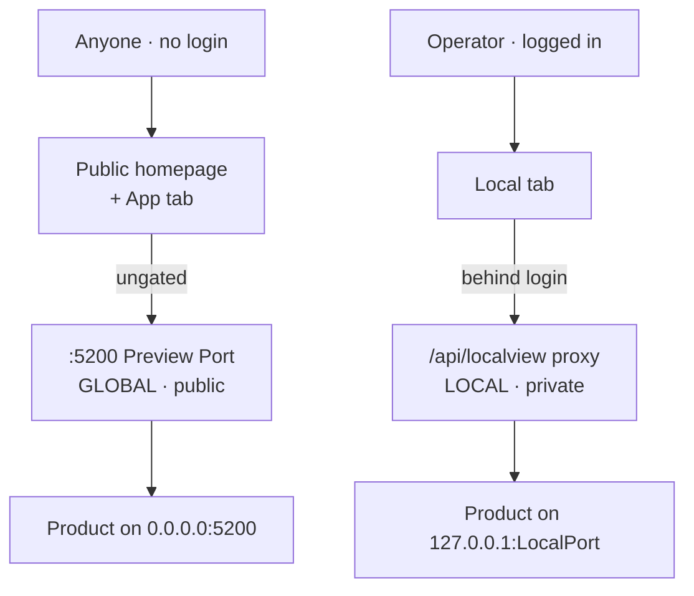

# Serving model clarity — make "global app vs local app" unmistakable and safe

> Editing this plan? First read [doc principles](doc-principles.md).

> **Status (2026-06-15):** **PROPOSED — not started.** On
> `feature/serving-model-clarity` (branched off main synced with origin/main).
> Scope below is a recommendation; the **primary-priority decision is the user's**
> (see *Open decision*).

## Why this exists

The Harness serves a Repo's **Product** in **two ways with inverted threat
models** — confusing them is easy and the consequences are real.

The danger, in short: a **private tool can be exposed publicly on :5200 by
mistake**; the local proxy's target port has **no blacklist** (an SSRF footgun —
`22`/`445`/`3389`/`:5099` are all accepted); self-dev port collisions and the
IPv6-bind trap fail **silently**. Full side-by-side and the enumerated gaps with
code locations: [the two serving paths](serving-model-paths.md).

## Goal

Make it **impossible to confuse** the two paths and **hard to do the dangerous
thing**, without (yet) re-architecting them into one:
- **Clarity** — at a glance, in the app and in one canonical doc: which path,
  public vs private, which port, what the Product must do to work there.
- **Safety** — the easy mistakes (private→public exposure, SSRF port, self-dev
  collision) are guarded or warned, not silent.

## Proposed slices (sequenced highest-danger / lowest-risk first)

- **Slice 1 — Canonical serving-model doc.** One authoritative page
  (`docs/serving-model.md`) naming the two paths, stating the public-vs-private
  threat model, and **linking** (not duplicating) the existing how-tos
  (`preview.md`, `proxy.md`, `local-product-guide.md`, `self-dev.md`). Update
  `docs/networking.md` + the `CLAUDE.md` glossary to point at it. Docs-only.
- **Slice 2 — Safety: the SSRF port.** Add a refused-port guard to
  `POST /api/repos/{id}/localport` (reject/confirm 22, 23, 25, 137-139, 445,
  3389, … and the Harness's own `:5099`/`:5200`) with a clear error in the
  Local-tab setup form. Backend + small frontend.
- **Slice 3 — In-app clarity.** Label the App tab product **"Public — anyone
  with the link"** and the Local tab **"Private — behind your login"**, each
  showing the actual port/URL; confirm before exposing anything sensitive on the
  public path. Frontend-mostly.
- **Slice 4 (later) — Self-Dev collision guard.** A preview/startup check that
  refuses to bind a build over the running Harness's own port and points at
  `self-dev.md`.

## Out of scope (for now)

- **Unifying the two paths into one mechanism** — a big, risky re-architecture
  touching the public homepage, the off-box IIS forward, and every Product's
  contract. Parked; revisit only if the user prioritizes it.
- Changing the deliberate **ungated `/preview/`** decision
  ([gates.md](../docs/networking/gates.md)) — clarify and warn around it, don't
  silently flip it.

## Open decision (needs the user before slice 1 builds)

What must "done right" prioritize: **(a)** safety/hardening, **(b)** in-app UX
clarity, **(c)** one canonical doc, **(d)** actually unify the paths? The slices
assume **c → a → b**, with **d parked**. Reorder/widen on the user's word.
