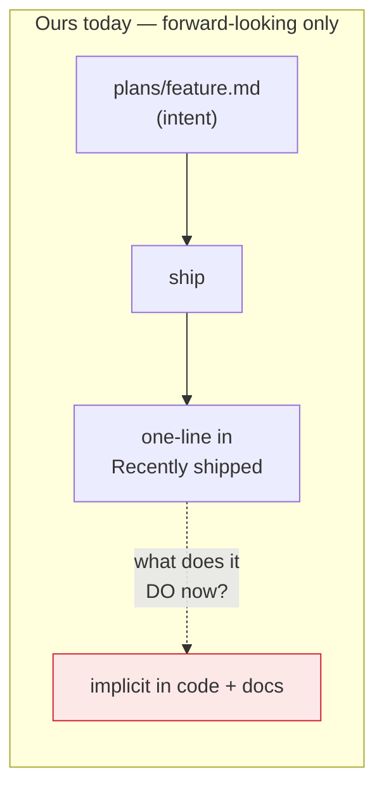
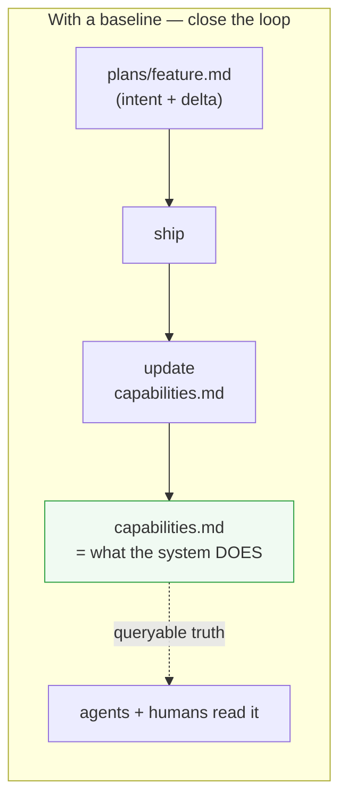

# Spec baseline — steal OpenSpec's best idea without its tooling

> **Status (2026-06-13):** Proposed — design/discussion, not built. Decides
> what (if anything) to adopt from [OpenSpec](https://github.com/Fission-AI/OpenSpec)
> into our existing plan-tracking convention ([doc-principles](doc-principles.md)).

## The question

Should we adopt OpenSpec, or borrow from it? We compared the two and the
answer is **borrow, don't rip-and-replace**. This plan records *what* to
borrow and *how* it lands in our convention.

## What we already have (don't rebuild)

Our plan-tracking already embodies most of spec-driven development:

- **Intent before code** — the playback ritual + `understanding.md` (rendered
  in the Understanding panel).
- **One artifact per feature** — `plans/<feature>.md` (problem, design,
  decisions-with-calls-flagged, user story, diagrams, verification).
- **A lifecycle** — status headers (Proposed → building → deployed-&-confirmed)
  + `plan.md` dashboard (Active / Recently shipped).
- **Harness-integrated** — the Plan tab renders `plan.md`; the doc viewer
  renders the plans + diagrams; the deploy ritual is the "archive" step.

OpenSpec is a *generic tool* for this; ours is a *bespoke convention wired
into the harness*. Adopting OpenSpec wholesale would duplicate all of the
above and **lose the harness integration** — two sources of truth, the exact
drift we keep fighting. So: no full adoption.

## The one real gap OpenSpec exposes

OpenSpec keeps a **persistent spec baseline** (`specs/`) — a queryable
description of what the system *does today*, as requirements — and every
change is an explicit **delta** (ADDED / MODIFIED / REMOVED) against it.

**We don't have that.** Our plans are *forward-looking work items*; once
shipped, a feature collapses to a one-line "Recently shipped" entry and the
detail plan becomes history. Nothing answers *"what does this system do
today, as a spec?"* — that truth is implicit in the code + scattered docs
(`CLAUDE.md`, `docs/networking.md`, `ANALYSIS.md`). Our delivery ritual is
strong; our **retrospective truth is thin**.

## We already do micro-SDD (proof it fits)

The exposure **contract** in [local-product-guide.md](../docs/networking/local-product-guide.md)
*is* a spec, and the **Exposure check** ([product-onboarding](product-onboarding.md))
*verifies against it*. That's spec-driven development in one corner — the
pattern generalizes.

## What to borrow (the proposal)

A lightweight **living capabilities baseline** in our existing convention —
no new tool, no `openspec/` directory, no CLI.

### 1. `docs/capabilities.md` — the baseline (the borrowed idea)

A single living doc: *what Claude Web does today*, grouped by area (Chat,
Files, Git, Local/App preview, Deploy, Auth/Gates, …), each capability a
short requirement line. It is the answer to "what does this system do now?"
Kept current as features ship — NOT a per-feature history (that stays in
`plans/*` + Recently-shipped).

### 2. Plans gain a "Capability delta" line

Every `plans/<feature>.md` adds one stanza: the **delta** it makes to the
baseline — `ADDED / CHANGED / REMOVED: <capability>`. Tiny, but it turns
"ship → one-liner" into "ship → update the baseline", closing the loop.

### 3. The ritual gains one step

The deploy/"keep it" step (status → deployed-&-confirmed) also **applies the
delta to `docs/capabilities.md`**. One extra edit per shipped feature; the
baseline never drifts because updating it is part of done.

### 4. (Optional, later) a Capabilities tab / Plan-tab section

Render `capabilities.md` in the harness like `plan.md`, so "what does this do"
is one tap away. Defer until the doc proves useful on disk.

## Explicitly NOT borrowing

- **The CLI / `openspec init`** — we don't want a second toolchain; our
  convention + harness rendering already covers authoring + viewing.
- **`changes/` + `archive/` dirs** — that's just our `plans/*` + status
  headers + Recently-shipped under different names; renaming churns history
  for no gain.
- **GIVEN/WHEN/THEN everywhere** — overkill for most of our plans; reserve
  the testable-scenario style for *contracts that get a verifier* (the
  exposure contract is the model), not prose features.

## Trade-offs / open questions

- **Maintenance cost.** A baseline is only worth it if it stays current — the
  whole point. Mitigation: make the delta-apply part of "deployed-&-confirmed"
  (step 3), so it can't be skipped without skipping done.
- **Granularity.** Capability lines, not paragraphs (doc-principles #6 spirit:
  it's a map). Detail stays in the plans it links to.
- **Overlap with ANALYSIS.md / CLAUDE.md.** Those are *rationale* and
  *working-notes*; `capabilities.md` is *current behavior as requirements*.
  Different jobs — link, don't merge.
- **Is it worth it at all?** Honest: only if "what does this do today?" is a
  question we actually keep asking. We've felt it (the networking docs were a
  retro-fit of exactly this). Lean: yes, but start as **just the doc** (steps
  1–3); skip the tab (step 4) until proven.

## Recommendation (phasing)

1. **Try OpenSpec on one throwaway change** in a side branch (an afternoon)
   to feel the workflow before committing to borrowing — cheap calibration.
2. **Slice 1 — `docs/capabilities.md` + the delta stanza + the ritual step**
   (steps 1–3). Pure convention, no code. Backfill the baseline from current
   features once.
3. **Slice 2 (optional) — render it in the harness** (step 4) if the doc earns
   it.
