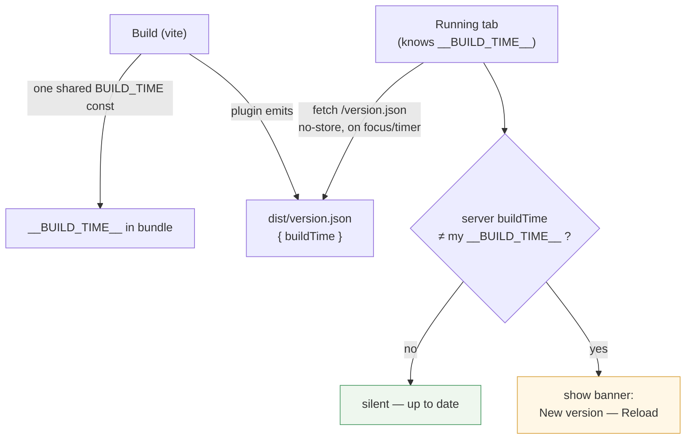

# Stale-copy warning banner — tell an open tab its code is out of date

> **Status (2026-06-14):** **Deployed & confirmed** on live :5099 (cf75052).
> Browser-verified on an isolated `:5210` harness
> (`.claudeweb-preview/playwright/verify-stale-banner.mjs`, 5/5: banner shows on
> differing build, Reload reloads, dismiss hides, no banner when builds match;
> per-tab regression still green). Merged to main via
> `feature/local-tab-expose-help`. Motivated by the per-tab-spaces deploy: open
> windows kept running the old cached bundle until a hard refresh (see
> [per-tab-spaces](per-tab-spaces.md)).

## Problem

The harness serves `index.html` without a no-cache header, and a single-page app
never re-fetches `index.html` during normal use. So after a redeploy, a
long-open browser keeps running the **old** JS bundle indefinitely — the user
thinks a just-shipped fix "doesn't work" when they're simply on stale code.

A pure `Cache-Control` header only helps on a full reload, which an idle SPA tab
never does on its own. The End User chose an active **notification** instead.

## Design

The build identity is the existing `__BUILD_TIME__` (vite `define`, baked into
the bundle). The build also emits a matching `dist/version.json`; the client
compares the two and warns on a mismatch.

- **`vite.config.js`** — hoist build time to a const used for both
  `define.__BUILD_TIME__` and a `generateBundle` plugin that emits
  `version.json`. (Dev `vite serve` has no `version.json`; the check treats a
  missing/failed fetch as "unknown — don't warn".)
- **Client check** — fetch `/version.json?t=<bust>` with `cache: 'no-store'` on
  mount, on `visibilitychange`→visible / `focus`, and on a periodic timer
  (~3 min). Warn only when both values are present and differ.
- **Banner UI** — dismissible bar: message + **Reload** (`location.reload()`)
  + close. Reuses the Exposure-freshness "current?" pattern and styling.
- **Visibility** — shown to **all** users (Basic + Advanced). CLAUDE.md defaults
  new UI to Advanced; deviating deliberately because the End User is exactly who
  gets stranded. Not a nav tab, so it's a global element, not a capability gate.
- **i18n** — en/tr strings.

## Files touched

| File | Change |
|------|--------|
| `client/vite.config.js` | Shared `BUILD_TIME` const; plugin emits `dist/version.json`. |
| `client/src/components/shared/StaleVersionBanner.jsx` (+ css) | The check + banner. |
| `client/src/layout/Layout.jsx` | Mount the banner globally. |
| `client/src/i18n/en.json`, `tr.json` | Banner strings. |

## Verification

Isolated `:5200` + Playwright (`verify-stale-banner.mjs`): `page.route` stubs
`/version.json` to a *different* buildTime → banner appears, Reload triggers a
navigation; stub to the *same* buildTime → no banner. Build isolated, test on
`:5200`, never touch live `:5099` until the user says deploy.
