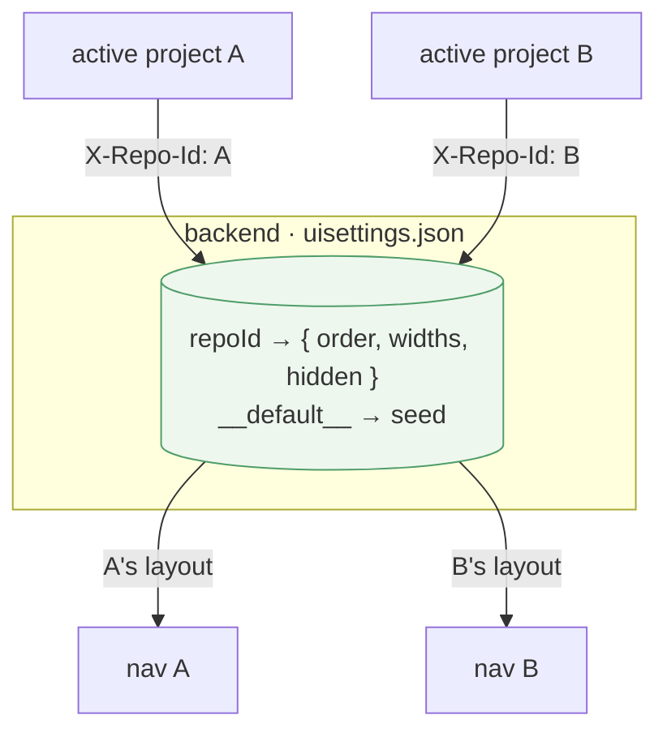

# Tab settings — Option B: scoped to the agent / project (chosen)

> Sub-plan of [browser-scoped-tab-order.md](browser-scoped-tab-order.md).
> Chosen option: a per-project layout map on the **backend**. Not built yet.
> Covers all three tab settings: **order, pane widths, visibility.**

## Design

Today the layout is one global record. Make it a **map keyed by project
(`repoId`)**: `repoId → { tabOrder, tabWidths, hiddenTabs }`. The API already
receives the `X-Repo-Id` header on every request, so `GET/PUT /api/settings/ui`
just read/write the *current* project's entry. Switching project re-fetches and
the nav, widths, and hidden set all swap. Stays on the backend → **cross-device
sync kept** (phone and desktop show the same layout for a given project).

### Why project (`repoId`), not the concrete agent

Agents (dock tabs) are **ephemeral** — deleted on close — so a per-agent layout
would vanish with the agent, and two agents on the same repo would usually want
the *same* layout. `repoId` persists and is already the axis Files/Git/App
follow ([agent-repo-sync](agent-repo-sync.md)). (A per-agent key remains
possible later by storing under the dock tab id instead; not chosen.)

### Why backend, not local

The earlier draft weighed a `localStorage` variant for *browser independence* —
but the user has declared that an explicit **non-goal**. Backend storage is
therefore strictly better here: it meets the goal **and** keeps cross-device
sync, with no reversal of [settings-tab.md](settings-tab.md) (we refine "one
global layout" → "one layout per project", same sync model).

## Code changes

| File | Change | Size |
|------|--------|------|
| `Services/Settings/UiSettingsService.cs` | Store becomes `Dictionary<string repoId, UiSettings>` instead of one flat record. Add `GetForRepo(repoId)` / `SetForRepo(repoId, …)`; atomic temp+rename write of the whole map (existing pattern). **Migration:** an old flat file loads as the `__default__` entry. | medium |
| `Controllers/SettingsController.cs` | Resolve the current repo via `RepositoryResolver` (the `X-Repo-Id` pattern other per-project controllers use); `GET` returns that repo's settings (falling back to `__default__`), `PUT` saves under it. Same validation (known keys, width clamp, non-hideable). | small |
| `context/UiSettingsContext.jsx` | Re-fetch when the active project changes, not just on mount. | small |
| `layout/Layout.jsx` | **Provider nesting:** move `UiSettingsProvider` to sit **inside** `RepoProvider` (today it's outside, so it can't see `currentRepoId`). Then the context can depend on `useRepo().currentRepoId` for its re-fetch. Safe — `RepoProvider` doesn't depend on UI settings. | 2 lines |
| `useOrderedTabs` / `Settings.jsx` / `PaneStrip` | **Unchanged** — they keep reading `tabOrder`/`tabWidths`/`hiddenTabs` from the context and saving via the same callbacks; only the context's source/destination changed. | 0 |

**Magnitude:** ~3 backend/frontend files + a 2-line provider move. Moderate —
the work is the store-shape change + migration + the per-project re-fetch, not
new infrastructure. No new endpoints, no new store file.

### Migration / fallback (no surprise resets)

- Old flat `uisettings.json` → loaded as `__default__`. Any project with no
  entry yet inherits `__default__`, so existing users keep their current layout
  everywhere until they customise a specific project.
- No project selected (fresh app, no repos) → use `__default__`.

## Open issues

- **First-customise UX:** when the user reorders under project A, do we copy the
  current effective layout into A's entry then edit (so A diverges only on
  purpose), or start A from `__default__`? (Leaning: fork-on-write from the
  effective layout.)
- **Settings tab caption:** worth showing "layout for *project A*" so it's clear
  the change is project-scoped. Small addition.

## Verdict

Chosen. Backend, keyed by `repoId`, all three settings. Meets the sole goal
(per-project layouts), keeps cross-device sync, moderate contained cost.
