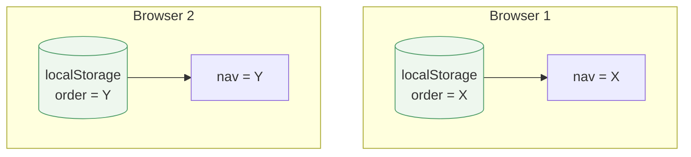

# Tab order — Option A: scoped to the browser

> Sub-plan of [browser-scoped-tab-order.md](browser-scoped-tab-order.md).
> One tab order per browser; not built.

## Design

One order per browser, in `localStorage` (key `claudeweb_tab_order`), exactly
like UI mode and language already live there. No backend, no per-context split.

## Code changes

| File | Change | Size |
|------|--------|------|
| `context/UiSettingsContext.jsx` | `tabOrder` initial state reads `localStorage`; `saveTabOrder` writes `localStorage` instead of `PUT /api/settings/ui`. One-time seed from the backend value if no local key yet. | ~15 lines |
| everything else | unchanged — `useOrderedTabs`, `tabRegistry`, `BottomNav`, `PaneStrip`, `Settings` all keep calling the same context API. | 0 |

**Backend:** untouched (`/api/settings/ui` keeps serving widths/visibility).
**Magnitude:** one file, frontend-only. The smallest possible change.

## Pros / cons

- ✔ Stable nav; trivial to build (one file).
- ✘ **No per-context layouts** — one order for the whole browser, so it does
  **not** meet the goal (different layout per agent/project).
- ✘ Loses cross-device sync, for no benefit the user wants (browser independence
  is an explicit non-goal).

## Verdict

Rejected. It optimises for browser independence, which the user has declared a
non-goal, while failing the actual goal (per-project layouts). Kept only to
document the alternative.
