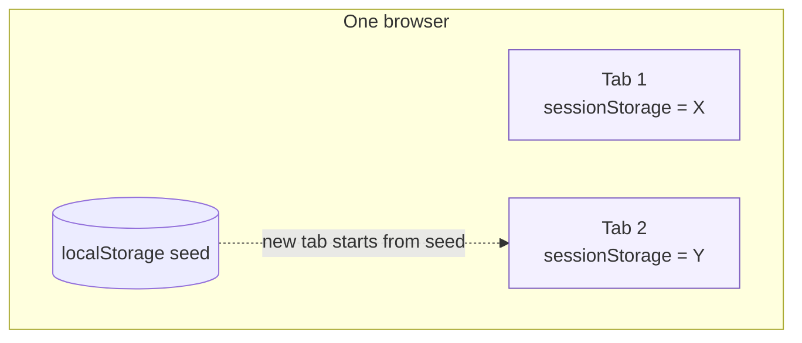

# Tab order — Option C: scoped to a single browser tab

> Sub-plan of [browser-scoped-tab-order.md](browser-scoped-tab-order.md).
> Listed for completeness; not recommended.

## Design

Reuse the per-tab mechanism from [per-tab-spaces.md](per-tab-spaces.md):
`viewState.js`'s `readTabState`/`writeTabState` (sessionStorage, with a
localStorage seed). Tab order would be authoritative per **browser tab**.

## Code changes

| File | Change | Size |
|------|--------|------|
| `context/UiSettingsContext.jsx` | `tabOrder` via `readTabState`/`writeTabState('claudeweb_tab_order')` instead of the backend. | ~10 lines |

Frontend-only, backend untouched. Small — but see the cons.

## Pros / cons

- ✔ Browser-independent (per tab ⇒ certainly per browser).
- ✘ **Resets on every new tab** (sessionStorage), only softened by the seed —
  people expect a nav layout to persist per browser, not per tab.
- ✘ **Doesn't give per-context layouts** (goal 2) — it varies by tab, which
  matches agent/project only by accident.
- ✘ No cross-device sync.

## Verdict

Rejected. It varies layout by browser tab — neither the goal (per-project) nor
even browser independence cleanly — and resets per tab. The per-tab mechanism is
right for "which agent is this tab viewing" (its actual use), not for tab
settings. Kept only to document the alternative.
