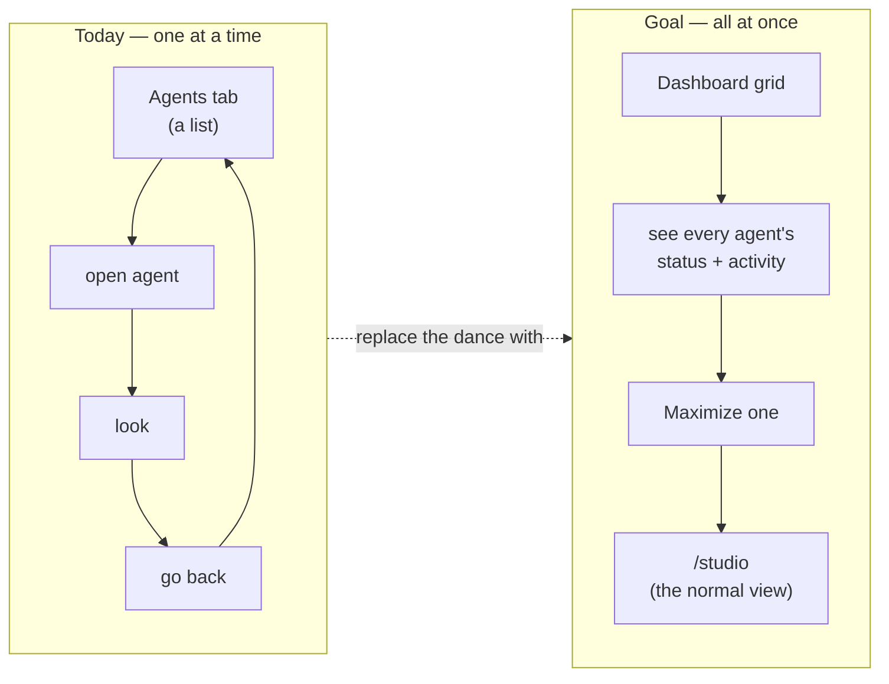
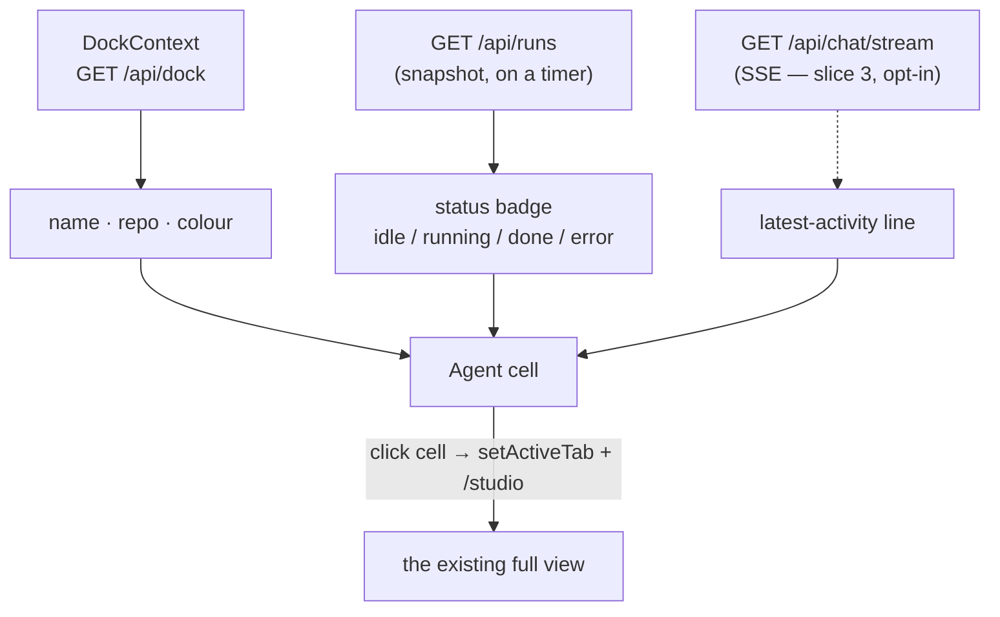
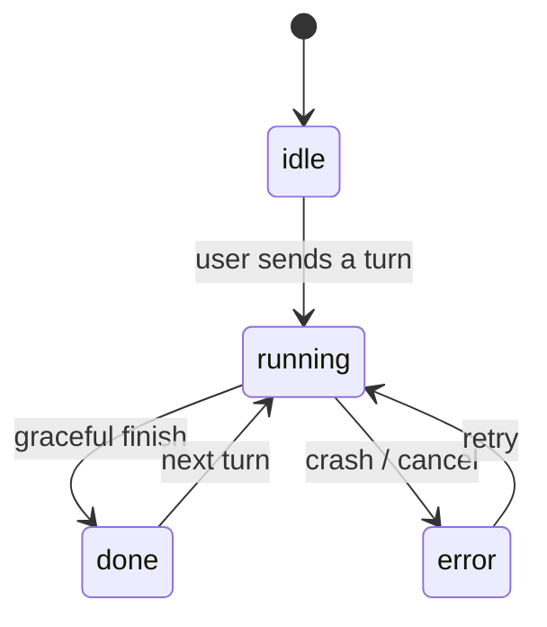
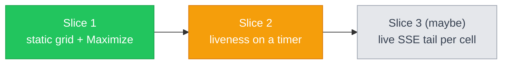
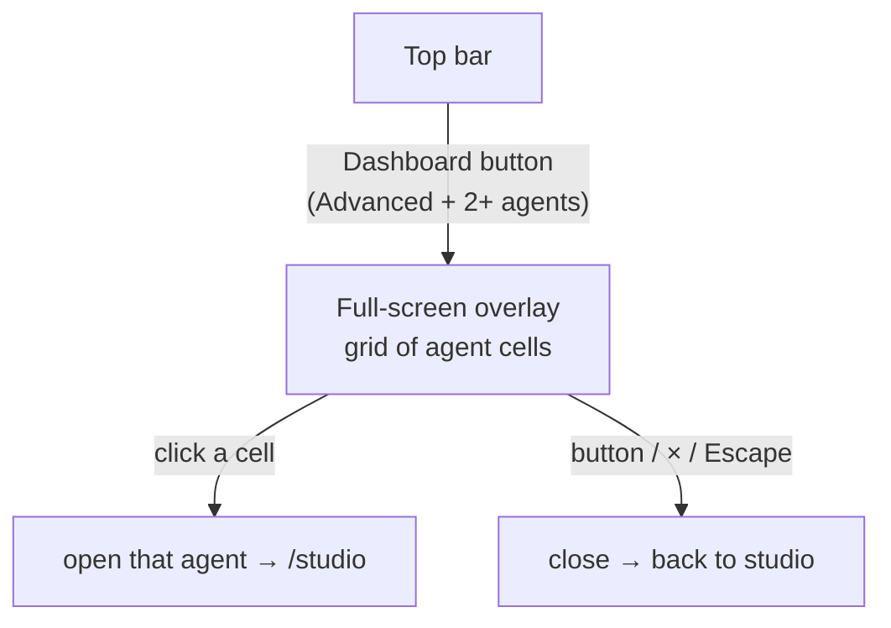

# Understanding — Agent dashboard (grid overview of all agents)

> **Progress (2026-06-14):** Fork **resolved → top-bar full-screen overlay**
> (option B). Slice 1 rebuilt: the dashboard is no longer a tab — a top-bar
> **Dashboard** button (Advanced + 2+ agents) opens a full-screen overlay; click
> a cell to open that agent; close via the button, the × , or Escape.
>
> **👉 NEXT STEP — Slice 2 (liveness):** give each cell a live status refresh +
> a one-line "what's it doing", on a timer. Then Slice 3 (live tail) is optional.
> The authoritative slice plan lives in
> [plans/agent-dashboard.md](plans/agent-dashboard.md) (+ its UX / tech detail).

## The goal, in one picture

Today every agent lives behind the Agents tab one at a time: open one, look,
navigate back, repeat. There is no single screen showing **all** agents and
what each is doing **at once**. The dashboard is that screen.

## What a cell shows, and where each piece comes from

Each agent in the dock becomes one cell. The dashboard is a new **view** over
plumbing we already have — it does not add backend.

## The status each badge reflects (already modelled today)

## What's done vs. what's left

- **Slice 1 — done.** Advanced top-bar **Dashboard** button → full-screen
  overlay; responsive grid of dock agents (name, status badge + dot, colour
  mark); click any cell → open that agent in `/studio`.
- **Slice 2 — 👈 next.** Per-cell status refresh + a one-line "what's it doing",
  updated on a **timer** (poll `/api/runs` + a cheap latest-activity source).
  No per-cell connections.
- **Slice 3 — later, maybe.** An **opt-in** scrolling SSE tail per cell, bounded
  so we never open N heavy streams at once.

## How it's reached (resolved → overlay)

The dashboard is **not a tab**. A top-bar **Dashboard** button opens a
full-screen overlay that replaces the content area and hides the bottom nav /
pane strip; the top bar stays so the same button closes it.

## What we reuse, not rebuild (both options)

- **Agent list** — `DockContext` (`{ id, repoId, repoName, sessionId, status,
  color, stash }`) via `/api/dock`, persisted server-side.
- **Status** — already `idle | running | done | error` (the Agents-tab legend).
- **Open** — `setActiveTab(id)` + navigate `/studio` (what an Agents card
  does today).
- **Grid baseline** — `PaneStrip` / `useMultiPane` lay out N panes; the
  dashboard is a sibling (a CSS grid of cells, not panes of one agent).

## Assumptions / out of scope

- Scope = agents on **this** computer (the dock list); no cross-machine.
- Creating / editing / configuring agents stays in the **Agents tab** — the
  dashboard is **read + open**, an overview, not a management screen.
- One feature, one branch (`feature/agent-dashboard`).
